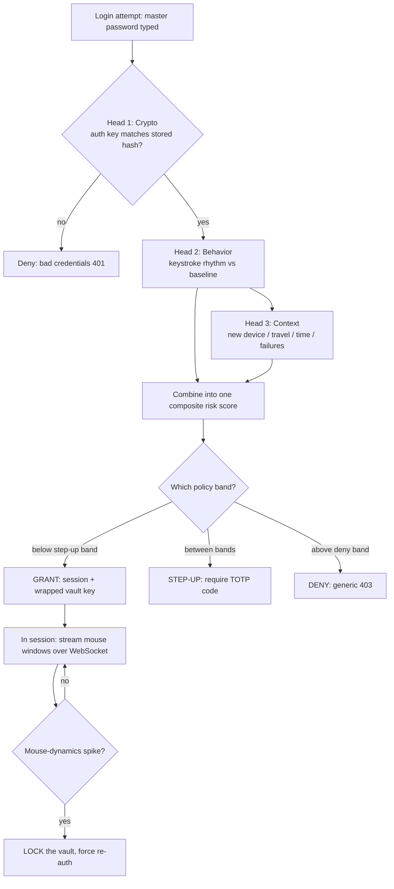

# 01 — Overview: what Cerberus is, the big picture, the trust model

> _"Cerberus — the three-headed guardian of the threshold. Nothing passes unrecognized."_
> ([PROJECT.md](../../PROJECT.md) epigraph)

This is the front door of the encyclopedia. Read it first, then branch out to
[Architecture](02-architecture.md) for the moving parts, the [Repository Map](03-repository-map.md)
for where everything lives, or the [Cryptographic Core](04-cryptographic-core.md) for the lock on
the vault. Unfamiliar words are defined the first time they appear and collected in the
[Glossary](13-glossary.md).

---

## 1. In plain English

Cerberus is a **password vault** — software that stores all your passwords behind one master
password — with a twist: it also watches *how you log in*, not just *what you type*, and decides
on each attempt whether to let you in, ask for a second proof, or refuse.

Two ideas make it different from an ordinary password manager:

1. **Zero-knowledge.** The server that stores your encrypted passwords can never read them. It
   holds only scrambled data ("ciphertext") and a proof that you knew the password — never the
   password itself, never the keys, never the decrypted secrets. Think of a left-luggage locker
   where the staff hold a sealed box they cannot open and have no key for; they can hand you back
   the same box, but its contents are yours alone.

2. **Risk-based adaptive authentication.** Knowing the master password is not automatically enough.
   The system also looks at *how* you type it (your personal rhythm), *where* you are logging in
   from, *which* device you are on, and *whether* there have been recent failed attempts. From
   those signals it computes a single **risk score**, and that score decides the outcome: let you
   straight in, demand a one-time code (a "step-up"), or deny the attempt. After you are in, it
   keeps watching your mouse movements; if they suddenly look like someone else, it locks the vault.

The project name maps to its design. Cerberus, the mythical three-headed dog, guards a gate.
Cerberus the software has **three heads** guarding *its* gate:

- **Crypto** — the zero-knowledge vault. Secrets pass only with the right key.
- **Behavior** — keystroke timing (at login) and mouse dynamics (during a session). It recognises
  *how* you act, not just *what you know*.
- **Context** — the device, the location, the time, the recent failures. It recognises the
  *circumstances* of the attempt.

A clean login satisfies all three heads. Failing one wakes the guardian — and that is the
step-up or the lock ([PROJECT.md §1](../../PROJECT.md), lines 9-15).

This is a **security-focused bachelor-thesis project** (FDIBA), so it deliberately favours
correctness, explainability, and demonstrable security properties over speed or convenience
([CLAUDE.md](../../CLAUDE.md); [docs/CERBERUS_HANDOFF.md](../CERBERUS_HANDOFF.md), line 15).

> ⚠️ **The README status line is stale — ignore it.** [README.md](../../README.md), lines 10-12
> says: *"Status: Milestone 1 — monorepo scaffold + CI. Structure and tooling only; no crypto,
> vault, or risk logic yet."* That is no longer true. The codebase implements the **complete
> system**: the crypto core, vault CRUD, zero-knowledge login, behavioral and contextual risk
> scoring, TOTP step-up, and the continuous-auth WebSocket. The authoritative status is in
> [docs/CERBERUS_HANDOFF.md](../CERBERUS_HANDOFF.md), line 27: *"ALL milestones M1–M12 COMPLETE."*
> When the README and the code disagree, the code wins — and here the code is far ahead of the
> README.

---

## 2. Where it lives

This overview draws on the project's top-level prose documents (not the source code itself —
the per-subsystem docs go into the code). The files in scope:

```
cerberus/
├── PROJECT.md                  the binding development plan + coding rules (authoritative)
├── CLAUDE.md                   durable rules for contributors; the 5 security invariants
├── README.md                   the public-facing intro (STATUS LINE IS STALE)
├── ROADMAP.md                  the dependency-ordered build phases (Phase 0-8)
└── docs/
    ├── threat-model.md         assets, adversaries (A1-A8), trust boundaries
    └── CERBERUS_HANDOFF.md     the real, current status (M1-M12 complete) + open items
```

For the verified, file-by-file map of the *actual code*, see the reconnaissance notes
([docs/encyclopedia/00-RECON-NOTES.md](00-RECON-NOTES.md)) and the
[Repository Map](03-repository-map.md).

---

## 3. The four stacks (so the rest of the docs make sense)

Cerberus is one product made of four cooperating parts. You will meet all four repeatedly, so
here they are once, plainly:

| Part | What it is | What it does here |
|---|---|---|
| **Desktop core** | Rust, inside a [Tauri](13-glossary.md) app (`apps/desktop/src-tauri`) | The *only* place secrets ever live in the clear. Derives keys, encrypts/decrypts. |
| **Webview** | React + TypeScript (`apps/desktop/src`) | The screens you see. Captures keystroke/mouse timing. Holds *no* keys. |
| **Server** | Node + Express + PostgreSQL (`apps/server`) | The blind storage + the authoritative risk engine. Stores only ciphertext + hashes. |
| **Contracts** | TypeScript + a tiny Rust mirror (`packages/*`) | The shared API/IPC shapes and the crypto constants, defined once. |

Tauri (the desktop framework) is the key structural idea: a Tauri app is a native shell (here,
Rust) wrapping a web UI (here, React). The two halves talk over **IPC** (Inter-Process
Communication — function calls that cross from the web side into the native side). Cerberus uses
that boundary as a security wall: the master password crosses *into* Rust, and keys never cross
back *out*. Details in [Architecture](02-architecture.md) and the
[Cryptographic Core](04-cryptographic-core.md).

---

## 4. The three heads, in detail

### Head 1 — Crypto (the zero-knowledge vault)

**Plain English.** Your master password is turned into keys *on your own machine*, in the Rust
core. One key proves your identity to the server; another key (which the server never sees)
unlocks the vault. The server stores a sealed box it cannot open.

**The mechanism (kept brief here; full treatment in
[Cryptographic Core](04-cryptographic-core.md#key-hierarchy)).** The master password runs through
**Argon2id**, a deliberately slow "password-stretching" function (a [KDF](13-glossary.md), Key
Derivation Function), producing a **master key**. That master key is then split — via
**HKDF-SHA-256**, a key-separation step — into an **auth key** (sent to the server as a login
proof; the server stores only a *hash* of it) and an **encryption key** (which never leaves your
machine). The encryption key unwraps a random per-user **vault key**, and the vault key encrypts
each individual credential with **XChaCha20-Poly1305**, an [AEAD](13-glossary.md) cipher
(Authenticated Encryption with Associated Data — encryption that also detects tampering).

```
master password
      │  Argon2id  (slow on purpose)
      ▼
   master key
      │  HKDF-SHA-256  (split into two unrelated keys)
      ├──► auth key       → sent to server as proof (server stores only a hash)
      └──► encryption key → NEVER leaves the device
                  │  unwraps
                  ▼
            vault key  (random, per-user, encrypted at rest)
                  │  encrypts each credential (AEAD)
                  ▼
            credential ciphertext
```
*(adapted from [PROJECT.md §3](../../PROJECT.md), lines 92-104)*

> Verified parameters (from code, via [00-RECON-NOTES.md](00-RECON-NOTES.md) §8): Argon2id uses
> **224 MiB memory, 3 iterations, parallelism 1** on the client; the server's separate auth-key
> hash uses Argon2id at ~19 MiB. These are two *different* Argon2id uses — don't conflate them.

### Head 2 — Behavior (how you act)

**Plain English.** Everyone has a personal typing rhythm — how long you hold each key, how long
between keys. Cerberus measures that rhythm while you type the master password and compares it to
a learned profile ("baseline"). It does the same with mouse movement during a session. If the
rhythm or the movement looks wrong, the risk score rises.

**Crucially, it never sees the characters.** The behavioral path captures timing *by keystroke
position* (the hold and gap durations of the 1st, 2nd, 3rd... key), **never which letters you
pressed**. So your password never enters the behavioral pipeline ([CLAUDE.md](../../CLAUDE.md),
invariant 4). Scoring is done server-side with a statistical method (Mahalanobis distance →
χ² probability — see [Behavioral Engine](06-behavioral-engine.md) and the
[Algorithms Deep-Dive](14-algorithms-deep-dive.md)). The server stores only the *model*
(means + covariance), never raw samples — those are purged once a baseline activates.

### Head 3 — Context (the circumstances)

**Plain English.** Beyond *who* and *how*, Cerberus asks *where and when*. Logging in from a
brand-new device, from a location implausibly far from your last one ("impossible travel"), at an
unusual hour, or right after a burst of failed attempts — each is a signal that nudges the risk
score up.

The four contextual signals are: **new-device**, **geovelocity** (impossible travel),
**time-of-day deviation**, and **failure-velocity** ([docs/CERBERUS_HANDOFF.md](../CERBERUS_HANDOFF.md),
line 40; full treatment in [Decision & Policy](07-decision-and-policy.md)).

### How the three heads combine into one decision

The behavioral sub-score and the contextual sub-scores are fused into a single **composite score**,
which is compared against two **policy bands**:

- below the step-up band → **grant** (let in),
- between the bands → **step-up** (demand a TOTP one-time code),
- above the deny band → **deny**.

> Verified bands (from code): step-up at **0.30**, deny at **0.70**
> ([00-RECON-NOTES.md](00-RECON-NOTES.md) §8). The combiner is a weighted sum and is described in
> [Decision & Policy](07-decision-and-policy.md).



---

## 5. The trust model in plain terms

**Plain English.** The whole design rests on one assumption: *the server is not trusted with your
secrets*. So the interesting question is — what can the server actually see, and what can it never
see? Here is the honest answer.

**What the server CAN see (and store):**

- Vault **ciphertext** — sealed boxes it cannot open ([threat-model.md](../threat-model.md),
  line 18).
- An **auth-key hash** — a one-way fingerprint of your login proof, used to verify logins without
  storing anything reversible.
- The wrapped (encrypted) **vault key** — opaque to the server.
- The encrypted **behavioral baseline** — the statistical *model* of your typing/mouse behaviour
  (means + covariance), encrypted at rest and pseudonymised. Not raw keystrokes.
- Non-secret **metadata**: your username, the public KDF parameters + salt, item types, revision
  numbers, risk scores, coarse geolocation, and truncated IP addresses
  ([00-RECON-NOTES.md](00-RECON-NOTES.md) §6).

**What the server can NEVER see:**

- Your **master password** — it crosses into Rust on your device and never leaves it.
- Your **derived keys** (master / encryption / vault key) — they live only in Rust memory and are
  zeroized (wiped) after use ([threat-model.md](../threat-model.md), lines 15-17).
- Any **plaintext credential** — decryption happens only in Rust, only on your device.

The single permitted piece of server-side cryptography is **hashing the already-derived auth key**
for storage — defence in depth, so that even the login proof is not stored in a directly usable
form ([CLAUDE.md](../../CLAUDE.md), invariant 2).

**The trust boundaries** ([threat-model.md §3](../threat-model.md), lines 70-79):

1. **Webview ↔ Rust core.** The master password crosses *once* per unlock. Rule: hand it to Rust
   immediately, derive keys, zeroize; never store it in JavaScript state or logs.
2. **Client ↔ Server.** An untrusted network. Everything crossing is ciphertext, a derived proof,
   or non-secret telemetry. The server trusts nothing the client *claims* — only what it can
   verify or score itself. (This is exactly why risk scoring is server-side: a tampered client
   cannot just announce "low risk" — threat **A6**, [threat-model.md](../threat-model.md),
   lines 54-58.)
3. **Server ↔ Database.** All access via repositories; parameterized queries only; secrets
   encrypted at rest.

**Honest limitations (the threat model states them plainly, [threat-model.md §2](../threat-model.md)):**

- **A4 — malicious server operator.** Behavioral baselines must be *decrypted in server memory at
  scoring time*. So encryption-at-rest protects stolen DB dumps and backups, but **not** a
  malicious operator watching live. Mitigated by data minimisation (store the model, not raw
  keystrokes) and pseudonymisation — but acknowledged, not hidden.
- **A5 — fully compromised unlocked device.** If an attacker owns your device while the vault is
  unlocked, behavioral auth cannot save you — they have everything. Documented as residual risk.
- **Out of scope** entirely: physical coercion ("rubber-hose"), kernel-level malware /
  supply-chain compromise of the client binary, and host-OS side channels
  ([threat-model.md §5](../threat-model.md), lines 89-95).

---

## 6. The five non-negotiable invariants (restated for a newcomer)

These are the rules that the whole project bends to. They come straight from
[CLAUDE.md](../../CLAUDE.md) ("Non-negotiable security invariants") and
[PROJECT.md §1](../../PROJECT.md). If a feature conflicts with one of these, **the feature is
wrong** — not the rule. Every later doc keeps pointing back here.

1. **Zero-knowledge.** The server stores only ciphertext, key hashes, and non-secret metadata. The
   master password, derived keys, and plaintext credentials *never* reach the server — not in any
   endpoint, log, error, or test fixture.
   *Why it matters:* a stolen database (or a curious operator) yields no usable secrets.

2. **Crypto lives in Rust.** All vault key derivation, encryption, and secret handling happen in
   the Rust core (`apps/desktop/src-tauri`). The only server-side crypto allowed is hashing the
   already-derived auth key. Secrets are zeroized, `Debug` output is redacted, secret comparisons
   are constant-time, and there is **no `unwrap`/`expect`/`panic`** in non-test code.
   *Why it matters:* a single language and a single audited module own every secret; a panic must
   never cross the IPC boundary and crash with secrets in a backtrace.

3. **AEAD only**, with a fresh random [nonce](13-glossary.md) per operation, never reused. Use the
   ADR-0005 wire format and the AAD domain-separation labels exactly; never invent a new on-wire or
   on-disk format.
   *Why it matters:* unauthenticated encryption lets attackers tamper undetected; nonce reuse with
   a stream cipher can leak plaintext. These are hard bugs, not style nits
   ([PROJECT.md §3](../../PROJECT.md), line 113).

4. **Behavioral capture is position-indexed, never character identity.** Keystroke timing is
   captured by keystroke *position* (hold/flight durations); the password characters never enter the
   behavioral path. Mouse dynamics is the *second* modality under the same rules. All baselines are
   server-side, **model-only** (mean + covariance), encrypted at rest, pseudonymised; raw samples
   are purged on activation. Feature vectors are biometric-adjacent: never logged beside identity,
   never returned raw over the API.
   *Why it matters:* the behavioral defence must not become a side channel that leaks the password
   or the user's biometrics.

5. **Fail closed.** On any ambiguity in an auth/risk path — a missing baseline, a telemetry error,
   a scoring failure — the system *escalates or denies*. It never silently grants.
   *Why it matters:* the naive failure mode ("error, so let them in") would let an attacker bypass
   the entire behavioral defence simply by omitting telemetry. Cerberus does the opposite — a
   missing or mismatched sample scores as maximally anomalous
   ([00-RECON-NOTES.md](00-RECON-NOTES.md) §7, step 3).

A sixth rule governs *what the user is told*: **no risk detail in user-facing copy.** Denial,
step-up, and lock messages are generic ("Access denied", "Additional verification needed", "Locked
for your security") and never reveal which signal fired, the device, or the location — while still
rendering a *distinct* message per outcome (granted / step-up / 401 / 403 / 429 / network / 5xx)
([CLAUDE.md](../../CLAUDE.md), invariant 6; ADR-0012, ADR-0015). The reasoning: telling an attacker
*why* they were challenged hands them a map to evade it.

---

## 7. How a single login ties it all together

To make the three heads concrete, here is the end-to-end path of one login attempt, verified
against the code ([00-RECON-NOTES.md](00-RECON-NOTES.md) §7). Each numbered doc in the set zooms
into one of these steps.

1. **Prelogin.** The client asks the server for *this user's* public KDF parameters + salt. For an
   *unknown* user the server returns a deterministic dummy salt, so attackers cannot tell which
   usernames exist (username-enumeration defence).
2. **Derive in Rust.** The client hands the master password to Rust, which runs Argon2id (off the
   UI thread) → master key → HKDF → auth key. The password and encryption key stay in Rust.
3. **Login.** The client sends `{username, authKey, deviceFingerprintHash, keystrokeSample}`. The
   server verifies the auth key against the stored Argon2id hash (constant-time), then computes the
   **behavioral** sub-score and the four **contextual** sub-scores, **combines** them, and **bands**
   the result.
4. **Outcome.** Grant → session token + wrapped vault key. Step-up → a TOTP challenge. Deny →
   a generic 403.
5. **Step-up (if needed).** The client submits a TOTP code (RFC 6238, ±1 step) → session.
6. **Unlock.** Rust re-derives keys and decrypts the local vault; sync pulls the server's encrypted
   blobs and re-encrypts them locally — plaintext never leaving Rust.
7. **In session.** The vault view streams mouse windows over the continuous-auth WebSocket; a spike
   locks the vault.

See [Architecture](02-architecture.md) for the full trace with the participating files, and the
matching deep-dive docs: [Vault & Sync](05-vault-and-sync.md),
[Behavioral Engine](06-behavioral-engine.md), [Decision & Policy](07-decision-and-policy.md),
[Continuous Auth](08-continuous-auth.md), [Server & API](09-server-and-api.md).

---

## 8. Gotchas & invariants (overview level)

- **The README is wrong about the project's maturity.** Treated above — this is the single most
  important thing for a newcomer to internalise. The system is M1–M12 complete
  ([docs/CERBERUS_HANDOFF.md](../CERBERUS_HANDOFF.md), line 27), not "scaffold only."

- **Two halves, cleanly separated.** The *vault* (password manager) and the *adaptive-auth engine*
  (risk scoring) are independent modules with a defined interface; neither reaches into the other's
  internals ([PROJECT.md §1](../../PROJECT.md), lines 37-39). This is why the docs can treat crypto
  and risk almost separately.

- **Explainable over clever.** Every risk decision must be reconstructible — which signals fired,
  what score, which band ([PROJECT.md §1](../../PROJECT.md), lines 40-42). No black-box scoring.
  This is a thesis, so the *defensibility* of each number matters as much as the number.

- **Fail-closed is a feature, not a bug.** If a login arrives with no behavioral telemetry, that is
  not "skip the check" — it is the *most* suspicious case and scores accordingly. Newcomers often
  expect the opposite; here, omission is penalised.

- **One honest exception to "deny on no baseline": the newcomer bootstrap-grant.** A brand-new user
  has no baseline yet, so a strict fail-closed rule would lock them out forever. There is a
  documented bootstrap rule that lets a first-time user in (so they can, e.g., set up TOTP). This is
  intentional and called out in [Decision & Policy](07-decision-and-policy.md); see
  [00-RECON-NOTES.md](00-RECON-NOTES.md) §7 and §14.

- **The threat model is candid about what it does *not* solve.** A malicious live operator (A4), a
  fully compromised unlocked device (A5), coercion, and supply-chain malware are acknowledged
  residual risks, not claimed wins ([threat-model.md](../threat-model.md), lines 41-52, 89-95). A
  good encyclopedia repeats these honestly rather than overselling.

---

*Next: [02 — Architecture](02-architecture.md) — the four processes, the four "wires" between them,
and the end-to-end traces. Or jump to the [Repository Map](03-repository-map.md).*
