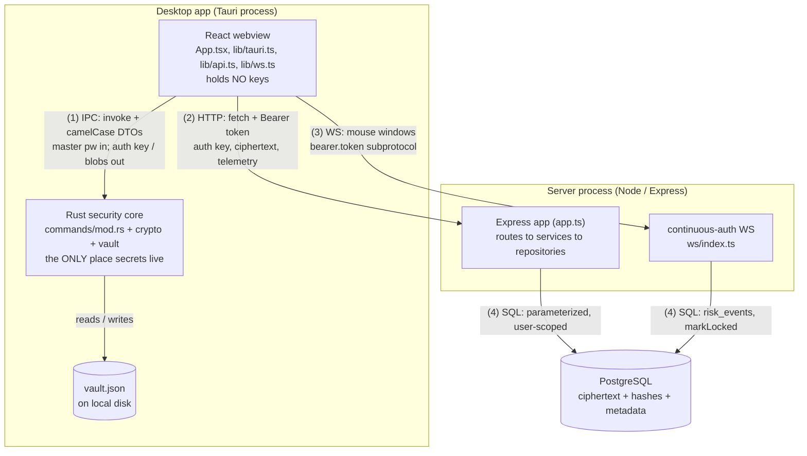
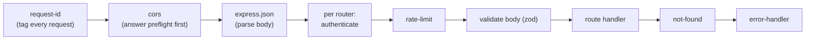

# Architecture — the four processes and how they talk

> Part of the [Cerberus encyclopedia](00-index.md). See also the [Overview](01-overview.md),
> the [Repository map](03-repository-map.md), and the [Glossary](13-glossary.md).

---

## 1. In plain English

Cerberus is a password vault that watches *how you type and move the mouse* and only lets you in
if both your password **and** your behaviour look right. To do that safely it is split into four
separate running programs (we call them "processes"), each with one job and a strict boundary
between them:

1. A **Rust security core** — the only place that ever sees your master password or any decryption
   key. Think of it as a sealed safe-room: secrets go in, encrypted blobs come out, and nothing
   secret ever crosses the door.
2. A **React webview** — the screens you see and click. It is "dumb" on purpose: it holds no keys
   and does no crypto; it just shows things and shuttles requests between the safe-room and the
   internet.
3. An **Express server** (Node.js) — the online brain. It stores ciphertext, verifies your
   identity, and runs the *risk decision* (behaviour + context → grant / step-up / deny). It is
   deliberately **blind**: it never receives your password or any key it could use to decrypt your
   vault.
4. A **PostgreSQL database** — the server's filing cabinet. It holds only encrypted blobs, hashes,
   and non-secret metadata.

Plus one extra "live wire": a **WebSocket** that stays open while you use the vault, streaming
mouse-movement statistics so the server can lock you out mid-session if your movements suddenly
look like somebody else.

The acronyms you will meet (each defined again in the [glossary](13-glossary.md)):
**IPC** (Inter-Process Communication — how the webview talks to the Rust core),
**HTTP** (HyperText Transfer Protocol — ordinary request/response web calls),
**WS** (WebSocket — a long-lived two-way connection),
**SQL** (Structured Query Language — how the server talks to the database),
**KDF** (Key Derivation Function — turning a password into a key),
**AEAD** (Authenticated Encryption with Associated Data — encryption that also detects tampering),
**TOTP** (Time-based One-Time Password — the 6-digit codes from an authenticator app).

---

## 2. Where it lives

This doc covers the *entry points and wiring* of all four processes — not the deep internals of
each subsystem (those have their own docs). The files in scope:

```
cerberus/
├── apps/
│   ├── desktop/
│   │   ├── src-tauri/src/
│   │   │   ├── main.rs              binary entry point (Tauri app)
│   │   │   ├── lib.rs               library crate root; the `desktop` feature gate
│   │   │   └── commands/mod.rs      the 12 #[tauri::command] IPC handlers + run()
│   │   └── src/
│   │       ├── main.tsx             React entry point (mounts <App/>)
│   │       ├── App.tsx              two-state shell: AuthScreen ↔ VaultView
│   │       └── lib/
│   │           ├── tauri.ts         IPC client (invoke + zod-validate replies)
│   │           ├── api.ts           HTTP client (fetch + zod-validate replies)
│   │           └── ws.ts            continuous-auth WebSocket client
│   └── server/
│       └── src/
│           ├── index.ts             server bootstrap (config, pool, listen)
│           ├── app.ts               builds Express with the fixed middleware order
│           ├── ws/index.ts          continuous-auth WebSocket (HTTP upgrade)
│           ├── middleware/authenticate.ts   Bearer-token session check
│           └── routes/auth.ts       login / step-up / register HTTP surface
```

---

## 3. File-by-file

### The Rust core (the safe-room)

**[main.rs](../../apps/desktop/src-tauri/src/main.rs)** — the binary that the OS launches.
Its `main()` (line 7) is one line: `cerberus_desktop::run()`. Per project rule §4.1 the
binary stays trivial; all real work is in the library. The `#![cfg_attr(...)]` at line 5 hides
the console window in release builds on Windows.

**[lib.rs](../../apps/desktop/src-tauri/src/lib.rs)** — the library crate root. It declares the
modules and, crucially, holds the **feature gate**. `pub mod commands;` (line 13) is annotated
`#[cfg(feature = "desktop")]`, and so is the real `run()` (line 22). When the `desktop` Cargo
feature is **off**, `commands` is not compiled at all and `run()` becomes an empty stub
(line 30). This is what lets the crypto core build and test *without* the Tauri runtime
(see §6 and [ADR-0003](../adr/0003-hermetic-phase0-ci-deferred-tauri.md), referenced in CLAUDE.md).
`crypto`, `error`, and `vault` are **not** gated — they are always compiled.

**[commands/mod.rs](../../apps/desktop/src-tauri/src/commands/mod.rs)** — the entire IPC surface.
It defines:
- `VaultState(Mutex<VaultManager>)` (line 27) — the one piece of shared, locked session state
  Tauri "manages" for the app.
- The **12 commands** (each a `#[tauri::command]`): `prepare_registration`,
  `derive_login_auth_key_cmd`, `seal_credential`, `open_credential`, `sync_pull_merge`, `unlock`,
  `lock`, `add_credential`, `list_credentials`, `get_credential`, `update_credential`,
  `delete_credential`.
- Small `…Dto` structs (`KdfParamsDto`, `RegistrationMaterialDto`, `BlobDto`, `ServerItemDto`,
  `MergeOutcomeDto`) — the on-the-wire shapes, all `#[serde(rename_all = "camelCase")]` so they
  match the TypeScript DTOs.
- `run()` (line 384) — builds the Tauri app: it resolves the OS app-data directory, creates
  `vault.json` there, `manage`s the `VaultState`, registers all 12 commands via
  `generate_handler!` (lines 393–406), and runs. On any setup error it prints and
  `std::process::exit(1)` — **fail closed**, never a half-started app.

Gotcha: the five heavy commands (`prepare_registration`, `derive_login_auth_key_cmd`,
`seal_credential`, `open_credential`, and `sync_pull_merge`) are `async fn`
and wrap their work in `tauri::async_runtime::spawn_blocking` so Argon2id (~0.5 s) runs off the
webview thread. But `unlock` (line 322) is a **synchronous** command that runs Argon2id on its
own invocation thread — flagged below in §6 and [§Gotchas](#6-gotchas--invariants).

> The deep behaviour of these commands (key derivation, AEAD, the merge) lives in
> [Cryptographic core](04-cryptographic-core.md) and [Vault & sync](05-vault-and-sync.md). This
> doc only treats them as the IPC *boundary*.

### The React webview (the screens)

**[main.tsx](../../apps/desktop/src/main.tsx)** — mounts React. Finds `#root`, throws if it is
missing, and `createRoot(...).render(<StrictMode><App/></StrictMode>)`. Nothing else.

**[App.tsx](../../apps/desktop/src/App.tsx)** — the top-level shell, and it is tiny on purpose.
It holds exactly two pieces of state: `session` (null ⇒ show `AuthScreen`; non-null ⇒ show
`VaultView`) and `lockReason` (presentation only — *why* we are back at the unlock screen). There
is **no router**: the whole app is "logged out" or "logged in". The comment at lines 8–14 spells
out the security stance: "No secret state lives here — keys stay in Rust."

**[lib/tauri.ts](../../apps/desktop/src/lib/tauri.ts)** — the typed client for the IPC wire. One
exported async function per Rust command (`prepareRegistration`, `deriveLoginAuthKey`,
`sealCredential`, `openCredential`, `unlock`, `syncPullMerge`, `lock`, `addCredential`,
`listCredentials`, `getCredential`, `updateCredential`, `deleteCredential`). Every one calls
`invoke('command_name', {...})` and then **zod-parses the reply** (`RegistrationMaterialSchema`,
`Base64ResultSchema`, etc.) before returning. The header comment (lines 1–7) states the rule:
"trust nothing across the process boundary, **including replies from Rust**." It also documents a
sharp edge (lines 27–32): invoke args must be **camelCase** keys (`masterPassword`) even though
the Rust params are snake_case (`master_password`) — Tauri v2 maps them; sending snake_case
yields a "missing required key" error. `errorMessage()` (line 173) normalizes any IPC error to a
non-leaking string.

**[lib/api.ts](../../apps/desktop/src/lib/api.ts)** — the typed client for the HTTP wire. Base URL
defaults to `http://localhost:8080` (overridable via `VITE_API_BASE_URL`). Two internal helpers:
`postJson` (unauthenticated — register/prelogin/login/step-up) and `authed` (adds
`Authorization: Bearer <token>`). Both **zod-parse every response body**. The exported functions
mirror the server routes: `register`, `prelogin`, `login`, `verifyStepUp`, `getVaultKey`,
`listVaultItems`/`getVaultItem`/`createVaultItem`/`updateVaultItem`/`deleteVaultItem`,
`submitEnrollmentSample`/`getEnrollmentStatus`, `getRiskEvents`, `elevateStepUp`, and the TOTP
trio (`getTotpStatus`/`setupTotp`/`confirmTotp`). `ApiError` (line 48) carries the HTTP status and
a best-effort parsed `detail` body. `apiBaseUrl()` (line 66) is reused by the WS client to derive
the socket origin. Gotcha: on a non-OK response `postJson` captures the JSON body into
`ApiError.detail` (so the dev-only deny breakdown can be read) but the *user-facing* message stays
generic — see [Decision & policy](07-decision-and-policy.md) and the no-risk-detail rule.

**[lib/ws.ts](../../apps/desktop/src/lib/ws.ts)** — the continuous-auth WebSocket client.
`openContinuousAuth(token, handlers)` (line 62) opens a socket to the `ws://…/ws/continuous-auth`
URL derived by `continuousAuthWsUrl()` (line 50), passing **two** subprotocols: the real one
(`CONTINUOUS_AUTH_SUBPROTOCOL`) and `bearer.<token>` (the auth token smuggled as a subprotocol,
because a browser `WebSocket` cannot set an `Authorization` header). It returns
`{ sendWindow, close }`: `sendWindow(features)` ships one `mouse_window` message (only if the
socket is OPEN); incoming `locked` messages call `handlers.onLocked()`, and the gated `score`
messages call the optional `handlers.onScore`. Every inbound message is zod-validated. The
header comment (lines 56–61) is important: a dropped socket is **fail-safe, not fail-open** —
losing the stream cannot grant access (the server is the authority).

### The Express server (the online brain)

**[index.ts](../../apps/server/src/index.ts)** — the bootstrap, and "no business logic here." Its
`main()` (line 13): load config → create the pg pool → open the offline GeoIP DB (falling back to
a demo geo table *only outside production*) → `createApp(...)` → wrap it in
`http.createServer(app)` → create the continuous-auth service → `attachContinuousAuthWebSocket` →
`listen(config.port)` (default 8080). Wrapping Express in a raw `http.Server` is necessary because
the WebSocket needs the HTTP `upgrade` event the bare Express app doesn't expose. Any startup
error sets `process.exitCode = 1`.

**[app.ts](../../apps/server/src/app.ts)** — assembles the Express app with the **fixed middleware
order** and wires routes → services → repositories via dependency injection. `createApp(pool,
config, deps)` (line 39): sets `trust proxy` from config (line 43), then registers global
middleware (`requestId`, `cors`, `express.json`), constructs the per-process rate limiters and all
the services (`scoring`, `enrollment`, `riskDecision`, `totp`, `auth`, `vault`, `riskInspector`),
builds the `authenticate` middleware from the sessions repository, and mounts the four routers
(auth, vault, enrollment, risk) plus the health route, finishing with `notFound` then
`errorHandler`. Injecting `pool` and `deps.geoLookup` is what lets tests run against an ephemeral
Postgres with a stub geo lookup. Covered in depth in [Server & API](09-server-and-api.md).

**[ws/index.ts](../../apps/server/src/ws/index.ts)** — the server half of the continuous-auth
socket. `attachContinuousAuthWebSocket(server, deps)` (line 87) creates a `noServer` WebSocket
server and listens for HTTP `upgrade` events. It **only** serves the path
`/ws/continuous-auth`; every other upgrade is `socket.destroy()`d (line 109 — there are no other
WS endpoints). It extracts the token (header *or* `bearer.<token>` subprotocol), looks up an
**active** session by token hash, and rejects with `401` if none (fail closed). Each accepted
connection runs `onConnection` → a per-session `evaluator`, and windows are processed **strictly
in order** through a promise chain (line 144) because the EWMA score is mutable per connection.
`handleWindow` (line 148) scores a window, streams a `score` message **only to step-up-confirmed
sessions** (the Risk Inspector), and on a spike: writes a `risk_events` row, calls
`sessions.markLocked`, sends `{type:'locked', reason:'risk'}`, and closes the socket. Detailed in
[Continuous auth](08-continuous-auth.md).

**[middleware/authenticate.ts](../../apps/server/src/middleware/authenticate.ts)** — the session
gate. `createAuthenticate(sessions)` (line 28) returns middleware that reads the `Bearer` token,
hashes it (`hashSessionToken`), looks up an active session, and attaches the non-secret
`AuthenticatedSession` to `res.locals.session`; any failure ⇒ `401` (fail closed).
`requireStepUpConfirmed` (line 77) runs *after* `authenticate` and returns `403` unless the
session passed a TOTP step-up — this is the **server-side** gate on the read-only Risk Inspector
(never "hide a button" security). Notice `AuthenticatedSession` carries `createdAt`, `isNewDevice`,
and `stepUpConfirmed` — fields the risk and inspector paths need.

**[routes/auth.ts](../../apps/server/src/routes/auth.ts)** — the thin HTTP surface for auth.
`createAuthRouter(deps)` (line 94) mounts `POST /auth/register`, `/auth/prelogin`, `/auth/login`,
`/auth/step-up/verify`, `/auth/step-up/elevate`, the TOTP endpoints, and `GET /auth/me`. The key
helper is `sendLoginResult` (line 58): it maps a `LoginResult` union to **distinct, non-leaking**
HTTP responses — `granted` ⇒ `200` + session token + wrapped vault key; `step_up` ⇒ `200
{status:'step_up_required'}`; `denied` ⇒ `403 {error:'denied'}` (with a `risk` breakdown attached
**only outside production**); `rate_limited` ⇒ `429` + `Retry-After`; `invalid_credentials` ⇒
`401`. This is the enforcement of the "each outcome a distinct, non-leaking message" invariant.

**Trivial files skipped:** `routes/index.ts` is a 9-line aggregator that currently mounts only
`healthRouter` (the auth/vault/enrollment/risk routers are mounted directly in `app.ts`). The
remaining middleware (`cors`, `request-id`, `rate-limit`, `not-found`, `error-handler`, `validate`,
`async-handler`) are covered in [Server & API](09-server-and-api.md).

---

## 4. How it works — the four wires

Everything in Cerberus moves across exactly four channels. Knowing which wire carries what (and,
just as importantly, what it must **never** carry) is the whole architecture.



### Wire 1 — Tauri IPC (webview ↔ Rust core)

The webview calls `invoke('command', { camelCaseArgs })`; Tauri serializes the args to the Rust
command, runs it, and serializes the reply back. The data that crosses **in**: the master password
(as a plain `String`, immediately wrapped in a zeroizing `SecretString` inside Rust). The data
that crosses **out**: the base64 auth key, public KDF params + salt, the opaque *wrapped* vault
key, per-credential ciphertext + nonce, and — only for `get_credential` — one credential's
plaintext to display. The encryption key, the vault key, and the master password itself **never**
cross back out. Both ends are paranoid: Rust returns only sanitized DTOs, and the webview
zod-parses every reply ([tauri.ts](../../apps/desktop/src/lib/tauri.ts) lines 1–7).

> ⚠️ The on-disk `vault.json` is snake_case JSON while the IPC DTOs are camelCase — the same data
> in two encodings. See [Vault & sync](05-vault-and-sync.md).

### Wire 2 — HTTP (webview ↔ server)

Ordinary `fetch` to `http://localhost:8080`. Unauthenticated for register/prelogin/login/step-up;
everything else carries `Authorization: Bearer <session token>`. Requests flow through the fixed
middleware chain (below). The client zod-validates every response; the server zod-validates every
request body. What the client sends the server: the **auth key** (not the password), public KDF
params, opaque ciphertext blobs, and behavioral telemetry. What it never sends: the master
password or any decryption key.

### Wire 3 — WebSocket (webview ↔ server, continuous auth)

A single long-lived connection on `/ws/continuous-auth`, opened after the vault unlocks. The
session token rides as a `bearer.<token>` **subprotocol** because browsers cannot set headers on a
WebSocket. The client streams `mouse_window` messages (9-dimensional motion statistics — never raw
pointer positions); the server replies with `score` messages (only to step-up-confirmed sessions)
and, on a risk spike, a `locked` message before closing. Detailed in
[Continuous auth](08-continuous-auth.md).

### Wire 4 — SQL (server ↔ PostgreSQL)

All SQL lives in `repositories/*`, every query parameterized and scoped to the authenticated
`user_id` (no IDOR — Insecure Direct Object Reference). Routes never touch the database; services
call repositories. The database stores only ciphertext, hashes, and non-secret metadata — it is
the embodiment of "the server is blind." Detailed in [Database](10-database.md).

### The fixed middleware order (the server's request pipeline)

`app.ts` mounts middleware in one deliberate order; reordering it would break either security or
correctness. The order (from [app.ts](../../apps/server/src/app.ts) lines 45–130, matching
PROJECT.md §4.3):



- **request-id first** so every later log/error can reference the same id.
- **cors before any handler** so the webview's cross-origin preflight is answered before auth (a
  preflight has no token; gating it on auth would break the browser, [app.ts](../../apps/server/src/app.ts) lines 46–48).
- **authenticate before rate-limit** on protected routes so per-user limiting can key on the
  identity, and before validate so an unauthenticated caller never reaches body parsing.
- **not-found then error-handler last** — anything that fell through becomes a clean 404, and any
  thrown error becomes a non-leaking response.

What breaks if you did it the naive way? Put `validate` before `authenticate` and an anonymous
caller could probe your schema; put `cors` after `authenticate` and the browser preflight (which
carries no credentials) gets a 401 and the real request never fires.

---

## 5. How it connects — the desktop `desktop` Cargo feature

The single most important *build-time* architectural fact: the Rust crate has two faces.

**Plain English.** The same Rust code can be compiled in two modes. In "core" mode it is just a
crypto library with no GUI — fast to test, no Tauri, no operating-system dependencies. In "desktop"
mode it additionally pulls in the Tauri runtime and the 12 IPC command handlers to become the real
app. A feature flag switches between them.

**The mechanism.** In [lib.rs](../../apps/desktop/src-tauri/src/lib.rs), `pub mod commands;`
(line 13) and the real `pub fn run()` (line 22) are both annotated `#[cfg(feature = "desktop")]`.
When the feature is off, the compiler skips `commands` entirely and substitutes the empty
`run()` stub (line 29–30). The `crypto`, `error`, and `vault` modules carry no gate — they always
compile. Cargo also only pulls `tauri`, `tauri-build`, and `time =0.3.47` under the `desktop`
feature (per the recon parameter table and CLAUDE.md).

**Why.** Two reasons. (1) **Hermetic CI** — one CI job builds and tests just the crypto/vault core
with no Tauri at all (fast, deterministic, [ADR-0003](../adr/0003-hermetic-phase0-ci-deferred-tauri.md)).
A separate job builds the full desktop app `--features desktop`. (2) **Blast radius** — the
security-critical primitives are provably independent of the GUI framework; you can audit and
fuzz them without dragging in a browser engine. What breaks if you didn't do this? The crypto tests
would require a full desktop toolchain (and a display) to run, CI would be slow and flaky, and a
Tauri vulnerability would sit in the same compilation unit as your key derivation.

This piece hands the webview a stable IPC surface (12 commands) and hands CI a tiny, dependency-light
core to verify. See [Build, run, test](12-build-run-test.md) for the actual CI jobs and
[Cryptographic core](04-cryptographic-core.md) for what lives inside the always-compiled modules.

---

## 6. Follow a login — end to end

Here is the whole system in motion. A returning user types their master password and presses
Enter. Watch the data — note that the password is captured for *timing* before it is sent to Rust
for *derivation*, and that it **never** reaches the server.

The numbered steps below are confirmed against [api.ts](../../apps/desktop/src/lib/api.ts),
[tauri.ts](../../apps/desktop/src/lib/tauri.ts), [routes/auth.ts](../../apps/server/src/routes/auth.ts),
[authenticate.ts](../../apps/server/src/middleware/authenticate.ts), and the recon trace (§7 of the
[recon notes](00-RECON-NOTES.md)). The risk-engine internals are cross-referenced, not repeated.

```mermaid
sequenceDiagram
    actor U as User
    participant W as React webview
    participant R as Rust core
    participant S as Express server
    participant DB as PostgreSQL

    Note over W: keystroke capture records hold/flight<br/>timing by POSITION, never the characters
    U->>W: type master password, press Enter

    W->>S: POST /auth/prelogin {username}
    S->>DB: lookup user KDF params + salt
    S-->>W: public KDF params + salt<br/>(deterministic dummy salt if unknown user)

    W->>R: invoke derive_login_auth_key_cmd(pw, salt, params)
    Note over R: Argon2id (spawn_blocking, off UI thread)<br/>then HKDF-SHA256 to the auth key
    R-->>W: base64 auth key (master pw stays in Rust)

    W->>S: POST /auth/login {authKey, deviceFingerprintHash, keystrokeSample}
    S->>DB: verify auth key vs stored Argon2id hash (constant-time)
    S->>DB: enrol / look up device (new device?)
    Note over S: behavioral sub-score (Mahalanobis to chi-squared)<br/>fail-closed to 1 if telemetry missing
    Note over S: contextual sub-scores (new-device, geovelocity,<br/>time-of-day, failure-velocity)
    Note over S: combine to composite, band it (grant / step-up / deny)
    S->>DB: write risk_events row

    alt composite below step-up band
        S-->>W: 200 granted: session token + wrapped vault key
    else step-up band
        S-->>W: 200 step_up_required + challengeToken
        U->>W: enter 6-digit TOTP code
        W->>S: POST /auth/step-up/verify {challengeToken, code}
        S->>DB: RFC 6238 verify (plus/minus 1 step) + replay watermark
        S-->>W: 200 granted: session token + wrapped vault key
    else deny band
        S-->>W: 403 denied (generic)
    end

    W->>R: invoke unlock(master pw)  [re-derive keys, decrypt local vault]
    W->>S: GET /vault/items + /vault/key  (Bearer token)
    S-->>W: encrypted server blobs + server wrapped vault key
    W->>R: invoke sync_pull_merge(...)  [decrypt under server key,<br/>re-encrypt under local key, merge]
    R-->>W: merge counts only (no secrets)

    Note over W,S: VaultView opens continuous-auth WS
    W->>S: WS connect /ws/continuous-auth (bearer.token subprotocol)
    loop while unlocked
        W->>S: mouse_window {9 features}
        S->>S: EWMA composite; spike?
        opt step-up-confirmed session
            S-->>W: score (Inspector telemetry only)
        end
    end
    opt mouse spike
        S->>DB: write risk_events + markLocked
        S-->>W: locked (reason risk)
        W->>R: lock()  [zeroize keys]; back to unlock screen
    end
```

Step-by-step, in the order the code runs:

1. **Keystroke capture.** As the user types, the webview's keystroke capture records hold and
   flight *durations* indexed by keystroke **position** — never the characters
   ([behavioral capture invariant](06-behavioral-engine.md)). This is the behavioral sample sent
   with login.

2. **Prelogin.** The webview calls `prelogin({username})`
   ([api.ts](../../apps/desktop/src/lib/api.ts) line 95). The server returns the user's *public*
   KDF params + salt — or, for an **unknown** user, a deterministic dummy salt derived from
   `HMAC-SHA256(secret, username)` so unknown and known users look identical (anti-enumeration;
   see [Server & API](09-server-and-api.md)).

3. **Derive in Rust.** The webview calls
   `deriveLoginAuthKey(masterPassword, kdfSalt, kdfParams)`
   ([tauri.ts](../../apps/desktop/src/lib/tauri.ts) line 46 →
   `derive_login_auth_key_cmd`, [commands/mod.rs](../../apps/desktop/src-tauri/src/commands/mod.rs)
   line 99). Inside Rust, Argon2id runs via `spawn_blocking` (off the UI thread), then HKDF-SHA-256
   derives the **auth key**. The master password and encryption key stay in Rust; only the base64
   auth key comes back. (Math + parameters: [Cryptographic core](04-cryptographic-core.md#key-hierarchy).)

4. **Login.** The webview calls `login({username, authKey, deviceFingerprintHash,
   keystrokeSample})` ([api.ts](../../apps/desktop/src/lib/api.ts) line 99). The request flows
   through `request-id → cors → json → ipLimit → validate` and into the handler
   ([routes/auth.ts](../../apps/server/src/routes/auth.ts) line 123). The auth service:
   - verifies the auth key against the stored Argon2id hash in **constant time** (a fixed dummy
     hash equalizes timing for unknown users);
   - enrols or looks up the device (a brand-new device is a contextual signal);
   - computes the **behavioral sub-score** (Mahalanobis distance → χ², [behavioral
     engine](06-behavioral-engine.md)); fail-closed to score `1` ("missing") if telemetry is absent
     or mismatched — omitting the sample cannot bypass the check;
   - computes the **contextual sub-scores** (new-device, geovelocity, time-of-day,
     failure-velocity, [decision & policy](07-decision-and-policy.md));
   - **combines** them into a composite and **bands** it: grant (below 0.30), step-up
     (0.30–0.70), deny (≥ 0.70) — plus backstops and a newcomer bootstrap-grant;
   - writes a `risk_events` row.

5. **Outcome → distinct, non-leaking response.** `sendLoginResult`
   ([routes/auth.ts](../../apps/server/src/routes/auth.ts) line 58) maps the result: granted ⇒
   `200` with the session token + the server's wrapped vault key; step-up ⇒ `200
   {status:'step_up_required', challengeToken}`; denied ⇒ generic `403`; rate-limited ⇒ `429`;
   bad creds ⇒ `401`. The `risk` breakdown rides on the 403 **only outside production**.

6. **TOTP step-up (only if required).** The webview shows a 6-digit prompt and calls
   `verifyStepUp({challengeToken, code})`
   ([api.ts](../../apps/desktop/src/lib/api.ts) line 104). The server verifies the RFC 6238 code
   (±1 step) against a monotonic replay watermark and, on success, returns a granted session via
   the same `sendLoginResult` path.

7. **Unlock + pull.** With a session in hand, the webview calls `unlock(masterPassword)`
   ([tauri.ts](../../apps/desktop/src/lib/tauri.ts) line 105) so Rust re-derives the keys and
   decrypts the *local* vault, then fetches the server's encrypted items and wrapped vault key and
   calls `syncPullMerge(...)` — Rust decrypts each blob under the **server** vault key and
   re-encrypts under the **local** vault key, merging by revision. Plaintext never crosses back to
   the webview; only counts do ([Vault & sync](05-vault-and-sync.md)).

8. **In session.** `VaultView` opens the continuous-auth WebSocket
   ([ws.ts](../../apps/desktop/src/lib/ws.ts)) and streams mouse windows. The server scores each
   with an EWMA; a spike writes a `risk_events` row, marks the session locked, and sends `locked`
   — the client zeroizes keys and returns to the unlock screen
   ([Continuous auth](08-continuous-auth.md)).

---

## 7. Gotchas & invariants

- **The webview holds no keys.** `App.tsx` keeps only a session token and presentation flags;
  every secret lives in the Rust core. This is the load-bearing zero-knowledge invariant
  (CLAUDE.md §1–§2). Breaking it (e.g. returning a derived key from a command) defeats the whole
  design.

- **Trust nothing across a boundary — including Rust.** Both `tauri.ts` and `api.ts` zod-parse
  *every* reply; the server zod-validates every request body and the WS clients validate every
  frame. A boundary that skips validation is a bug, not an optimization.

- **`unlock` is synchronous.** Unlike the five async `spawn_blocking` commands,
  [`unlock`](../../apps/desktop/src-tauri/src/commands/mod.rs) (line 322) is
  `#[tauri::command] pub fn unlock(...)` and runs Argon2id on its invocation thread. The handoff
  flags this as a known open item.
  > ⚠️ **Unverified:** whether Tauri dispatches synchronous commands off the webview's main thread
  > (so the UI does not actually freeze during the ~0.5 s derivation). To confirm, profile an
  > `unlock` call or check the Tauri v2 command-dispatch docs for the version pinned in
  > `Cargo.toml`. The five heavy commands deliberately use `async` + `spawn_blocking` and are not
  > in doubt.

- **Each login outcome is a distinct, non-leaking message.** `sendLoginResult` renders granted /
  step-up / 401 / 403 / 429 as separate responses that never reveal *which* signal fired (CLAUDE.md
  §6). The dev-only `risk` breakdown is attached to the 403 *only outside production* — in a shipped
  build it is `undefined` and omitted ([routes/auth.ts](../../apps/server/src/routes/auth.ts)
  lines 73–80).

- **Fail closed at every fork.** Setup error ⇒ `exit(1)`; missing/invalid session ⇒ `401`;
  non-step-up session at the inspector ⇒ `403`; missing behavioral telemetry ⇒ score `1`; a corrupt
  sync blob is *skipped*, not fatal; a dropped WS is fail-safe (cannot grant access). Ambiguity
  always escalates or denies.

- **Only one WebSocket path exists.** `ws/index.ts` `socket.destroy()`s every upgrade that is not
  `/ws/continuous-auth` (line 109). There is no other WS endpoint to probe.

- **`routes/index.ts` is nearly empty.** It mounts only `healthRouter`; the auth/vault/enrollment/
  risk routers are mounted directly in `app.ts`. Do not assume new route groups go through the
  aggregator — currently they don't.

- **CORS comes before everything but request-id.** And `authenticate` comes before `rate-limit`
  and `validate` on protected routes. The order is a security property, not a style choice
  (PROJECT.md §4.3).

- **`trust proxy` default and an ADR conflict.** `app.ts` line 43 sets `trust proxy` from
  `config.trustProxy`, which defaults to `false` ([config.ts](../../apps/server/src/config.ts)
  line 267, env `TRUST_PROXY`). ADR-0007 prose says the app does *not* set trust proxy while
  ADR-0011 says it is configured via `TRUST_PROXY`; the **code matches ADR-0011** (it always calls
  `app.set('trust proxy', …)`), and ADR-0011 supersedes. Behind a reverse proxy this must be set so
  per-IP rate limiting and geovelocity read the real client IP.

- **Protocol constants are hand-synced, not compile-checked.** The crypto constants live in both
  `packages/protocol` (TS) and the Rust core; silent drift would break auth/decrypt. See
  [Cryptographic core](04-cryptographic-core.md).
