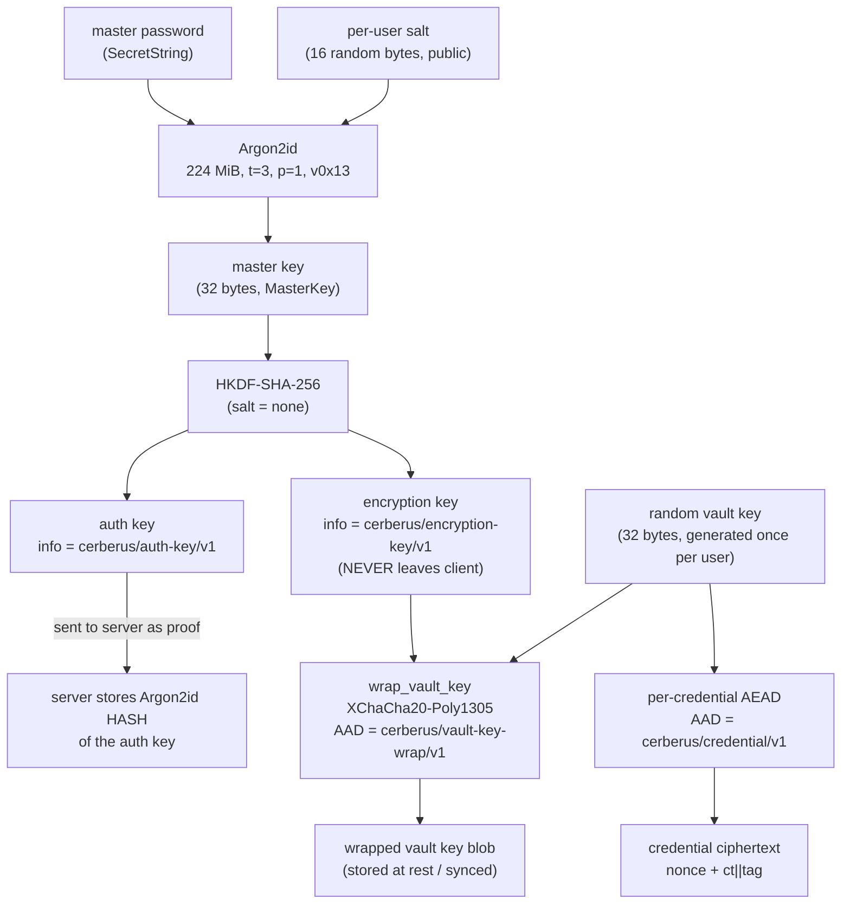

# 04 — Cryptographic core: the Rust security core and the key hierarchy

> **Scope.** This document covers the cryptographic heart of Cerberus: the Rust
> modules under `apps/desktop/src-tauri/src/crypto/` (key derivation, authenticated
> encryption, secret types), the crypto half of `vault/mod.rs` (credential
> encrypt/decrypt and master-password rotation), the single error enum in
> `error.rs`, the shared constant file `packages/protocol/src/index.ts`, and the
> two binding decisions in [ADR-0001](../../docs/adr/0001-crypto-model.md) and
> [ADR-0005](../../docs/adr/0005-crypto-wire-format-and-domain-separation.md).
>
> For the deeper math behind the primitives (Argon2id's memory-hard inner loop,
> HKDF's extract/expand, Poly1305's MAC) see the
> [algorithms deep-dive](14-algorithms-deep-dive.md). For how these keys are used
> to unlock and sync a vault, see [Vault and sync](05-vault-and-sync.md). For where
> this core sits in the whole system, see [Architecture](02-architecture.md).

---

## 1. In plain English

Cerberus is a **zero-knowledge** password vault: the server only ever stores
scrambled data, never your master password or your actual passwords. For that
promise to hold, all the real cryptography has to happen on *your* machine — and in
Cerberus it happens inside a small, carefully-written **Rust core** that ships
inside the desktop app. (Rust is a systems programming language chosen here because
it makes it easy to wipe secrets from memory and hard to leak them by accident.)

Everything starts from one thing you type: your **master password**. From it the
core grows a small family tree of keys:

- A slow, deliberately-expensive function (**Argon2id**) turns the password into a
  single 32-byte **master key**.
- A fast key-splitter (**HKDF**) splits that master key into two independent keys:
  an **auth key** (a login proof handed to the server) and an **encryption key**
  (which never leaves your machine).
- The encryption key doesn't directly encrypt your passwords. Instead it
  *wraps* (encrypts) a separate random **vault key**. The vault key is what
  actually encrypts each individual credential.

That last layer of indirection is the clever bit: when you change your master
password, Cerberus only has to re-wrap one small key — it does **not** have to
re-encrypt your entire vault.

Jump to the [key-hierarchy diagram](#key-hierarchy) for the whole picture at a
glance.

---

## 2. Where it lives

```
apps/desktop/src-tauri/src/
├── crypto/
│   ├── mod.rs        key hierarchy glue: generate/wrap/unwrap the vault key, re-exports
│   ├── kdf.rs        Argon2id (master key) + HKDF-SHA-256 (auth/encryption keys)
│   ├── aead.rs       XChaCha20-Poly1305 seal/open + AeadCiphertext
│   └── secret.rs     zeroizing, redacted, constant-time secret newtypes
├── error.rs          the single AppError enum returned across every boundary
└── vault/
    └── mod.rs        encrypt_credential / decrypt_credential / rotate_master_password

packages/protocol/src/index.ts   the crypto CONSTANTS, mirrored by Rust (no logic)

docs/adr/0001-crypto-model.md     the key hierarchy + primitive choices
docs/adr/0005-crypto-wire-format-and-domain-separation.md   on-wire byte format + AAD labels
```

> The on-disk serialization (`vault/store.rs`, the base64 `StoredBlob`) is touched
> briefly here for the wire format, but is documented in full in
> [Vault and sync](05-vault-and-sync.md). The Tauri command wrappers that call into
> this core live in `commands/mod.rs`, also covered there.

---

## 3. File-by-file

### `crypto/secret.rs` — the secret types

**Job:** define the typed, self-cleaning containers that hold every secret so they
can't leak, can't be confused with one another, and can't be compared insecurely.

- **Key types (all 32 bytes):** `MasterKey`, `AuthKey`, `EncryptionKey`, `VaultKey`
  — each a distinct newtype generated by the `define_key!` macro
  ([secret.rs:20-59](../../apps/desktop/src-tauri/src/crypto/secret.rs#L20)). Each
  exposes `from_bytes`, `from_slice` (length-checked), `as_bytes`, and `ct_eq`
  (constant-time equality).
- **`SecretString`** ([secret.rs:79](../../apps/desktop/src-tauri/src/crypto/secret.rs#L79)) —
  holds the master password; `expose()` hands the raw `&str` to the KDF.
- **`SecretBytes`** ([secret.rs:109](../../apps/desktop/src-tauri/src/crypto/secret.rs#L109)) —
  holds decrypted credential plaintext.
- **`KEY_LEN = 32`** ([secret.rs:17](../../apps/desktop/src-tauri/src/crypto/secret.rs#L17)) —
  the one length for every symmetric key (256-bit).

Every one of these `derive`s `Zeroize + ZeroizeOnDrop` (bytes wiped when the value
goes out of scope), implements a redacted `Debug` that prints e.g.
`MasterKey([redacted])`, and compares via the `subtle` crate's constant-time
`ct_eq`. **Imports:** `subtle`, `zeroize`, `AppError`. **Imported by:** every other
crypto and vault module.

### `crypto/kdf.rs` — key derivation

**Job:** turn the master password into the master key (Argon2id), then split the
master key into the auth key and the encryption key (HKDF-SHA-256).

- **`KdfParams`** + **`KdfParams::V1`** ([kdf.rs:26-44](../../apps/desktop/src-tauri/src/crypto/kdf.rs#L26)) —
  the pinned Argon2id cost: `memory_kib = 229_376` (224 MiB), `iterations = 3`,
  `parallelism = 1`.
- **`KDF_VERSION = 1`** ([kdf.rs:18](../../apps/desktop/src-tauri/src/crypto/kdf.rs#L18)) —
  the parameter-set version, stored per user.
- **`derive_master_key`** ([kdf.rs:56](../../apps/desktop/src-tauri/src/crypto/kdf.rs#L56)) —
  Argon2id over `(password, salt, params)`.
- **`derive_auth_key`** / **`derive_encryption_key`** ([kdf.rs:92,100](../../apps/desktop/src-tauri/src/crypto/kdf.rs#L92)) —
  HKDF-expand the master key under two distinct `info` labels.

**Imports:** `argon2`, `hkdf`, `sha2`, `zeroize`, the secret types, `AppError`.
**Imported by:** `vault/account.rs` (registration + login derivation) and the Tauri
commands.

### `crypto/aead.rs` — authenticated encryption

**Job:** the only encrypt/decrypt primitive in the system — XChaCha20-Poly1305,
authenticated, with a fresh random nonce per operation.

- **`NONCE_LEN = 24`** ([aead.rs:15](../../apps/desktop/src-tauri/src/crypto/aead.rs#L15)) —
  192-bit nonce.
- **`AeadCiphertext`** ([aead.rs:19-25](../../apps/desktop/src-tauri/src/crypto/aead.rs#L19)) —
  `{ nonce: [u8; 24], ciphertext: Vec<u8> }` where `ciphertext` already includes the
  16-byte Poly1305 tag appended.
- **`seal`** ([aead.rs:29](../../apps/desktop/src-tauri/src/crypto/aead.rs#L29)) —
  encrypt + authenticate, generating the random nonce.
- **`open`** ([aead.rs:50](../../apps/desktop/src-tauri/src/crypto/aead.rs#L50)) —
  decrypt + verify; any tampering or wrong key → `AppError::Decryption`.

**Imports:** `chacha20poly1305`, the `KEY_LEN` constant, `AppError`. **Imported
by:** `crypto/mod.rs` (vault-key wrap) and `vault/mod.rs` (credential encrypt).

### `crypto/mod.rs` — the hierarchy glue

**Job:** assemble the primitives into the vault-key layer and re-export the public
crypto surface.

- **`VAULT_KEY_AAD = b"cerberus/vault-key-wrap/v1"`** ([mod.rs:29](../../apps/desktop/src-tauri/src/crypto/mod.rs#L29)) —
  the domain-separation label for wrapped vault keys.
- **`generate_vault_key`** ([mod.rs:32](../../apps/desktop/src-tauri/src/crypto/mod.rs#L32)) —
  32 fresh random bytes from the OS RNG.
- **`wrap_vault_key`** / **`unwrap_vault_key`** ([mod.rs:41,47](../../apps/desktop/src-tauri/src/crypto/mod.rs#L41)) —
  AEAD-encrypt / decrypt the vault key under the encryption key, bound to
  `VAULT_KEY_AAD`.

This file also re-exports the whole crypto API (`pub use` at
[mod.rs:23-25](../../apps/desktop/src-tauri/src/crypto/mod.rs#L23)).

### `vault/mod.rs` (crypto portion) — credentials + rotation

**Job:** encrypt/decrypt individual credentials and rotate the master password.

- **`CREDENTIAL_AAD = b"cerberus/credential/v1"`** ([vault/mod.rs:30](../../apps/desktop/src-tauri/src/vault/mod.rs#L30)) —
  the credential domain-separation label.
- **`encrypt_credential`** / **`decrypt_credential`** ([vault/mod.rs:33,39](../../apps/desktop/src-tauri/src/vault/mod.rs#L33)) —
  seal/open a credential blob under the vault key.
- **`rotate_master_password`** ([vault/mod.rs:51](../../apps/desktop/src-tauri/src/vault/mod.rs#L51)) —
  unwrap the vault key with the old encryption key, re-wrap it under the new one;
  credentials are **not** touched.

> ⚠️ **`rotate_master_password` is implemented and tested but is not wired to any
> Tauri command** — there is no IPC path that invokes it on this branch (confirmed
> against the command list in [the recon notes §5a / §11](00-RECON-NOTES.md)). The
> rotation *property* is proven by a unit test
> ([vault/mod.rs:114](../../apps/desktop/src-tauri/src/vault/mod.rs#L114)); the
> end-to-end password-change flow is not exposed yet.

### `error.rs` — the one error type

**Job:** a single `thiserror` enum, `AppError`
([error.rs:18-53](../../apps/desktop/src-tauri/src/error.rs#L18)), returned by every
fallible path. Its messages are deliberately generic so they never leak crypto
detail. Crucially, **a wrong key and a tampered ciphertext both surface as the same
`AppError::Decryption`** — the caller learns "authentication failed", nothing more.

### `packages/protocol/src/index.ts` — the constants mirror

**Job:** hold the crypto constants (`KDF_VERSION`, `ARGON2ID_PARAMS`, `HKDF_HASH`,
`HKDF_INFO`, `AEAD_ALGORITHM`) as the documented single source of truth for the
TypeScript side, **mirroring** the Rust values by hand. No logic lives here.

> ⚠️ **These constants are duplicated, not compile-checked.** The Rust core and
> `packages/protocol` hold the same numbers/labels independently; nothing fails the
> build if they drift. A divergence would silently break login or decryption. This
> is flagged in [the recon notes §11.8](00-RECON-NOTES.md).

---

## 4. The key hierarchy {#key-hierarchy}



---

## 5. How it works — follow the data

This is the order the code runs, from a typed password to stored ciphertext.

### Step 0 — wrap the password (`SecretString`)

The webview hands the master password into Rust, where it immediately becomes a
`SecretString` ([secret.rs:79](../../apps/desktop/src-tauri/src/crypto/secret.rs#L79)).
From this point on it can only be looked at through `expose()`, prints as
`[redacted]`, and is zeroized the moment it drops.

### Step 1 — Argon2id: password → master key

#### (a) Intuition

A normal hash is fast — and that's a problem for passwords, because an attacker who
steals the salt can try billions of guesses per second on a GPU. Argon2id is a
**deliberately slow, deliberately memory-hungry** hash. Think of it as forcing every
single guess to fill a 224-megabyte scratchpad and stir it for a fixed number of
passes. Doing that once when *you* log in is a half-second you barely notice; doing
it billions of times on rented GPUs is economically ruinous for an attacker. The
memory requirement specifically defeats cheap parallel hardware (GPUs/ASICs) that
have lots of compute but little fast memory per core.

#### (b) Mechanism

Argon2id (the hybrid, side-channel-resistant Argon2 variant, RFC 9106) takes
`(password, salt, m, t, p, output_len)`:
- `m` = memory in KiB (fills an `m`-KiB matrix of blocks),
- `t` = iterations (passes over that matrix),
- `p` = parallelism (lanes),
- output_len = 32 bytes here.

It outputs a 32-byte master key. Same inputs → same output (deterministic);
different salt → different key.

#### (c) Where in the code

[`derive_master_key`, kdf.rs:56-79](../../apps/desktop/src-tauri/src/crypto/kdf.rs#L56):

```rust
let argon_params = Params::new(params.memory_kib, params.iterations,
                               params.parallelism, Some(KEY_LEN))?;
let argon = Argon2::new(Algorithm::Argon2id, Version::V0x13, argon_params);
argon.hash_password_into(password.expose().as_bytes(), salt, &mut out)?;
```

The pinned production parameters are `KdfParams::V1`
([kdf.rs:39-43](../../apps/desktop/src-tauri/src/crypto/kdf.rs#L39)):
`memory_kib = 229_376` (= 224 × 1024 KiB), `iterations = 3`, `parallelism = 1`,
`Version::V0x13` (= 0x13 = 19, the current Argon2 version). The 32-byte output
stack buffer `out` is `zeroize()`d on every path — success *or* error
([kdf.rs:77](../../apps/desktop/src-tauri/src/crypto/kdf.rs#L77)).

The salt must be 8–64 bytes (Argon2's requirement); the expected caller input is a
16-byte random salt. A too-short salt returns `AppError::KeyDerivation` rather than
panicking ([test at kdf.rs:216](../../apps/desktop/src-tauri/src/crypto/kdf.rs#L216)).

#### (d) Worked example

Memory cost: `229_376 KiB = 229_376 × 1024 bytes = 234,881,024 bytes ≈ 224 MiB`.
With `t = 3` the algorithm passes over that whole 224 MiB block matrix three times
before squeezing out the 32-byte key. [ADR-0001](../../docs/adr/0001-crypto-model.md)
records a measured **~521 ms per derivation** on the target hardware (release build,
mean of 5 runs) — see the timing caveat in [§6](#6-gotchas--invariants).

#### Why slow on purpose / KDF versioning

ADR-0001 explains the choice: the original 64 MiB / t=3 / p=1 starting point
benchmarked at ~134 ms, comfortably under the ~0.5 s target, so memory cost was
raised to 224 MiB to maximize memory-hardness against GPU/ASIC brute force (threat
A7) while staying on the ~0.5 s budget. **What breaks if you lower it?** Cracking a
stolen vault gets cheaper — the entire security margin of the at-rest data depends
on this cost. The project's own rules forbid lowering it to "fix" UI lag; the fix is
concurrency (run it off the UI thread), not weaker crypto.

Because parameters may need to rise as hardware improves, every user's KDF params
are stored *alongside their vault* and tagged with `KDF_VERSION`
([kdf.rs:18](../../apps/desktop/src-tauri/src/crypto/kdf.rs#L18)). Raising the cost
later bumps the version; old vaults still open under their original recorded params.
The persisted params live in `StoredKdf` (`store.rs`), and the version is mirrored in
`packages/protocol` as `KDF_VERSION = 1`.

### Step 2 — HKDF-SHA-256: master key → auth key + encryption key

#### (a) Intuition

We need *two* keys from the one master key, and we need them to be completely
independent: learning the auth key (which we hand to the server) must reveal nothing
about the encryption key (which decrypts your vault). HKDF is a "key splitter": feed
it one strong key plus a short text **label**, and it deterministically produces a
fresh key bound to that label. Two different labels → two unrelated keys, even though
they come from the same root.

#### (b) Mechanism

HKDF (RFC 5869) is extract-then-expand. Here the master key is already
high-entropy, so only the **expand** stage matters: `HKDF-Expand(prk = master_key,
info = label, L = 32)`. The `info` parameter is the domain-separation label.
Different `info` ⇒ different output stream.

#### (c) Where in the code

[`expand`, kdf.rs:82-89](../../apps/desktop/src-tauri/src/crypto/kdf.rs#L82):

```rust
let hk = Hkdf::<Sha256>::new(None, master.as_bytes()); // salt = None
hk.expand(info, &mut okm)?;
```

Two labels ([kdf.rs:21-23](../../apps/desktop/src-tauri/src/crypto/kdf.rs#L21)):
- `HKDF_INFO_AUTH = b"cerberus/auth-key/v1"` → `derive_auth_key`
- `HKDF_INFO_ENC = b"cerberus/encryption-key/v1"` → `derive_encryption_key`

Each derivation zeroizes its 32-byte output buffer after wrapping it in the typed
key ([kdf.rs:95,103](../../apps/desktop/src-tauri/src/crypto/kdf.rs#L95)).

#### Why salt = none?

HKDF normally takes a salt to *extract* entropy from low-entropy input. Here the
input is the Argon2id master key, which is already a uniform high-entropy 256-bit
key — so RFC 5869 explicitly permits salt = none, and key separation rests entirely
on the distinct `info` labels. [ADR-0005](../../docs/adr/0005-crypto-wire-format-and-domain-separation.md)
records this as **intentional**, so a future reviewer doesn't "fix" it as a missing
salt. (The code comment at [kdf.rs:83](../../apps/desktop/src-tauri/src/crypto/kdf.rs#L83)
notes `None` means an all-zero salt internally.)

#### (d) Worked example

Same master key `MK`, two labels:
`auth_key = HKDF-Expand(MK, "cerberus/auth-key/v1", 32)` and
`enc_key  = HKDF-Expand(MK, "cerberus/encryption-key/v1", 32)`. The test
`auth_and_encryption_keys_are_independent`
([kdf.rs:186](../../apps/desktop/src-tauri/src/crypto/kdf.rs#L186)) asserts the two
byte arrays differ. Where each goes: the **auth key** is sent to the server (which
stores only an Argon2id *hash* of it — see [Server and API](09-server-and-api.md));
the **encryption key** never leaves the client.

### Step 3 — the wrapped vault key (the indirection)

#### (a) Intuition

You'd think the encryption key should just encrypt your passwords directly. It
doesn't — and that's on purpose. Imagine your house key opened your front door
directly: changing the key means re-keying the whole house. Instead, your front-door
lock holds a *second* key (the vault key) in a tiny safe; your house key just opens
that little safe. Change your house key, and you only re-lock the little safe — the
house's locks (your encrypted credentials) are untouched.

#### (b) Mechanism

A single random 32-byte **vault key** is generated once per user and encrypts every
credential. The encryption key (derived from the password) only *wraps* (AEAD-
encrypts) that vault key. On a password change you re-derive a new encryption key,
unwrap the vault key with the old one, and re-wrap it with the new one — the vault
key itself is unchanged, so every credential ciphertext still decrypts.

#### (c) Where in the code

- Generate: [`generate_vault_key`, mod.rs:32](../../apps/desktop/src-tauri/src/crypto/mod.rs#L32)
  (`getrandom` 32 bytes; the transient stack buffer is zeroized).
- Wrap: [`wrap_vault_key`, mod.rs:41](../../apps/desktop/src-tauri/src/crypto/mod.rs#L41)
  → `seal(enc, vault_bytes, VAULT_KEY_AAD)`.
- Unwrap: [`unwrap_vault_key`, mod.rs:47](../../apps/desktop/src-tauri/src/crypto/mod.rs#L47)
  → `open(...)`, then the transient decrypted-key buffer is `zeroize()`d
  ([mod.rs:50](../../apps/desktop/src-tauri/src/crypto/mod.rs#L50)).
- Rotate: [`rotate_master_password`, vault/mod.rs:51](../../apps/desktop/src-tauri/src/vault/mod.rs#L51)
  = unwrap with `old_enc`, wrap with `new_enc`.

#### (d) Worked example

The test `rotation_rewraps_without_reencrypting_credentials`
([vault/mod.rs:114-140](../../apps/desktop/src-tauri/src/vault/mod.rs#L114)) walks it:
wrap a vault key under `old_enc` (0xA1), encrypt a credential under that vault key,
then `rotate_master_password(wrapped_old, old_enc, new_enc=0xB2)`. After rotation:
the credential ciphertext bytes are **byte-for-byte identical**; `old_enc` can no
longer unwrap (returns `Err`); `new_enc` unwraps to the *same* vault key, which still
decrypts the untouched credential. **What breaks without the indirection?** Every
password change would require decrypting and re-encrypting your entire vault — slow,
and a large window where lots of plaintext is in memory at once.

### Step 4 — XChaCha20-Poly1305 AEAD: encrypt a credential

#### (a) Intuition

**AEAD (Authenticated Encryption with Associated Data)** does two jobs in one: it
hides the data *and* it stamps it with a tamper-proof seal. If even one bit of the
ciphertext, nonce, or seal is altered — or you try the wrong key — decryption
refuses outright rather than handing back garbage. A **nonce** is a one-time random
number per encryption; reusing one with the same key is catastrophic for this cipher
family, so Cerberus uses **XChaCha20**, whose nonce is so large (24 bytes / 192 bits)
that fresh random nonces effectively never collide. The "Associated Data" is an
unencrypted label baked into the seal — it doesn't get hidden, but the data won't
verify unless the *same* label is supplied on decrypt.

#### (b) Mechanism

`seal(key, plaintext, aad)`:
1. build the cipher from the 32-byte key,
2. generate a fresh random 24-byte nonce,
3. encrypt, producing `ciphertext || 16-byte Poly1305 tag`,
4. return `AeadCiphertext { nonce, ciphertext }`.

`open(key, ct, aad)` runs it in reverse and **verifies the tag**; any mismatch (wrong
key, flipped bit, wrong nonce, or wrong AAD) → `AppError::Decryption`.

#### (c) Where in the code

- Nonce length: `NONCE_LEN = 24`
  ([aead.rs:15](../../apps/desktop/src-tauri/src/crypto/aead.rs#L15)).
- `seal` generates the nonce with `getrandom`
  ([aead.rs:32-33](../../apps/desktop/src-tauri/src/crypto/aead.rs#L32)) and appends
  the tag via the `chacha20poly1305` crate's combined output.
- `open` maps every failure to `AppError::Decryption`
  ([aead.rs:61](../../apps/desktop/src-tauri/src/crypto/aead.rs#L61)).
- AAD labels in use: `cerberus/vault-key-wrap/v1`
  ([mod.rs:29](../../apps/desktop/src-tauri/src/crypto/mod.rs#L29)) and
  `cerberus/credential/v1`
  ([vault/mod.rs:30](../../apps/desktop/src-tauri/src/vault/mod.rs#L30)).

Both `encrypt_credential` and `decrypt_credential`
([vault/mod.rs:33,39](../../apps/desktop/src-tauri/src/vault/mod.rs#L33)) wrap
`seal`/`open` with the credential AAD; the decrypted plaintext is returned as a
zeroizing `SecretBytes`.

#### (d) Worked example — domain separation in action

The test `wrong_aad_fails_authentication`
([aead.rs:170-177](../../apps/desktop/src-tauri/src/crypto/aead.rs#L170)) seals
`"secret"` with AAD `"context-a"` and then tries to `open` with AAD `"context-b"` —
result: `Err(AppError::Decryption)`. Concretely, this means a **wrapped-vault-key
blob can never be opened in the credential context** and vice-versa, because the AAD
labels differ. An attacker who somehow swaps blobs between contexts just gets a
decryption failure. The tamper tests
([aead.rs:140-161](../../apps/desktop/src-tauri/src/crypto/aead.rs#L140)) likewise
flip one byte of the ciphertext, the tag, or the nonce and confirm each fails.

### The on-wire / on-disk byte format

[ADR-0005](../../docs/adr/0005-crypto-wire-format-and-domain-separation.md) freezes
the layout. An `AeadCiphertext` is **a 24-byte random nonce followed by
`ciphertext || tag` (16-byte Poly1305 tag)** — in memory the nonce is a separate
field, and the ciphertext `Vec<u8>` already has the tag appended (the AEAD crate's
combined output, not detached). For text storage and the wire, each blob becomes a
`StoredBlob` with **exactly two base64 fields**
([store.rs:21-26](../../apps/desktop/src-tauri/src/vault/store.rs#L21)):

```rust
pub struct StoredBlob {
    pub nonce: String,       // base64(24-byte nonce)
    pub ciphertext: String,  // base64(ciphertext || 16-byte tag)
}
```

`StoredBlob::encode` base64-encodes both fields with the standard alphabet;
`StoredBlob::decode` ([store.rs:37-47](../../apps/desktop/src-tauri/src/vault/store.rs#L37))
decodes and **validates the nonce is exactly `NONCE_LEN` bytes** (else
`AppError::InvalidInput`). The vault file itself is versioned (`VAULT_FILE_VERSION =
1`) so the format can evolve safely — see [Vault and sync](05-vault-and-sync.md).

---

## 6. How it connects

- **Receives from** the webview (via the Tauri IPC commands in `commands/mod.rs`):
  the master password, the public salt, and KDF params. These are documented in
  [Vault and sync](05-vault-and-sync.md) and [Architecture](02-architecture.md).
- **Hands to the server** (indirectly, through the webview's HTTP client): only the
  **auth key** (base64), the public KDF params + salt, and the wrapped-vault-key /
  credential **ciphertext blobs**. The server stores only an Argon2id *hash* of the
  auth key (see [Server and API](09-server-and-api.md)) and treats every blob as
  opaque. The encryption key, the vault key, and all plaintext **never cross the IPC
  boundary** ([recon notes §5a](00-RECON-NOTES.md)).
- **Hands to disk:** the base64 `StoredBlob`s plus public KDF metadata in
  `vault.json` ([Vault and sync](05-vault-and-sync.md)).
- **Shares constants with** `packages/protocol` (TS) — the mirrored
  `ARGON2ID_PARAMS`, `HKDF_INFO`, `AEAD_ALGORITHM`.
- **Math details** of all four primitives are expanded in the
  [algorithms deep-dive](14-algorithms-deep-dive.md).

---

## 7. Gotchas & invariants

**Hygiene the code actually enforces (with tests):**

- **Zeroize on drop.** Every secret type derives `Zeroize + ZeroizeOnDrop`
  ([secret.rs:23](../../apps/desktop/src-tauri/src/crypto/secret.rs#L23)); transient
  stack buffers in the KDF and vault-key unwrap are zeroized explicitly even on the
  error path ([kdf.rs:77](../../apps/desktop/src-tauri/src/crypto/kdf.rs#L77),
  [mod.rs:50](../../apps/desktop/src-tauri/src/crypto/mod.rs#L50)).
- **Redacted Debug.** `format!("{key:?}")` prints `MasterKey([redacted])` — tested
  to not contain the bytes
  ([secret.rs:156](../../apps/desktop/src-tauri/src/crypto/secret.rs#L156)).
- **Constant-time compare.** All secret equality goes through `subtle`'s `ct_eq`
  ([secret.rs:48](../../apps/desktop/src-tauri/src/crypto/secret.rs#L48)) so timing
  can't leak how many bytes matched.
- **Distinct newtypes.** A `VaultKey` is not assignable where an `EncryptionKey` is
  expected — the type system prevents key-confusion bugs at call sites.
- **Known-answer tests (KATs).** Each primitive is checked against a *published*
  vector: Argon2id from draft-irtf-cfrg-argon2-12 §5.3
  ([kdf.rs:117](../../apps/desktop/src-tauri/src/crypto/kdf.rs#L117)), HKDF-SHA-256
  from RFC 5869 Appendix A Test Case 1
  ([kdf.rs:145](../../apps/desktop/src-tauri/src/crypto/kdf.rs#L145)), and
  XChaCha20-Poly1305 from draft-arciszewski-xchacha-03 §A.1
  ([aead.rs:72](../../apps/desktop/src-tauri/src/crypto/aead.rs#L72)).

> ⚠️ **The Argon2id KAT uses different parameters than production V1, on purpose.**
> The KAT runs `m_cost=32, t_cost=3, p_cost=4` *with a secret and associated data*
> ([kdf.rs:120-138](../../apps/desktop/src-tauri/src/crypto/kdf.rs#L120)) to match
> the published draft vector — it validates that the **primitive** computes Argon2id
> correctly, **not** the production invocation. The production cost (224 MiB / t=3 /
> p=1, no secret/AD) is exercised separately by the round-trip and (ignored)
> benchmark tests.

**Invariants that must never break:**

1. **No secret crosses the IPC boundary except the auth key and opaque ciphertext.**
   The encryption key, vault key, master key, and all plaintext stay in Rust.
2. **AEAD only, fresh nonce per op.** `seal` never accepts a caller-supplied nonce;
   `fresh_nonce_per_op` ([aead.rs:131](../../apps/desktop/src-tauri/src/crypto/aead.rs#L131))
   proves identical plaintext yields different ciphertext.
3. **Fail closed and indistinguishably.** Wrong key and tamper both → the *single*
   `AppError::Decryption` ([error.rs:38](../../apps/desktop/src-tauri/src/error.rs#L38));
   no panics cross the FFI boundary; no error message leaks crypto detail.
4. **Domain separation by AAD label.** Every encryption context has its own
   `/vN`-suffixed AAD label; a blob from one context can never verify in another.
5. **Format is versioned.** `KDF_VERSION`, `VAULT_KEY_AAD`/`CREDENTIAL_AAD` suffixes,
   and `VAULT_FILE_VERSION` all carry versions so a future change is an explicit bump
   plus migration, never a silent break of stored blobs.

**Honest gaps (flagged above, collected here):**

- `rotate_master_password` is **not wired to any command** — the property is tested
  but there is no user-facing password-change flow on this branch.
- Protocol constants are **hand-mirrored** between Rust and `packages/protocol` with
  **no compile-time check** that they agree.
- The "~0.5 s / 521 ms" Argon2id timing is an **ADR/code-comment claim**, not a
  checked-in measurement: the benchmark test is `#[ignore]`d
  ([kdf.rs:226-248](../../apps/desktop/src-tauri/src/crypto/kdf.rs#L226)). To confirm
  on your hardware: `cargo test -p cerberus-desktop --release -- --ignored --nocapture`.
- `error.rs` still carries a `NotImplemented` "skeleton placeholder" variant
  ([error.rs:21](../../apps/desktop/src-tauri/src/error.rs#L21)).
