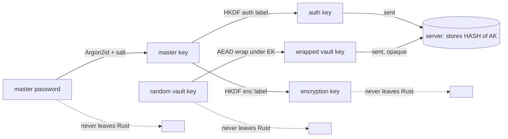
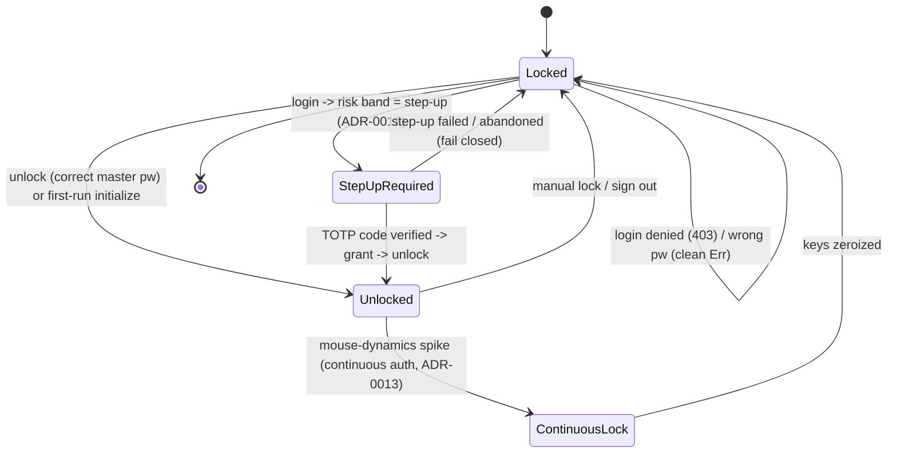

# 05 — Vault and sync: storing credentials, zero-knowledge login, multi-device sync

> **Scope.** How a credential is added, read, edited, and deleted; how the vault locks
> and unlocks and where the keys live; the on-disk `vault.json` file format; the
> zero-knowledge login handshake (the server never sees your password); and how a second
> device or a reinstall rebuilds the vault by *pulling* from the server. This doc is the
> "vault session + sync" layer. The raw crypto primitives it stands on (Argon2id, HKDF,
> XChaCha20-Poly1305) are in [the cryptographic core](04-cryptographic-core.md); the
> decision engine that decides *grant / step-up / deny* at login is in
> [decision and policy](07-decision-and-policy.md); the in-session mouse-spike lock is in
> [continuous auth](08-continuous-auth.md).

---

## 1. In plain English

A password vault is a locked box that holds your other passwords. Cerberus is
**zero-knowledge**: the company's server never learns your master password or anything
inside the box — it only ever holds **ciphertext** (scrambled bytes) it cannot read. The
master password unlocks a small **vault key**; the vault key encrypts each saved
credential. When you log in, the app proves who you are *without sending the password*: it
turns the password into a one-way **auth key** (think of it as a fingerprint of the
password) and sends only that. When you sit down at a second computer, the app downloads
your encrypted credentials from the server and decrypts them locally — the plaintext never
leaves your machine.

Two pieces do the heavy lifting:

- A **Rust core** (the only place secrets live) that derives keys, encrypts/decrypts, and
  manages the locked/unlocked session.
- A thin **webview** (React/TypeScript) that forwards the master password to Rust and never
  holds a derived key itself.

> **AEAD (Authenticated Encryption with Associated Data).** The encryption scheme used
> throughout: it both hides the data *and* tamper-proofs it, so a single flipped byte makes
> decryption fail loudly instead of returning garbage. Cerberus uses XChaCha20-Poly1305 — see
> [the cryptographic core](04-cryptographic-core.md#aead).

---

## 2. Where it lives

```
apps/desktop/src-tauri/src/         Rust security core (secrets live ONLY here)
├── vault/
│   ├── mod.rs        credential encrypt/decrypt + rotate_master_password (the crypto glue)
│   ├── account.rs    registration + login handshake material (auth key, wrapped vault key)
│   ├── manager.rs    VaultManager: unlock/lock state machine + credential CRUD + pull-merge
│   └── store.rs      on-disk vault.json (snake_case, atomic temp+rename, versioned)
└── commands/
    └── mod.rs        the 12 #[tauri::command] adapters (the Rust <-> webview wire)

apps/desktop/src/lib/               webview glue (no keys held here)
├── tauri.ts          invoke() each Rust command; zod-validate every reply
├── auth.ts           orchestrates register / prelogin -> derive -> login / unlock+pull
└── sync.ts           pull-on-unlock + (defined-but-unwired) push helpers

apps/server/src/                    the blind server
├── services/vault.ts              base64 <-> Buffer; never decrypts
├── repositories/vault-items.ts    SQL for the encrypted blobs (user-scoped)
└── repositories/vault-keys.ts     SQL for the wrapped vault key (user-scoped)

docs/adr/0006-desktop-app-architecture.md   Tauri wiring, command split, local vault
docs/adr/0007-zero-knowledge-login-handshake.md  prelogin/derive/verify + enumeration defence
docs/adr/0008-encrypted-blob-sync.md        opaque blobs, revisions, fresh-client bootstrap
```

---

## 3. File-by-file

### `vault/mod.rs` — the crypto glue (and the unwired rotation)
[vault/mod.rs](../../apps/desktop/src-tauri/src/vault/mod.rs). One-sentence job: encrypt/decrypt
a credential blob under the vault key, plus implement master-password rotation.

- `encrypt_credential(vault, plaintext)` / `decrypt_credential(vault, ct)` — wrap the
  core `seal`/`open` with a fixed **AAD label** `b"cerberus/credential/v1"`
  ([line 30](../../apps/desktop/src-tauri/src/vault/mod.rs)). The AAD is "associated data" — extra
  bytes that are *authenticated but not encrypted*; binding it to this label means a
  credential ciphertext can't be replayed as, say, a wrapped-vault-key blob.
- `rotate_master_password(wrapped, old_enc, new_enc)` — changes your master password by
  **re-wrapping the vault key under a new encryption key, without re-encrypting any
  credential** (the vault key itself is unchanged, so every existing credential ciphertext
  still decrypts). This is elegant and fully tested (`rotation_rewraps_without_reencrypting_credentials`,
  [lines 114-140](../../apps/desktop/src-tauri/src/vault/mod.rs))…
  - **Gotcha (half-wired):** `rotate_master_password` is **not wired to any Tauri command**.
    Grep `commands/mod.rs` — there is no `rotate_*` command in `generate_handler!`
    ([lines 393-406](../../apps/desktop/src-tauri/src/commands/mod.rs)). So the capability exists in the
    core but a user has no way to invoke it. See [§11](#gotchas).
- Re-exports the public surface of `account`, `manager`, `store`.

### `vault/account.rs` — registration & login handshake material
[vault/account.rs](../../apps/desktop/src-tauri/src/vault/account.rs). One-sentence job: produce
*exactly* what the server needs at registration and login (auth key, public KDF params/salt,
wrapped vault key) and nothing it must not see.

- `build_registration(password)` → `RegistrationMaterial { auth_key, kdf_version, kdf_params,
  kdf_salt, wrapped_vault_key, vault_key }`. Generates a fresh random 16-byte salt and a fresh
  random vault key. The `vault_key` field is the one thing **kept in memory and never sent**.
- `derive_login_auth_key(password, salt, params)` — re-derives the same auth key at login from
  the prelogin salt/params.
- `unwrap_login_vault_key(password, salt, params, wrapped)` — after a granted login, re-derives
  the encryption key and unwraps the server-returned wrapped vault key. A wrong password yields a
  different key and fails as a clean `AppError::Decryption` (tested, `wrong_password_cannot_unwrap_the_vault_key`).
- `SALT_LEN = 16`.

### `vault/manager.rs` — the session (state machine + CRUD + merge)
[vault/manager.rs](../../apps/desktop/src-tauri/src/vault/manager.rs). One-sentence job: hold the
in-memory unlocked state and implement unlock/lock, add/list/get/update/delete, and the pull-merge.

- `VaultManager { store, init_params, unlocked: Option<Unlocked> }`. `Unlocked { vault_key,
  file }` exists *only while unlocked*; `lock()` sets `unlocked = None`, and the `VaultKey` is
  `ZeroizeOnDrop`, so locking wipes the key from memory.
- `CredentialData` — the plaintext fields that get serialized to JSON and AEAD-encrypted. It has
  **no `Debug` impl** and is `Zeroize, ZeroizeOnDrop` so it can never be accidentally logged
  and is wiped on drop. The first five fields (`name, username, password, url, notes`) are the
  original shape; the rest (`item_type, favourite, category, otp_secret, password_updated_at,
  card_*`) are additive and `#[serde(default)]` for backward compatibility.
- `CredentialSummary` — the list-view shape: id + display fields + `has_otp` bool, but **never
  the password, card number, CVV, notes, or the OTP seed** (asserted by test
  `per_item_fields_round_trip_and_summary_omits_secrets`).
- `merge_pulled(pulled)` — the revision-reconciled pull. Returns `MergeOutcome { added, updated,
  kept }`.
- **Gotcha:** `add()` stores a new item at `revision: 0` ("locally created, not yet synced");
  a later push would assign a real revision — but [no push is wired](#gotchas).

### `vault/store.rs` — the on-disk file
[vault/store.rs](../../apps/desktop/src-tauri/src/vault/store.rs). One-sentence job: read/write
`vault.json` containing **only** ciphertext + public KDF params/salt — the sole component that
touches disk.

- `VAULT_FILE_VERSION = 1` ([line 19](../../apps/desktop/src-tauri/src/vault/store.rs)) — a version
  number so the format can evolve safely.
- `VaultFile { version, kdf: StoredKdf, wrapped_vault_key: StoredBlob, items: Vec<StoredItem> }`
  — serialized **snake_case** (e.g. `wrapped_vault_key`).
- `StoredBlob { nonce, ciphertext }` — each AEAD blob as two base64 strings. `decode()`
  validates the nonce length (`NONCE_LEN`) before use.
- `VaultStore::save()` — writes to `vault.json.tmp` then `fs::rename`s over `vault.json`
  ([lines 152-161](../../apps/desktop/src-tauri/src/vault/store.rs)). See [§4.5](#disk).
- `VaultStore::load()` — `Ok(None)` if the file doesn't exist yet (first run → initialize a
  fresh vault).

### `commands/mod.rs` — the 12-command IPC wire
[commands/mod.rs](../../apps/desktop/src-tauri/src/commands/mod.rs). One-sentence job: thin
`#[tauri::command]` adapters that take the master password as a `String`, move it into a
zeroizing `SecretString` immediately, call exactly one `VaultManager` method (or one pure
crypto function), and map errors to a non-leaking string.

- DTOs (`KdfParamsDto`, `RegistrationMaterialDto`, `BlobDto`, `ServerItemDto`, `MergeOutcomeDto`)
  are `#[serde(rename_all = "camelCase")]` — **camelCase on the wire**, the mirror of the
  snake_case on disk.
- The five **Argon2id-heavy** commands (`prepare_registration`, `derive_login_auth_key_cmd`,
  `seal_credential`, `open_credential`, `sync_pull_merge`) run inside
  `tauri::async_runtime::spawn_blocking` so the UI never freezes during the ~0.5 s key
  derivation.
- **Gotcha:** `unlock` is a **synchronous** command ([line 322](../../apps/desktop/src-tauri/src/commands/mod.rs))
  — it runs Argon2id on the invoking thread, unlike the async ones. See [§11](#gotchas).

### `lib/tauri.ts` — invoke + validate
[lib/tauri.ts](../../apps/desktop/src/lib/tauri.ts). One-sentence job: call each Rust command via
`invoke()` and **zod-validate every reply** before use ("trust nothing across the process
boundary, including replies from Rust"). Exports `prepareRegistration`, `deriveLoginAuthKey`,
`sealCredential`, `openCredential`, `unlock`, `lock`, `syncPullMerge`, and the CRUD wrappers.

### `lib/auth.ts` — account flow orchestration
[lib/auth.ts](../../apps/desktop/src/lib/auth.ts). One-sentence job: wire Rust key derivation (IPC)
to the server API (HTTP) for register / login / step-up / unlock. `loginAccount` runs
prelogin → derive → login and returns a `LoginOutcome` (`granted` or `step_up`).
`unlockAndPull` opens the local vault then best-effort pulls from the server.

### `lib/sync.ts` — pull-on-unlock (+ the unwired push helpers)
[lib/sync.ts](../../apps/desktop/src/lib/sync.ts). One-sentence job: glue between the server API and
the Rust crypto for sync. `syncPullOnUnlock(ctx)` is **the wired path**. `pushNewItem` /
`pushUpdatedItem` are defined and correct but **no caller uses them** (see [§11](#gotchas)).

### `services/vault.ts` / `repositories/vault-items.ts` / `repositories/vault-keys.ts` — the blind server
[services/vault.ts](../../apps/server/src/services/vault.ts),
[repositories/vault-items.ts](../../apps/server/src/repositories/vault-items.ts),
[repositories/vault-keys.ts](../../apps/server/src/repositories/vault-keys.ts). The service converts
base64 ↔ Buffer and **never decrypts**; the repositories hold all SQL, every query scoped to
`user_id` (IDOR defence). `vault_items` carries the optimistic-concurrency `revision`; `vault_keys`
holds the one wrapped vault key per user.

*Trivial pieces skipped:* the test modules inside the Rust files (large but they only *demonstrate*
the behaviours described above) and the icon/UI sub-components inside `VaultView.tsx` (covered in
[the frontend doc](11-frontend.md)).

---

## 4. How it works (follow the data)

### 4.1 Registration — making the box and its key

When a brand-new user registers, the webview calls `registerAccount` → `prepareRegistration`
→ the Rust `prepare_registration` command, which runs `build_registration`
([account.rs:35](../../apps/desktop/src-tauri/src/vault/account.rs)):

1. Generate a fresh random 16-byte **salt** and a fresh random 32-byte **vault key**.
2. `derive_master_key(password, salt, params)` — Argon2id turns the password into a master key.
3. From the master key, **HKDF** derives two *separate* keys (different labels):
   - the **auth key** (`derive_auth_key`) — the login proof, sent to the server;
   - the **encryption key** (`derive_encryption_key`) — used only locally to wrap the vault key.
4. `wrap_vault_key(encryption_key, vault_key)` — AEAD-encrypt the random vault key under the
   encryption key, producing the **wrapped vault key** (opaque to the server).

The webview sends the server `{ username, authKey, kdfVersion, kdfParams, kdfSalt,
wrappedVaultKey, wrappedVaultKeyNonce }`. The server stores an **Argon2id hash of the auth key**
(not the auth key itself — defence in depth), the public KDF params/salt, and the wrapped vault
key. It never sees the password, the encryption key, or the vault key.



> **Why two derived keys instead of one?** If the same key both proved your identity to the
> server *and* encrypted your data, then anything the server must verify (the auth key) would be
> dangerously close to the key that decrypts your secrets. HKDF with distinct labels guarantees
> the auth key reveals nothing about the encryption key. See
> [the key hierarchy](04-cryptographic-core.md#key-hierarchy).

### 4.2 Adding / reading / editing / deleting a credential (local)

Once unlocked, CRUD is entirely local in `VaultManager`. The webview `VaultView` calls
`addCredential` / `getCredential` / `updateCredential` / `deleteCredential`
([lib/tauri.ts](../../apps/desktop/src/lib/tauri.ts)) which `invoke` the matching synchronous Rust
commands.

- **Add** ([manager.rs:239](../../apps/desktop/src-tauri/src/vault/manager.rs)): `encrypt_to_blob`
  serializes `CredentialData` to JSON, AEAD-encrypts it under the in-memory vault key, mint a
  `Uuid` id, push `StoredItem { id, blob, revision: 0 }`, then `store.save`. Returns the id.
- **List** ([manager.rs:299](../../apps/desktop/src-tauri/src/vault/manager.rs)): decrypt every
  blob and project to `CredentialSummary` — **secrets stripped**.
- **Get** ([manager.rs:319](../../apps/desktop/src-tauri/src/vault/manager.rs)): find by id, decrypt
  to a full `CredentialRecord` (this *does* carry the password/CVV/OTP seed, because the user
  asked to reveal a specific item).
- **Update** ([manager.rs:332](../../apps/desktop/src-tauri/src/vault/manager.rs)): re-encrypt the
  whole record to a *new* blob (fresh nonce), replace `item.blob`, save.
- **Delete** ([manager.rs:347](../../apps/desktop/src-tauri/src/vault/manager.rs)): `retain` the
  others; `NotFound` if nothing was removed.

The two helpers at the bottom of `manager.rs` carry the encrypt/decrypt contract:
`encrypt_to_blob` ([line 372](../../apps/desktop/src-tauri/src/vault/manager.rs)) holds the transient
JSON in a zeroizing `SecretBytes`; `decrypt_from_blob` ([line 381](../../apps/desktop/src-tauri/src/vault/manager.rs))
zeroizes the transient plaintext on return.

> **Important:** every one of these CRUD calls touches **only the local Rust vault and disk**.
> None of them call the server. The local encrypted `vault.json` is the source of truth; the
> server is reconciled separately (and, on this branch, only by *pulling* — see [§4.6](#sync)
> and [§11](#gotchas)).

### 4.3 The unlock / lock state machine {#vault-state}

The `VaultManager` itself is a two-state machine: **Locked** (`unlocked == None`) or **Unlocked**
(`unlocked == Some`). The two *higher-level* states the user sees — `StepUpRequired` (a TOTP
challenge before access is granted) and `ContinuousLock` (the in-session mouse-spike lock) — are
imposed by the server and the webview *around* the manager; the manager only ever knows
locked/unlocked. The combined picture:



The transitions, grounded in code:

- **unlock** — `VaultManager::unlock(password)` ([manager.rs:191](../../apps/desktop/src-tauri/src/vault/manager.rs)):
  if `store.load()` returns a file, `unlock_existing` re-derives the keys from the file's recorded
  params/salt and **unwraps the stored vault key** (a wrong password fails as `AppError::Decryption`,
  never a panic — tested by `wrong_master_password_fails_cleanly`); if there's no file,
  `initialize` creates a fresh vault. On success, `unlocked = Some(Unlocked { vault_key, file })`.
- **lock** — `VaultManager::lock()` ([manager.rs:229](../../apps/desktop/src-tauri/src/vault/manager.rs))
  sets `unlocked = None`; the `VaultKey` is wiped because it is `ZeroizeOnDrop`. Any subsequent
  CRUD returns `AppError::Locked` (tested by `locked_operations_fail_cleanly`).
- **step-up** — decided server-side (`loginAccount` returns `kind: 'step_up'`,
  [auth.ts:64](../../apps/desktop/src/lib/auth.ts)); the webview must **not** open the local vault until
  the TOTP code passes (`unlockVault`'s doc: "a denied/step-up-pending login must never open the
  local vault (fail closed)"). Details in [decision and policy](07-decision-and-policy.md).
- **continuous lock** — the webview's continuous-auth WebSocket receives `onLocked` and calls
  `lock()` then returns to the unlock screen ([VaultView.tsx:719-744](../../apps/desktop/src/features/vault/VaultView.tsx)).
  Mechanics in [continuous auth](08-continuous-auth.md).

### 4.4 Where the keys live (and where they don't)

| Secret | Lives where | Lifetime |
|---|---|---|
| Master password | Inside the Rust command, as `SecretString` | Wiped when the command returns |
| Master key / encryption key | Local Rust stack during derivation | Wiped at end of derivation |
| Auth key | Sent to server (server stores only a *hash*) | Server keeps the hash forever |
| Vault key | `Unlocked.vault_key` in `VaultManager` (RAM only) | Wiped on `lock()` (ZeroizeOnDrop) |
| Wrapped vault key | `vault.json` on disk + `vault_keys` row on server | Persistent (opaque ciphertext) |
| Credential plaintext | Transient zeroizing buffers in encrypt/decrypt | Wiped immediately after use |

The webview **never** holds a derived key — it forwards the master password to Rust and gets back
only non-secret DTOs (plus, for a specific `get`, that one credential's plaintext to display).

### 4.5 The on-disk file format {#disk}

A real `vault.json` (after registering and adding one item) looks like:

```json
{
  "version": 1,
  "kdf": {
    "version": 1,
    "memory_kib": 229376,
    "iterations": 3,
    "parallelism": 1,
    "salt": "Xx7p…base64…"
  },
  "wrapped_vault_key": { "nonce": "…base64-24-bytes…", "ciphertext": "…base64…" },
  "items": [
    { "id": "b1f2…uuid…", "blob": { "nonce": "…", "ciphertext": "…" }, "revision": 0 }
  ]
}
```

Three load-bearing properties (all tested by `on_disk_file_contains_no_plaintext`,
[manager.rs:578](../../apps/desktop/src-tauri/src/vault/manager.rs)):

1. **No plaintext, ever.** The file contains only ciphertext + the *public* KDF params/salt
   needed to re-derive keys. The test asserts the credential password, the master password,
   the username, and the note are all absent from the bytes — while `wrapped_vault_key` and
   `"version"` *are* present.
2. **snake_case.** Keys are `wrapped_vault_key`, `memory_kib`, etc. — the deliberate mirror of
   the camelCase IPC DTOs. Conceptually the same data, two encodings.
3. **Atomic writes.** `save()` writes `vault.json.tmp` then `fs::rename`s it over the real file.
   A rename is atomic on the filesystem, so a crash mid-write can corrupt the *temp* file but
   never the existing vault.

> **What breaks if we did the naive thing?** If `save` wrote directly into `vault.json` and the
> process died halfway, you'd be left with a truncated, unparseable vault — and `load` returns
> `AppError::Serialization`, locking you out of *all* your credentials. The temp+rename keeps the
> last good vault intact until the new one is fully written.

`VAULT_FILE_VERSION` and `KDF_VERSION` (both `1`) are stored so a future format change can be
detected and migrated rather than silently misread. Older items without a `revision` field read
back as `revision: 0` thanks to `#[serde(default)]` ([store.rs:69](../../apps/desktop/src-tauri/src/vault/store.rs)),
so a fresh server pull (revision ≥ 1) wins.

### 4.6 The zero-knowledge login handshake {#login}

The handshake is **prelogin → derive → verify** (ADR-0007). The point: the client needs the
per-user salt/params to derive its keys, but those are stored server-side — and fetching them must
not reveal whether an account exists.

1. **prelogin** — `loginAccount` calls `prelogin({ username })`
   ([auth.ts:49](../../apps/desktop/src/lib/auth.ts)). The server returns `{ kdfVersion, kdfSalt,
   kdfParams }`. **For an unknown username it returns a deterministic dummy salt** —
   `HMAC-SHA256(enumerationSecret, username)[..16]` — with the real pinned version/params, so a
   present and an absent account are indistinguishable, and the dummy is *stable across calls*
   (a salt that changed per call would itself leak "no such user"). See
   [the server-and-api doc](09-server-and-api.md) for the endpoint internals.
2. **derive** — `deriveLoginAuthKey(password, salt, params)` runs the Rust
   `derive_login_auth_key_cmd` (Argon2id off-thread) → auth key. Only the auth key leaves the
   device.
3. **verify** — `login({ username, authKey, deviceFingerprintHash, keystrokeSample })`. The server
   verifies the auth key in **constant time** with Argon2id `verify` against the stored hash;
   for an unknown user it verifies against a *fixed precomputed dummy hash* so the timing is the
   same. On success it returns a session token and the **server's wrapped vault key**.

The login *outcome* is then `grant / step-up / deny` (the risk engine — [decision and policy](07-decision-and-policy.md)).
On a grant, the webview unwraps the wrapped vault key locally and the vault becomes usable.

> **Why send a derived auth key instead of the password?** If the password itself crossed the wire,
> a compromised server (or a logged request) would have the master password — which would let it
> derive the encryption key and decrypt everything. Sending only a one-way auth key, of which the
> server stores only a further hash, means a full server breach yields only hashes and opaque
> ciphertext.

### 4.7 Multi-device sync via revision-reconciled pull-merge {#sync}

The sync model (ADR-0008): the server stores **opaque blobs** `{ id, ciphertext, nonce, item_type,
revision }` and never decrypts. Ids are **client-owned UUIDs** (so the same credential has the same
id on every device). Each item has a monotonic integer **revision** starting at 1, used for
optimistic concurrency.

On unlock, `unlockAndPull` ([auth.ts:102](../../apps/desktop/src/lib/auth.ts)) →
`syncPullOnUnlock` ([sync.ts:63](../../apps/desktop/src/lib/sync.ts)) lists the server's blobs and
hands them to the Rust `sync_pull_merge` command, which:

1. Re-derives the **server vault key** from the master password + the server's wrapped vault key
   (the same `derive_master_key → encryption key → unwrap` path), in `decrypt_server_items`
   ([commands/mod.rs:238](../../apps/desktop/src-tauri/src/commands/mod.rs)).
2. Decrypts each blob. **Any blob that fails to decrypt is skipped, not fatal** — a corrupt or
   undecryptable item must never crash the unlock (`skipped += 1`; only its opaque id is logged,
   never plaintext or identity, [commands/mod.rs:263-268](../../apps/desktop/src-tauri/src/commands/mod.rs)).
3. Hands the successfully-decrypted items to `VaultManager::merge_pulled`
   ([manager.rs:267](../../apps/desktop/src-tauri/src/vault/manager.rs)), which **re-encrypts each
   under the LOCAL vault key** (the local and server stores hold *independent* vault keys) and
   reconciles by revision.

**The reconciliation rule** (per id):

| Case | Action |
|---|---|
| Item on **server only** | **Added** locally |
| Same id, **server revision > local** | **Replaced** (server wins) |
| Same id, **server revision ≤ local** | **Kept** (local copy preserved — a same-revision local edit is not clobbered) |
| Item **local only** | **Preserved** (a pull never deletes) |

Only the non-secret counts `MergeOutcome { added, updated, kept }` (+ `skipped`) cross back to the
webview. The plaintext never leaves Rust.

> **Why re-encrypt under a *different* local vault key?** Because the local `vault.json` was created
> with its own randomly-generated vault key (at first-run `initialize`), independent of the server's.
> When the same plaintext is merged in, it has to be sealed under whatever key the local file
> actually uses, or `decrypt_from_blob` would later fail. The pull pipeline therefore decrypts with
> the server key and immediately re-encrypts with the local key, all inside Rust.

---

## 5. How it connects

- **Receives** the master password from the webview ([lib/tauri.ts](../../apps/desktop/src/lib/tauri.ts))
  via the 12-command IPC surface; receives the prelogin salt/params and the wrapped vault key from
  the server ([lib/api.ts] over HTTP, orchestrated by [lib/auth.ts](../../apps/desktop/src/lib/auth.ts)).
- **Hands to** the [cryptographic core](04-cryptographic-core.md) for every derive/wrap/seal/open;
  hands the *outcome* of login to the [decision-and-policy engine](07-decision-and-policy.md) (which
  decides grant/step-up/deny) and to [continuous auth](08-continuous-auth.md) (which can later
  force `ContinuousLock`).
- **Persists** locally to `vault.json` ([store.rs](../../apps/desktop/src-tauri/src/vault/store.rs))
  and remotely as opaque blobs in `vault_items` / `vault_keys`
  ([the database doc](10-database.md)).
- The **server** side is the blind half: [services/vault.ts](../../apps/server/src/services/vault.ts)
  + the two repositories enforce user-scoping and never decrypt — see
  [server-and-api](09-server-and-api.md).

---

## 6. Gotchas & invariants {#gotchas}

**Invariants (must never break):**

1. **The on-disk and on-wire vault contain only ciphertext + public KDF metadata.** No plaintext
   credential, no master password, no derived key. Demonstrated by `on_disk_file_contains_no_plaintext`.
2. **The vault key lives only in RAM while unlocked and is zeroized on lock.** `lock()` drops the
   `Unlocked` state; `VaultKey` is `ZeroizeOnDrop`.
3. **Wrong password → clean `AppError::Decryption`, never a panic.** Unwrapping the vault key with
   the wrong key fails the AEAD tag check.
4. **A pull never deletes a local item, and never silently overwrites a higher local revision.**
   Reconciliation keeps local copies that are equal-or-newer.
5. **A corrupt server blob is skipped, never fatal** — the unlock still succeeds (fail safe).
6. **`CredentialData` / `CredentialRecord` / `PulledCredential` / `CredentialSummary` have no
   `Debug` impl** — they cannot be `{:?}`-logged.

**Half-wired / incomplete areas (honest flags):**

- **`rotate_master_password` is implemented but not reachable.** It is a correct, tested function
  in [vault/mod.rs:51](../../apps/desktop/src-tauri/src/vault/mod.rs) (re-wrap the vault key under a
  new encryption key without re-encrypting credentials), but there is **no `#[tauri::command]`
  exposing it** — the command list at [commands/mod.rs:393-406](../../apps/desktop/src-tauri/src/commands/mod.rs)
  has no rotation command. A user therefore cannot change their master password through the app today.

- **The vault only ever *pulls*; it never *pushes*.** `VaultView` mutates the local Rust vault via
  `addCredential` / `updateCredential` / `deleteCredential`
  ([VaultView.tsx:816-857](../../apps/desktop/src/features/vault/VaultView.tsx)) and the only server
  contact is the *pull* on unlock (`unlockAndPull` → `syncPullOnUnlock`). The push helpers exist and
  are correct —
  ```ts
  // lib/sync.ts:101 — defined, but no caller
  export async function pushNewItem(ctx, id, data): Promise<number> { … }
  // lib/sync.ts:122 — defined, but no caller
  export async function pushUpdatedItem(ctx, id, data, baseRevision): Promise<number> { … }
  ```
  but nothing in `VaultView` (or elsewhere in the webview) invokes them. Consequence: a credential
  created on device A is **not** uploaded, so device B's pull won't see it; and `add()` deliberately
  stamps `revision: 0` "not yet synced" precisely for a push that is not currently wired. The
  recon notes flag this as possibly intentional for this branch or a regression to confirm against
  ADR-0008 (RECON §11.3). The *infrastructure* for push (server `POST`/`PUT /vault/items`, 409
  conflict handling, `seal_credential`) is all present and tested — only the UI call-site is absent.

- **`unlock` is synchronous** (runs Argon2id on the invoking thread), unlike the five async
  `spawn_blocking` commands ([commands/mod.rs:322](../../apps/desktop/src-tauri/src/commands/mod.rs)).
  Whether Tauri runs sync commands off the webview thread (so the UI doesn't actually freeze for
  the ~0.5 s derivation) needs confirming — flagged as a known open item.

- **Two serialization casings for the same data.** On-disk `vault.json` is snake_case
  ([store.rs](../../apps/desktop/src-tauri/src/vault/store.rs)); the IPC DTOs are camelCase
  ([commands/mod.rs](../../apps/desktop/src-tauri/src/commands/mod.rs)). Same logical blob, two
  encodings — a maintenance trap if a field is added to one and not the other.

- **`pullItems` (decrypt-in-JS) is superseded.** [sync.ts:86](../../apps/desktop/src/lib/sync.ts)
  returns plaintext to the webview; the unlock path uses `syncPullOnUnlock` instead (keeps plaintext
  in Rust). `pullItems` is retained only for callers that genuinely need decrypted items in JS.
