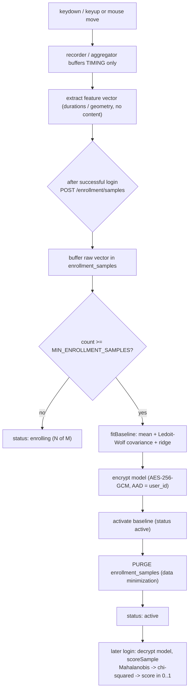

# 06 — Behavioral engine: keystroke & mouse capture, enrollment, the statistical model

> Part of the [Cerberus encyclopedia](00-index.md). Sibling docs:
> [Cryptographic core](04-cryptographic-core.md) · [Vault & sync](05-vault-and-sync.md) ·
> [Decision & policy](07-decision-and-policy.md) · [Continuous auth](08-continuous-auth.md) ·
> [Algorithms deep-dive](14-algorithms-deep-dive.md) · [Glossary](13-glossary.md).

---

## 1. In plain English

Cerberus does not only check *what* you type (your master password). It also learns *how* you
type it — the rhythm — and, once you are logged in, *how* you move the mouse. That rhythm is a
**behavioral biometric**: a fingerprint made of timing, not of secrets. This document covers the
machinery that turns raw key presses and mouse moves into small lists of numbers ("feature
vectors"), that learns a per-user "this is what normal looks like" model from a handful of
samples, and that later scores a fresh sample as "looks like you" or "looks like an impostor".

The single most important rule, repeated everywhere in this subsystem: **the rhythm path never
sees the keys.** The code that records typing rhythm has no way, structurally, to learn *which*
key you pressed — only *when* you pressed and released it. Same for the mouse: it records *where*
the pointer was and *when*, never *what was under it* or *what was clicked*. We will show that the
code proves this, not just promises it.

Two terms you need immediately, then we will keep re-defining acronyms as we go:

- **Feature vector** — a fixed-length list of numbers summarizing one sample (one password typed,
  or one window of mouse motion). E.g. a 3-key sample: `[92, 88, 70, 140, 130, 48, -5]`
  (milliseconds; a valid keystroke vector has dimension `3n−2` — here `3·3−2 = 7`).
- **Baseline** — the learned statistical model of a user's normal feature vectors: a *mean*
  (their average vector) plus a *covariance* (how the features vary and co-vary). Scoring compares
  a new vector against this baseline.

---

## 2. Where it lives

```
cerberus/
├── packages/shared-types/src/
│   ├── behavioral.ts          keystroke feature schema + extractor + enrollment DTOs (shared client/server)
│   └── mouse.ts               mouse feature schema + extractor + continuous-auth WS contract
├── apps/desktop/src/lib/
│   ├── keystroke.ts           KeystrokeRecorder: accumulate keydown/keyup timestamps, extract vector
│   ├── keystroke-capture.ts   React hook wiring the recorder onto the password <input>
│   └── mouse-capture.ts       MouseWindowAggregator: sliding-window mouse capture
└── apps/server/src/
    ├── services/
    │   ├── enrollment.ts      lifecycle: buffer samples → fit → encrypt → activate → purge
    │   └── scoring.ts         load active baseline → score a fresh vector (Mahalanobis → χ²)
    ├── risk/
    │   ├── baseline-model.ts  fitBaseline: mean + Ledoit-Wolf-shrunk covariance + ridge; Cholesky/inverse
    │   ├── scorer.ts          scoreSample: pure Mahalanobis → chi-squared anomaly score
    │   ├── mahalanobis.ts     D² = (x−μ)ᵀ Σ⁻¹ (x−μ)
    │   └── chi-squared.ts     χ² CDF / survival function (anomaly score / p-value)
    └── repositories/
        ├── behavioral-baselines.ts   stores the fitted MODEL ONLY, encrypted, per (user, modality)
        └── enrollment-samples.ts     ephemeral raw-vector buffer, purged on activation
```

Authoritative decisions: [ADR-0002](../../docs/adr/0002-behavioral-baselines-and-scoring.md)
(baselines live server-side, model-only, encrypted) and
[ADR-0009](../../docs/adr/0009-behavioral-feature-schema-and-enrollment.md) (the feature schema,
position-indexed capture, the enrollment lifecycle, and the covariance regularization).

This doc covers **how a baseline is built and how a sample is scored**. Where that score plugs into
the login grant/step-up/deny decision is [Decision & policy](07-decision-and-policy.md); how the
mouse score drives an in-session lock is [Continuous auth](08-continuous-auth.md); the from-zero
worked-number math (chi-squared internals, Ledoit-Wolf derivation, EER evaluation) is
[Algorithms deep-dive](14-algorithms-deep-dive.md).

---

## 3. The privacy invariant, loud

This is the load-bearing rule of the whole subsystem, so before any mechanics: **the behavioral
path is structurally incapable of seeing content.** Not "we are careful not to log it" —
*incapable*, because the types have no field that could carry it.

### Keystroke: position-indexed timing, never character identity

The unit of capture is [`KeystrokeTiming`](../../packages/shared-types/src/behavioral.ts#L21):

```ts
export interface KeystrokeTiming {
  readonly down: number; // timestamp of keydown (ms, monotonic)
  readonly up: number;   // timestamp of keyup (ms, monotonic)
}
```

Two numbers. There is no `key`, `code`, `char`, or `value` field — *the type itself cannot hold a
character.* The recorder's API ([`KeystrokeRecorder.recordDown`/`recordUp`](../../apps/desktop/src/lib/keystroke.ts#L30))
takes only a `timestamp: number`. And the DOM event shape the capture handler is allowed to read,
[`KeystrokeProbeEvent`](../../apps/desktop/src/lib/keystroke.ts#L112), is:

```ts
export interface KeystrokeProbeEvent {
  readonly repeat?: boolean; // the ONLY field — used to drop auto-repeat
}
```

A real browser `KeyboardEvent` has `.key`, `.code`, `.keyCode` — but the handler is typed to see
only `.repeat`, so it *cannot* touch character identity even by accident. ADR-0009 §2 notes a test
"proves this with an event whose `key` getter throws if touched." The master password still flows,
unchanged, only to the Rust crypto core for key derivation
([Cryptographic core](04-cryptographic-core.md)); the timing path derives purely from event
timestamps and is a **separate data path**.

> What breaks if we did it the naive way? If we captured a `key → timing` map ("the 'h' was held
> 92 ms"), the server would learn the password one keystroke at a time — exactly the
> zero-knowledge property the whole project exists to protect. Position-indexing ("the *3rd* key
> was held 92 ms") gives the same rhythm signal with none of the content.

### Mouse: motion statistics, never targets or content

Same discipline for the second modality. [`MouseSample`](../../packages/shared-types/src/mouse.ts#L63)
carries `x`, `y`, `t` (timestamp), and `kind` (`'move' | 'down' | 'up'`) — coordinates and timing
only. The capture handler's allowed event shape, [`PointerProbeEvent`](../../apps/desktop/src/lib/mouse-capture.ts#L54),
is just `{ clientX, clientY }` — no `target`, no `currentTarget`, no element under the pointer. And
crucially, the raw trail never leaves the client: a window of samples is collapsed into **9
aggregate statistics** (means and standard deviations of velocity etc.) and only that aggregate is
streamed. This follows ADR-0002's *data minimization* principle; ADR-0002 frames it for the stored
baseline as "a covariance matrix is far harder to reconstruct into 'what the person typed' than raw
keystroke timing logs."

### Both: biometric-adjacent, so never logged, never returned raw, encrypted at rest, purged

PROJECT.md §5: feature vectors are biometric-adjacent — "never logged beside identity, never
returned raw over the API." The enrollment route
([enrollment.ts](../../apps/server/src/routes/enrollment.ts)) never echoes the submitted vector;
the status endpoint returns only counts. The fitted model is encrypted before storage
([behavioral-baselines.ts](../../apps/server/src/repositories/behavioral-baselines.ts)). And once a
baseline activates, the raw samples are **deleted** ([enrollment.ts:164](../../apps/server/src/services/enrollment.ts#L164)).

---

## 4. File-by-file

### `packages/shared-types/src/behavioral.ts` — keystroke schema + extractor

One sentence: defines what a keystroke feature vector *is*, the single extractor that builds it,
and the zod-validated wire DTOs for the enrollment API.

Key exports:

- [`FEATURE_SCHEMA_VERSION = 1`](../../packages/shared-types/src/behavioral.ts#L33) — stamped on
  every sample and on the fitted baseline. Bumping it invalidates older in-progress enrollments so
  incompatible vectors never mix.
- [`MIN_KEYSTROKES = 2`](../../packages/shared-types/src/behavioral.ts#L39),
  [`MAX_KEYSTROKES = 128`](../../packages/shared-types/src/behavioral.ts#L42),
  [`MAX_TIMING_MS = 600_000`](../../packages/shared-types/src/behavioral.ts#L45) — bounds. Below 2
  keys there are no inter-key latencies, so the vector would be a single hold time — not a profile.
- [`featureDimension(n) = 3n − 2`](../../packages/shared-types/src/behavioral.ts#L51) and its
  inverse [`keystrokeCountFromDimension`](../../packages/shared-types/src/behavioral.ts#L56).
- [`extractFeatureVector(keystrokes)`](../../packages/shared-types/src/behavioral.ts#L83) — the
  heart of the file; builds the `3n−2` vector (detailed in §5).
- [`FeatureVectorSchema`](../../packages/shared-types/src/behavioral.ts#L117),
  [`EnrollmentSampleRequestSchema`](../../packages/shared-types/src/behavioral.ts#L126),
  [`EnrollmentStatusSchema`](../../packages/shared-types/src/behavioral.ts#L133) — the wire
  contract. Note the comment at line 112: "zod strips unknown keys, so a client cannot smuggle a
  character field alongside the vector."

Imported by: `keystroke.ts` (client capture) and the server eval/CMU pipeline. ADR-0009 §1: the
*same* extractor runs for live capture and for CMU-dataset ingestion, so the definition cannot
drift between the two.

### `packages/shared-types/src/mouse.ts` — mouse schema + extractor + WS contract

One sentence: the mouse counterpart — fixed 9-dim feature schema, the window extractor, and the
continuous-auth WebSocket message types.

Key exports:

- [`MOUSE_FEATURE_SCHEMA_VERSION = 1`](../../packages/shared-types/src/mouse.ts#L18),
  [`MOUSE_FEATURE_DIMENSION = 9`](../../packages/shared-types/src/mouse.ts#L25) (fixed, unlike
  keystroke's variable `3n−2`), [`MOUSE_FEATURE_LABELS`](../../packages/shared-types/src/mouse.ts#L28)
  (human-readable names for the 9 dims).
- [`MOUSE_WINDOW_SIZE = 32`](../../packages/shared-types/src/mouse.ts#L45),
  [`MOUSE_WINDOW_STEP = 16`](../../packages/shared-types/src/mouse.ts#L46),
  [`MIN_MOUSE_SAMPLES = 3`](../../packages/shared-types/src/mouse.ts#L49),
  [`MOUSE_PAUSE_THRESHOLD_MS = 120`](../../packages/shared-types/src/mouse.ts#L52).
- [`extractMouseWindowFeatures(samples)`](../../packages/shared-types/src/mouse.ts#L104) — the
  9-dim extractor (detailed in §6).
- WS contract: [`MouseWindowMessageSchema`](../../packages/shared-types/src/mouse.ts#L206) (client →
  server), [`ContinuousAuthServerMessageSchema`](../../packages/shared-types/src/mouse.ts#L230)
  (server → client: `locked` / `score`), [`CONTINUOUS_AUTH_WS_PATH`](../../packages/shared-types/src/mouse.ts#L243),
  and [`bearerSubprotocol`](../../packages/shared-types/src/mouse.ts#L255). These belong to
  [Continuous auth](08-continuous-auth.md); listed here because they live in this file.

### `apps/desktop/src/lib/keystroke.ts` — the recorder

One sentence: accumulates keydown/keyup timestamps by position and extracts the vector; has no
field that can hold a character.

Key type: [`KeystrokeRecorder`](../../apps/desktop/src/lib/keystroke.ts#L25). Methods: `recordDown`,
`recordUp`, `reset`, `isComplete`, `extract`. Plus [`attachKeystrokeCapture`](../../apps/desktop/src/lib/keystroke.ts#L129)
which wires keydown/keyup listeners (reading only `event.repeat`). The subtle `extract()` behavior
(dropping a trailing unreleased key) is in §7's Gotchas.

### `apps/desktop/src/lib/keystroke-capture.ts` — the React hook

One sentence: a thin `useKeystrokeCapture()` hook returning an `inputRef` (put on the password
`<input>`) and `takeSample()` (read the vector after a successful login, then reset). It holds only
timing in the recorder, never the password.

### `apps/desktop/src/lib/mouse-capture.ts` — the sliding-window aggregator

One sentence: [`MouseWindowAggregator`](../../apps/desktop/src/lib/mouse-capture.ts#L25) buffers
pointer samples and emits a feature vector once per 32-sample window, sliding by 16; plus
[`attachMouseCapture`](../../apps/desktop/src/lib/mouse-capture.ts#L73) which wires
mousemove/down/up reading only `clientX`/`clientY`.

### `apps/server/src/services/enrollment.ts` — the lifecycle conductor

One sentence: the authoritative enrollment lifecycle — buffer samples, fit a baseline at the
threshold, encrypt, activate, purge — and it is **modality-agnostic** (the same code fits keystroke
and mouse baselines, parameterized by `modality`/schema, not duplicated).

Key export: [`createEnrollmentService(deps)`](../../apps/server/src/services/enrollment.ts#L59) →
`{ getStatus, submitSample }`. Deps include `minEnrollmentSamples`, an optional `modality`
(default `'keystroke'`), and `baselineEncryptionKey`. The serialized model shape is
[`SerializedModel`](../../apps/server/src/services/enrollment.ts#L48) — "MODEL ONLY: means +
covariance + the regularization metadata the scorer needs. NO raw samples."

### `apps/server/src/services/scoring.ts` — the scorer's service wrapper

One sentence: loads a user's active baseline (decrypts the model-only blob), runs the pure scorer,
and returns a `BehavioralEvaluation` (score + structured reason + outcome) — never a raw vector,
never a crash on mismatch.

Key export: [`createScoringService(deps)`](../../apps/server/src/services/scoring.ts#L33) →
`{ scoreActive }`. Returns [`BehavioralEvaluation`](../../apps/server/src/services/scoring.ts#L24):
`behavioralScore` (null when not scored), `keystroke` (the signal object), `outcome`. After
decryption, the blob is re-validated with [`BaselineModelSchema.parse`](../../apps/server/src/services/scoring.ts#L47)
— "the decrypted blob is a trust boundary too."

### `apps/server/src/risk/baseline-model.ts` — the fitter

One sentence: turns a batch of feature vectors into a `FittedBaseline` (mean + a regularized,
invertible covariance) and provides the linear-algebra primitives (Cholesky, SPD inverse).

Key exports: [`fitBaseline(samples, ridge?)`](../../apps/server/src/risk/baseline-model.ts#L123),
[`choleskyDecompose`](../../apps/server/src/risk/baseline-model.ts#L167),
[`invertSpd`](../../apps/server/src/risk/baseline-model.ts#L200). Internal helpers:
`columnMeans`, `sampleCovariance`, `ledoitWolfShrinkage`. Detailed in §8.

### `apps/server/src/risk/scorer.ts` — the pure scorer

One sentence: given a deserialized baseline and a fresh sample, produces a Mahalanobis → chi-squared
anomaly score in `[0, 1]` (higher = more anomalous); pure, no DB/network/password.

Key exports: [`scoreSample(model, sample)`](../../apps/server/src/risk/scorer.ts#L64) →
`ScoreResult`, [`BaselineModelSchema`](../../apps/server/src/risk/scorer.ts#L18),
[`trainMahalanobisDetector`](../../apps/server/src/risk/scorer.ts#L98) (offline-eval convenience).
Detailed in §9.

### `apps/server/src/risk/mahalanobis.ts` and `chi-squared.ts` — the math primitives

One sentence each: `mahalanobis.ts` computes `D² = (x−μ)ᵀ Σ⁻¹ (x−μ)`; `chi-squared.ts` converts
`D²` into a probability via the chi-squared CDF (the anomaly score) and survival function (the
p-value). Both are pure and validated against known values. The chi-squared internals (Lanczos
lnΓ, incomplete-gamma series/continued-fraction) are spelled out in
[Algorithms deep-dive](14-algorithms-deep-dive.md); §9 here gives the intuition + the exact
parameters.

### `apps/server/src/repositories/behavioral-baselines.ts` — model storage

One sentence: stores the fitted **model only**, encrypted, one per `(user_id, modality)`, every
query user-scoped (IDOR defense); the encrypted blob is fetched separately from the metadata.

Key export: [`createBehavioralBaselinesRepository(db)`](../../apps/server/src/repositories/behavioral-baselines.ts#L50)
→ `{ findActiveByUser, findActiveModel, activate }`. `findActiveByUser` returns metadata only (no
blob — it backs the routine status path); `findActiveModel` returns the encrypted blob (scoring).
`activate` upserts keyed by `(user_id, modality, model_version)` so a mouse baseline never
overwrites the keystroke one.

### `apps/server/src/repositories/enrollment-samples.ts` — the ephemeral buffer

One sentence: holds raw feature vectors (as `jsonb`) until a baseline is fit, then they are purged;
every method `(user_id, modality)`-scoped, all SQL parameterized.

Key export: [`createEnrollmentSamplesRepository(db)`](../../apps/server/src/repositories/enrollment-samples.ts#L21)
→ `{ create, countByUser, pendingDimension, listVectorsByUser, deleteByUser }`.

> Skipped as trivial: the `.test.ts` files alongside each module (read for behavior confirmation
> but not documented file-by-file), and `repositories/pool.ts`'s `withTransaction` helper (covered
> in [Database](10-database.md)).

---

## 5. The keystroke feature schema (`3n−2` dims) — algorithm 4-pass

**(a) Intuition.** When you type a familiar password, your fingers have a habitual rhythm: how long
you hold each key, and the little gaps between presses. We capture that rhythm as three families of
timings, one set per *position* in the sequence.

**(b) Mechanism.** For `n` keystrokes, [`extractFeatureVector`](../../packages/shared-types/src/behavioral.ts#L83)
produces three concatenated blocks (all in milliseconds), the standard CMU keystroke-dynamics set:

| Block | Formula | Count | Meaning |
|---|---|---|---|
| hold (dwell) | `hold[i] = up[i] − down[i]` | `n` | how long key `i` was held |
| down-down (DD) | `DD[i] = down[i+1] − down[i]` | `n−1` | press-to-press latency |
| up-down (UD) | `UD[i] = down[i+1] − up[i]` | `n−1` | release-to-next-press gap (may be **negative** under rollover) |

Total dimension `= n + (n−1) + (n−1) = 3n − 2`. Layout: `[...holds, ...downDowns, ...upDowns]`.

**(c) In code.** [behavioral.ts:88-107](../../packages/shared-types/src/behavioral.ts#L88). Holds
in the first loop, DD and UD in the second. `MIN_KEYSTROKES = 2`, so the minimum dimension is
`3·2 − 2 = 4`. A real-world example: an 8-character password ⇒ `3·8 − 2 = 22`-dim vector. The CMU
benchmark password ("`.tie5Roanl`" + Enter, 11 keys) gives dim `31`
([RECON-NOTES §9](00-RECON-NOTES.md): "CMU, 51 subj, dim 31").

**(d) Worked example.** Type a 3-key sequence. Raw timestamps (ms): key1 down@0 up@90; key2
down@150 up@230; key3 down@300 up@370. Then:

- holds = `[90−0, 230−150, 370−300]` = `[90, 80, 70]`
- DD = `[150−0, 300−150]` = `[150, 150]`
- UD = `[150−90, 300−230]` = `[60, 70]`
- vector = `[90, 80, 70, 150, 150, 60, 70]` — dimension `3·3 − 2 = 7`. ✓

If the user typed fast and the next key went down before the previous came up, the UD value would
be negative — which is fine and expected; the baseline statistics absorb it.

---

## 6. The mouse feature schema (9 dims, window 32 / step 16) — algorithm 4-pass

**(a) Intuition.** While you use the app, your mouse has a personal "handwriting": how fast it
moves, how jerkily it accelerates, how sharply it turns, how you click and pause. We watch a
short *window* of pointer samples and summarize it into 9 numbers describing that motion. We slide
the window forward so a sudden change (a different person grabbing the mouse) is caught quickly.

**(b) Mechanism.** [`extractMouseWindowFeatures`](../../packages/shared-types/src/mouse.ts#L104)
computes, per window:

| Index | Feature | How |
|---|---|---|
| 0,1 | mean / std velocity | `dist/dt` per consecutive sample pair |
| 2,3 | mean / std abs acceleration | `|Δvelocity|` between consecutive steps |
| 4,5 | mean / std abs curvature | turning angle between segment directions, wrapped to `[0, π]` |
| 6 | click rate | clicks per second over the window |
| 7 | mean click duration | release − press, in ms (0 when no clicks) |
| 8 | pause rate | pauses per second, where a gap `> 120 ms` is a pause |

The window is a fixed number of samples (`MOUSE_WINDOW_SIZE = 32`); consecutive windows overlap by
`32 − 16 = 16` samples ([`MOUSE_WINDOW_STEP = 16`](../../packages/shared-types/src/mouse.ts#L46)),
so a spike is "caught within one step rather than one full window". `MIN_MOUSE_SAMPLES = 3` because
acceleration and curvature need at least three positions.

**(c) In code.** Velocity/pause loop [mouse.ts:113-132](../../packages/shared-types/src/mouse.ts#L113);
acceleration [136-142](../../packages/shared-types/src/mouse.ts#L136); curvature with the `[0, π]`
wrap [147-158](../../packages/shared-types/src/mouse.ts#L147); clicks (pair each `down` with the
next `up`) [161-170](../../packages/shared-types/src/mouse.ts#L161); the rate normalizer
`perSecond = 1000 / windowMs` [175](../../packages/shared-types/src/mouse.ts#L175). Note `std` is
**population** std (divide by N, not N−1) — deterministic, [mouse.ts:92](../../packages/shared-types/src/mouse.ts#L92).
The sliding is done in [mouse-capture.ts:34-45](../../apps/desktop/src/lib/mouse-capture.ts#L34):
take the first 32, then `buffer.slice(step)`.

**(d) Worked example (curvature wrap).** Suppose two consecutive segment directions are
`a0 = +170°` and `a1 = −170°` (i.e. the pointer nearly reversed). Naive `|a1 − a0| = 340°` would
read as an *almost-straight* turn, which is wrong. The wrap at
[mouse.ts:153-156](../../packages/shared-types/src/mouse.ts#L153) does `d = 2π − d` when
`d > π`, giving `360° − 340° = 20°` — a sharp reversal, correctly large. (Angles are in radians in
code; degrees here for readability.)

> ⚠️ Note: the curvature feature is labeled "radians per step" but is the absolute turning angle
> between segments, not divided by arc-length. This is the code's definition; it is consistent
> between client capture and server scoring because both use this one function, which is what
> matters for the Mahalanobis comparison.

---

## 7. How keystroke capture runs (follow the data, client side)

**(a)** The React hook [`useKeystrokeCapture`](../../apps/desktop/src/lib/keystroke-capture.ts#L19)
creates one `KeystrokeRecorder` and exposes an `inputRef`. When that ref lands on the password
`<input>`, [`attachKeystrokeCapture`](../../apps/desktop/src/lib/keystroke.ts#L129) adds keydown/keyup
listeners.

**(b)** On **keydown**: if `event.repeat === true` it is ignored (auto-repeat is not a fresh
keystroke); otherwise [`recordDown(now())`](../../apps/desktop/src/lib/keystroke.ts#L30) pushes a
new `{ down, up: null }` entry and remembers its position as pending.

**(c)** On **keyup**: [`recordUp(now())`](../../apps/desktop/src/lib/keystroke.ts#L37) matches it to
the **oldest unreleased keydown** (FIFO via `pending.shift()`) and fills in `up`. A stray keyup
(key pressed before capture began) is ignored. ADR-0009 §3: FIFO is exact for in-order release; a
rare *nested* release (a↓ b↓ b↑ a↑) makes the attribution approximate, and the statistics absorb
that noise.

**(d)** After a **successful login**, the UI calls [`takeSample()`](../../apps/desktop/src/lib/keystroke-capture.ts#L31),
which calls [`extract()`](../../apps/desktop/src/lib/keystroke.ts#L85) then resets. Samples are
submitted **only after success**; a failed attempt's capture is discarded.

**The Enter-key subtlety (a real gotcha).** [`extract()`](../../apps/desktop/src/lib/keystroke.ts#L85)
first drops a *trailing* run of never-released keydowns, then requires ≥ `MIN_KEYSTROKES`. Why?
Because "press Enter to log in" fires the submit handler *synchronously during the Enter keydown* —
before the Enter keyup. Without the trailing-drop, that dangling Enter would make capture look
"incomplete" and the entire valid password sample would be thrown away, silently freezing
enrollment. Dropping the trailing keydown also keeps the vector dimension stable (= password
length) whether the user clicks the button or presses Enter, so consecutive samples buffer instead
of being rejected as a dimension change. Crucially, the submit key is recognized **structurally** —
"a trailing keydown with no keyup" — never by testing key identity (the privacy rule holds).

Note `isComplete()` is *stricter* than `extract()` (it requires *all* keys released), so the right
question is "`extract() !== null`?", not "`isComplete()`?".

---

## 8. Fitting a baseline — algorithm 4-pass

This is the heart of [baseline-model.ts](../../apps/server/src/risk/baseline-model.ts).

**(a) Intuition.** Given ~10 examples of how a user types their password, we want a compact model
of "normal": their *average* vector, and a sense of *how much each timing wobbles and which timings
move together*. The average is easy. The wobble-and-co-movement part (the covariance matrix) is the
hard part, because with only ~10 samples but 31 dimensions, the naive estimate is degenerate — it
has "no inverse," and the scorer needs the inverse. The fix is to gently pull the wobble estimate
toward a simple, well-behaved shape until it becomes invertible.

**(b) Mechanism, step by step.** [`fitBaseline`](../../apps/server/src/risk/baseline-model.ts#L123):

1. Validate: non-empty, non-ragged (all vectors same dimension `d`) — else throw (fail closed,
   never fit an inconsistent batch).
2. **Mean** `μ`: per-feature average over the `N` samples
   ([columnMeans](../../apps/server/src/risk/baseline-model.ts#L29)).
3. **Sample covariance** `S`: the MLE estimate `S = (1/N) Σ (x−μ)(x−μ)ᵀ` (denominator `N`, per
   Ledoit-Wolf) ([sampleCovariance](../../apps/server/src/risk/baseline-model.ts#L40)). This `d×d`
   matrix is **singular** when `N ≤ d` (rank ≤ `N−1 < d`).
4. **Target scale** `μ̄ = trace(S)/d` — the average per-feature variance; the scaled-identity
   target is `μ̄·I` ([line 141](../../apps/server/src/risk/baseline-model.ts#L141)).
5. **Ledoit-Wolf shrinkage intensity** `ρ ∈ [0,1]`, computed analytically from the data — no
   hand-tuned constant ([ledoitWolfShrinkage](../../apps/server/src/risk/baseline-model.ts#L77)):
   - `d² = ||S − μ̄·I||²_F` — how far `S` is from the simple target.
   - `b̄² = (1/N²) Σ_k ||xₖxₖᵀ − S||²_F`, clipped to `d²` — the sampling error of `S`.
   - `ρ = b̄²/d²`. Intuition: if `S` is very noisy (`b̄²` large) we trust the target more (`ρ→1`);
     if `S` is reliable we keep it (`ρ→0`). Returns `0` when the data already equals the target.
6. **Shrunk covariance** `Σ = (1−ρ)·S + ρ·μ̄·I`, a convex blend toward a positive-definite target,
   then a **diagonal ridge** `+ COVARIANCE_RIDGE` on the diagonal
   ([lines 144-157](../../apps/server/src/risk/baseline-model.ts#L144)). The blend gives
   positive-definiteness for `ρ>0`; the ridge covers the `ρ=0` edge case (e.g. all samples
   identical), guaranteeing strict positive-definiteness — hence invertibility.

**(c) Real parameters.** `COVARIANCE_RIDGE = 1e-6`
([config.ts:26](../../apps/server/src/risk/config.ts#L26)). Keystroke threshold to fit:
`MIN_ENROLLMENT_SAMPLES = 10` ([config.ts:15](../../apps/server/src/risk/config.ts#L15)); mouse:
`MOUSE_MIN_ENROLLMENT_SAMPLES = 12` ([config.ts:337](../../apps/server/src/risk/config.ts#L337)).
`BASELINE_MODEL_VERSION = 1`. The shrinkage `ρ` is *not* a constant — it is data-driven per fit and
stored as `shrinkage` in the model. Invertibility is verified via
[`choleskyDecompose`](../../apps/server/src/risk/baseline-model.ts#L167) (success ⟺ SPD ⟺
invertible) and [`invertSpd`](../../apps/server/src/risk/baseline-model.ts#L200) (solve `A·x = eᵢ`
per column using the Cholesky factor).

**(d) Worked example (why the naive way breaks, then the fix).** Take 2 samples in 2-D:
`x₁ = [10, 20]`, `x₂ = [12, 24]`. Mean `μ = [11, 22]`. Centered: `[−1, −2]` and `[+1, +2]`.
Sample covariance (÷N=2):

```
S = [[1, 2], [2, 4]]
```

`det(S) = 1·4 − 2·2 = 0` → **singular, no inverse.** Both samples lie on the same line
`y = 2x`, so the matrix is rank 1. Now regularize. `μ̄ = trace(S)/d = (1+4)/2 = 2.5`, target
`μ̄·I = [[2.5,0],[0,2.5]]`. After shrinkage and the ridge, the diagonal grows and the off-diagonal
shrinks, e.g. with some `ρ` the result is roughly `[[1.x, <2], [<2, 4.x]]` whose determinant is now
clearly positive — invertible. (The exact `ρ` and numbers are walked by hand in
[Algorithms deep-dive](14-algorithms-deep-dive.md); the point here is *why*: the off-diagonal
shrinks relative to the inflated diagonal, breaking the perfect linear dependence.)

> What breaks if we did it the naive way? Feeding the singular `S` straight to the scorer would
> mean inverting a non-invertible matrix — either a crash or, worse, a garbage "distance." The
> code instead never produces a singular covariance, and the scorer *also* guards against it
> (`singular_covariance`) as defense in depth.

---

## 9. Scoring a sample — algorithm 4-pass

This is [scorer.ts](../../apps/server/src/risk/scorer.ts) + [mahalanobis.ts](../../apps/server/src/risk/mahalanobis.ts)
+ [chi-squared.ts](../../apps/server/src/risk/chi-squared.ts).

**(a) Intuition.** We have the user's "normal cloud" of vectors (mean + covariance). A fresh login
vector is a point. We ask: *how many standard-deviations-worth of unusualness is this point, given
the shape of the cloud?* Then we convert that into a clean `0..1` anomaly score: `0` = dead center
(totally normal), near `1` = way out in the tail (suspicious).

**(b) Mechanism.** [`scoreSample`](../../apps/server/src/risk/scorer.ts#L64):

1. Guard: `schema_version_mismatch` if the sample's schema ≠ the baseline's; `dimension_mismatch`
   if lengths differ; `singular_covariance` if the stored covariance won't invert. Each is an
   explicit **not-scored** result, never a crash, never a raw vector.
2. Invert the covariance once via [`invertSpd`](../../apps/server/src/risk/baseline-model.ts#L200).
3. **Squared Mahalanobis distance** `D² = (x−μ)ᵀ Σ⁻¹ (x−μ)`
   ([mahalanobisSquared](../../apps/server/src/risk/mahalanobis.ts#L18)), clamped at 0 to absorb
   floating-point round-off. (Plain Mahalanobis generalizes "how many σ away" to correlated,
   differently-scaled features; `Σ⁻¹` rescales and de-correlates the space.)
4. Under a Gaussian baseline, `D²` follows a **chi-squared distribution with `dof = d`** degrees of
   freedom (`d` = the full feature dimension). So the anomaly **score** is the chi-squared CDF:
   `score = chiSquaredCdf(D², dof)` = `1 − pValue`. The p-value
   `pValue = chiSquaredSf(D², dof)` is reported for explainability.

**(c) In code + real parameters.** [scorer.ts:75-78](../../apps/server/src/risk/scorer.ts#L75):
`dof = model.dimension` (so dof = `3n−2` for keystroke, `9` for mouse). `score = chiSquaredCdf(...)`,
`pValue = chiSquaredSf(...)`. The CDF is `lowerRegularizedGamma(dof/2, x/2)`
([chi-squared.ts:116](../../apps/server/src/risk/chi-squared.ts#L116)). Fail-closed edges:
`x ≤ 0 → score 0` (at/below the mean = benign), `x = +∞ → score 1` (maximally anomalous —
PROJECT.md §1.5 fail closed), `NaN → benign`. The returned `ScoredReason`
([scorer.ts:30-42](../../apps/server/src/risk/scorer.ts#L30)) carries `distance`, `distanceSquared`,
`dof`, `pValue`, `modelVersion`, `sampleCount` — structured, no timings.

**(d) Worked example (1-D, by hand).** Suppose a 1-feature baseline has `μ = 100`, variance
`σ² = 25` (so `Σ⁻¹ = 1/25 = 0.04`). A fresh sample `x = 115`:

- `D² = (115 − 100)·0.04·(115 − 100) = 15·0.04·15 = 9.0`. (That is `(15/5)² = 3² = 9`: the point
  is 3 standard deviations out.)
- `score = chiSquaredCdf(9.0, dof=1)`. For 1 dof, `P(χ² ≤ 9) ≈ 0.9973`, so **score ≈ 0.997** — very
  anomalous. The p-value `≈ 0.0027` (a genuine sample is rarely this far). A sample exactly at the
  mean (`x = 100`) gives `D² = 0` → score `0`.

The from-zero derivation of the chi-squared CDF (incomplete gamma) and a multi-dimensional worked
example are in [Algorithms deep-dive](14-algorithms-deep-dive.md).

---

## 10. The enrollment lifecycle (follow the data, server side)

**(a)** Client posts `POST /enrollment/samples { featureSchemaVersion, features }` (validated by
[`EnrollmentSampleRequestSchema`](../../packages/shared-types/src/behavioral.ts#L126)).
[`submitSample`](../../apps/server/src/services/enrollment.ts#L114) runs:

1. **Schema check** — if `featureSchemaVersion` ≠ the instance's, return `schema_version` (route →
   `409`, client must upgrade).
2. Open a transaction and take a **per-`(user, modality)` advisory lock**
   ([line 122](../../apps/server/src/services/enrollment.ts#L122)) so concurrent submits cannot
   double-fit, and keystroke vs mouse enrollment do not block each other.
3. If a baseline is **already active**, do nothing (idempotent) — return active status.
4. **Dimension check** — if the buffer's pending dimension ≠ this vector's length, return
   `dimension_mismatch` (route → `400`) so the client resets; a batch never mixes password lengths.
5. **Buffer** the sample ([samples.create](../../apps/server/src/repositories/enrollment-samples.ts#L24)).
6. **Count**. If `count < minEnrollmentSamples`, return `enrolling` status.
7. **Threshold reached** — fit → encrypt → activate → purge, atomically:
   - `fitBaseline(vectors)` ([line 153](../../apps/server/src/services/enrollment.ts#L153)).
   - `encryptBaselineModel(serializeModel(fitted), userId, key)` — AES-256-GCM, AAD bound to
     `user_id` (ADR-0009 §6; see [Cryptographic core](04-cryptographic-core.md#at-rest-server-crypto)).
   - `baselines.activate(...)` ([line 155](../../apps/server/src/services/enrollment.ts#L155)).
   - **`samples.deleteByUser(...)`** ([line 164](../../apps/server/src/services/enrollment.ts#L164))
     — the raw vectors are gone. Only the encrypted model remains. This is the purge.

**(b)** Later, at a login, [`scoreActive`](../../apps/server/src/services/scoring.ts#L56) loads the
active model, decrypts it, validates with zod, and runs `scoreSample`. If there is no active
baseline it returns `not_scored / no_active_baseline` (the user is still enrolling). The score then
feeds the [decision combiner](07-decision-and-policy.md).



---

## 11. How it connects

- **Receives from** the desktop webview: enrollment samples (after a successful login) and live
  mouse windows (in session), via [api.ts](../../apps/desktop/src/lib/api.ts) and the WS in
  [ws.ts](../../apps/desktop/src/lib/ws.ts). The capture lives in
  [keystroke-capture.ts](../../apps/desktop/src/lib/keystroke-capture.ts) /
  [mouse-capture.ts](../../apps/desktop/src/lib/mouse-capture.ts) on the
  [frontend](11-frontend.md).
- **Hands to** the [decision & policy](07-decision-and-policy.md) engine: the keystroke
  `behavioralScore` is the behavioral leg of the login combiner (weight `0.5`,
  [RECON-NOTES §8](00-RECON-NOTES.md)). The fail-closed default — when telemetry is absent or
  mismatched the leg is `not_scored`, and the policy treats that as a "missing" worst-case rather
  than a free pass — is detailed there.
- **Hands to** [continuous auth](08-continuous-auth.md): the mouse baseline (built by the *same*
  enrollment service with `modality: 'mouse'`) is scored per window; an EWMA spike locks the vault.
- **Shares the contract** with the server eval pipeline: the *same* `extractFeatureVector` /
  `extractMouseWindowFeatures` ingests the CMU keystroke and Balabit mouse benchmarks
  ([Algorithms deep-dive](14-algorithms-deep-dive.md)), so live and offline behavior are identical
  by construction.
- **Uses** the server's at-rest crypto ([baseline-crypto.ts] AES-256-GCM) — distinct from the
  vault's Rust XChaCha20-Poly1305 ([Cryptographic core](04-cryptographic-core.md)). The model is a
  *server* asset the server must decrypt to score (ADR-0002's documented limitation).

---

## 12. Gotchas & invariants

- **The privacy invariant is structural, not procedural.** `KeystrokeTiming`, `KeystrokeProbeEvent`,
  `MouseSample`, and `PointerProbeEvent` have *no* field for content. If someone later "improves"
  capture by reading `event.key` or `event.target`, they would have to widen these types — which is
  the review tripwire. Never add a key/character/target field to the behavioral path.
- **One extractor, two consumers.** `extractFeatureVector` and `extractMouseWindowFeatures` are the
  single source of truth for live capture *and* server-side eval ingestion. Forking them would let
  the trained model and the scored sample drift apart silently. Don't duplicate; reuse.
- **Fit threshold is named config, not a magic number.** `MIN_ENROLLMENT_SAMPLES = 10` /
  `MOUSE_MIN_ENROLLMENT_SAMPLES = 12`, env-overridable
  ([config.ts:15,337](../../apps/server/src/risk/config.ts#L15)). Same for `COVARIANCE_RIDGE = 1e-6`.
- **Covariance must come out invertible.** `fitBaseline` *always* produces SPD covariance
  (Ledoit-Wolf blend + ridge); the scorer *also* re-checks (`singular_covariance`). Both layers
  exist on purpose — defense in depth.
- **Mismatches fail closed, explicitly.** `scoreSample` returns a typed not-scored reason
  (`schema_version_mismatch` / `dimension_mismatch` / `singular_covariance`); `scoreActive` returns
  `behavioralScore: null` with a cause — never a crash, never a guessed score, never a raw vector.
- **Raw samples are deleted on activation.** [enrollment.ts:164](../../apps/server/src/services/enrollment.ts#L164).
  After a baseline activates, the `enrollment_samples` rows are purged; only the encrypted model
  remains. The data-minimization story (ADR-0002) depends on this purge actually running inside the
  same transaction as the fit/activate.
- **Submit only after success; reset between attempts.** `takeSample` is called post-login;
  `reset()` discards a failed attempt's timing so a wrong-password attempt never poisons the
  baseline.
- **The Enter-key trailing-drop** in `extract()` is load-bearing for enrollment — without it,
  Enter-submitted logins would send no telemetry and freeze the baseline. It is recognized
  structurally (trailing keydown, no keyup), never by key identity.
- **`std` is population std** (÷N) in the mouse extractor — intentional and deterministic
  ([mouse.ts:92](../../packages/shared-types/src/mouse.ts#L92)); scale is handled downstream by the
  covariance, so the divisor choice does not bias the Mahalanobis comparison.
- **`isComplete()` ≠ "has an extractable sample."** It is stricter (all keys released). Use
  `extract() !== null` instead ([keystroke.ts:65](../../apps/desktop/src/lib/keystroke.ts#L65)).
- **Mouse curvature is an absolute turning angle**, not normalized per arc-length, despite the
  "radians per step" label — flagged in §6. Internally consistent (one function), which is what the
  scorer requires.
