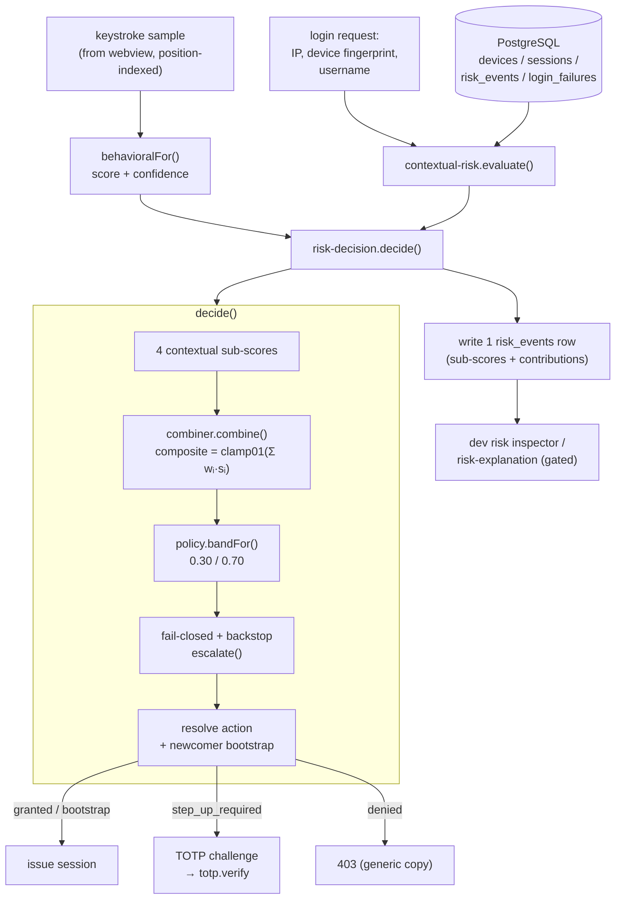
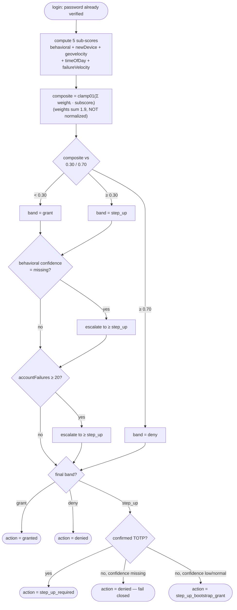

# 07 — Decision & policy: turning signals into allow / step-up / deny

> Part of the [Cerberus encyclopedia](00-index.md). See also: [Behavioral engine](06-behavioral-engine.md)
> (where the keystroke sub-score comes from), [Continuous auth](08-continuous-auth.md) (the same
> ideas applied in-session to mouse dynamics), [Server & API](09-server-and-api.md) (the HTTP login
> flow that calls this code), and [Algorithms deep-dive](14-algorithms-deep-dive.md).

---

## 1. In plain English

Every time you log in, Cerberus does not just check your password. It also asks five quiet
questions: *Does your typing rhythm match? Have we seen this computer before? Could you really have
travelled from your last login location in the time available? Is this a normal hour for you? Have
there been a suspicious number of recent failed attempts?* Each question produces a number between
**0** (totally normal) and **1** (very suspicious). Those five numbers are multiplied by importance
weights, added up into a single **composite score**, and that score lands in one of three bands:

- low score → **grant** (you're in),
- medium score → **step-up** (prove it's you with a one-time code from your authenticator app),
- high score → **deny** (access refused for this attempt).

The whole point is to be *adaptive*: a perfectly normal login is frictionless, a slightly-off one
asks for a second factor, and a wildly-off one is blocked — without ever telling the attacker *which*
of the five questions gave them away. This document explains exactly how the five numbers are
computed, how they are combined, where the band cut-offs sit, and the safety rules that make the
system **fail closed** (when in doubt, escalate or deny — never silently let someone in).

> **Term up front.** *Step-up authentication* means: the password alone wasn't enough confidence, so
> the system "steps up" to a stronger check — here, a six-digit **TOTP (Time-based One-Time
> Password)** code. *Fail closed* means: if anything is missing or ambiguous, default to the *safe*
> (more restrictive) outcome, never the permissive one.

---

## 2. Where it lives

This document covers the **decision layer** of the server — the pure arithmetic that turns
sub-scores into a band, plus the contextual signals it consumes and the TOTP machinery that
satisfies a step-up.

```
apps/server/src/
├── risk/
│   ├── combiner.ts            weighted-linear combine -> composite + per-signal contributions
│   ├── policy.ts              composite -> band (grant / step_up / deny); escalate helper
│   ├── config.ts              ALL named constants: weights, thresholds, backstop, TOTP, signals
│   └── signals/
│       ├── types.ts           SignalResult shape + clamp01 / round helpers
│       ├── new-device.ts      discrete device-status sub-score
│       ├── geovelocity.ts     impossible-travel sub-score (haversine / time)
│       ├── time-of-day.ts     circular-statistics hour-of-day sub-score
│       └── failure-velocity.ts recent-failed-login sub-score
└── services/
    ├── risk-decision.ts       THE ORCHESTRATOR: signals -> combine -> band -> enforce
    ├── contextual-risk.ts     gathers each signal's inputs from the DB; runs the four signals
    ├── totp.ts                RFC 6238 / RFC 4226 primitives (HOTP/TOTP, base32, verify)
    ├── totp-service.ts        setup / confirm / verify with replay watermark + at-rest crypto
    ├── risk-explanation.ts    DEV-ONLY human-readable deny breakdown (never in production)
    └── geoip.ts               offline IP -> coarse country/region; IP truncation
```

Supporting files referenced but documented elsewhere: [haversine.ts](../../apps/server/src/risk/geo/haversine.ts)
and [centroids.ts](../../apps/server/src/risk/geo/centroids.ts) (the geography tables, covered in
[14-algorithms-deep-dive.md](14-algorithms-deep-dive.md)); the behavioral keystroke sub-score that
feeds in here is produced in [06-behavioral-engine.md](06-behavioral-engine.md).

Authoritative design docs: [ADR-0011 (contextual signals)](../adr/0011-contextual-risk-signals.md)
and [ADR-0012 (adaptive policy & step-up)](../adr/0012-adaptive-policy-and-step-up.md).

---

## 3. File-by-file

### `risk/signals/types.ts` — the shape every signal returns
One-sentence job: defines the common output of a contextual signal and two tiny math helpers.

- **`SignalResult`** — `{ score: number /* [0,1] */, reason: Record<string, unknown> }`. Higher
  `score` = more anomalous. `reason` is a structured, explainable record carrying *why* (no raw
  secrets/PII).
- **`clamp01(x)`** — forces a value into `[0,1]`; crucially, **maps `NaN` to 0** (a "fail safe" so a
  bad arithmetic result can never become a spurious *high* score).
- **`round(x, decimals=2)`** — decimal rounding for compact reasons.

Imported by every signal file and by [combiner.ts](../../apps/server/src/risk/combiner.ts).
([types.ts:8-27](../../apps/server/src/risk/signals/types.ts))

### `risk/signals/new-device.ts` — "have we seen this machine?"
A pure function `newDeviceSignal(input, config)`. `input` is `{ known, trusted, firstSeen }`. The
score is purely **discrete** (a lookup, not a formula): unseen → `unseenScore` (1), known+trusted →
`knownTrustedScore` (0), known+untrusted → `knownUntrustedScore` (0.3).
([new-device.ts:17-29](../../apps/server/src/risk/signals/new-device.ts)). Gotcha: `known` is *not*
inferred from `firstSeen`; the caller passes the authoritative login-time `!isNewDevice` (see §4).

### `risk/signals/geovelocity.ts` — "could you have travelled that fast?"
`geovelocitySignal({ prev, curr }, config)`. Computes great-circle distance between the previous and
current country centroids ([haversineKm](../../apps/server/src/risk/geo/haversine.ts)), divides by
the elapsed time to get implied km/h, then maps that linearly onto `[0,1]` across the
`[normalKmh, impossibleKmh]` band. **Cold-start rule:** if either fix is `null` it returns score `0`
with `status: 'insufficient_geo'` ([geovelocity.ts:31-41](../../apps/server/src/risk/signals/geovelocity.ts)).

### `risk/signals/time-of-day.ts` — "is this a normal hour for you?"
`timeOfDaySignal({ priorHours, currentHour }, config)`. Treats hours as angles on a 24-hour circle
and uses the **mean resultant vector** (circular statistics) to find the user's typical hour and how
tightly they cluster. **Cold start:** fewer than `minHistory` prior logins → score 0,
`status: 'insufficient_history'` ([time-of-day.ts:28-34](../../apps/server/src/risk/signals/time-of-day.ts)).

### `risk/signals/failure-velocity.ts` — "are we under attack right now?"
`failureVelocitySignal({ accountFailures, ipFailures }, config)`. Takes the **larger** of the two
recent-failure counts and divides by `saturationCount`, clamped to `[0,1]`. Zero failures → 0
automatically (cold start needs no special case). ([failure-velocity.ts:20-36](../../apps/server/src/risk/signals/failure-velocity.ts))

### `risk/combiner.ts` — the weighted sum
`combine(behavioral, contextual, weights)` → `CombinedRisk`. Multiplies each of the five sub-scores
by its weight (rounding each product to 4 dp), sums them, and `clamp01`s the result into a
`compositeScore`. It **also** returns the four contextual contributions as a separate `contextScore`
and the full per-signal `contributions` breakdown. **No enforcement here — pure arithmetic.**
([combiner.ts:37-60](../../apps/server/src/risk/combiner.ts))

### `risk/policy.ts` — composite → band
`bandFor(composite, thresholds)` returns `'grant' | 'step_up' | 'deny'`. **Ties escalate**: the
comparison is `>=`, so a composite *exactly* at a threshold goes to the *more* restrictive band.
`escalate(a, b)` returns the more restrictive of two bands (used to ratchet a band *up* for the
fail-closed and backstop rules — it can never *lower* a band). `atLeast(a, b)` is a band comparison
helper. ([policy.ts:12-30](../../apps/server/src/risk/policy.ts))

### `risk/config.ts` — every magic number, named, in one place
Per project rule "no magic numbers in risk code", this file is the single home for the weights, band
thresholds, backstop caps, TOTP parameters, and the per-signal config (`DEFAULT_CONTEXTUAL_CONFIG`).
The key blocks: `DEFAULT_COMBINER_WEIGHTS` ([:255-261](../../apps/server/src/risk/config.ts)),
`DEFAULT_BAND_THRESHOLDS` ([:283-286](../../apps/server/src/risk/config.ts)),
`DEFAULT_BACKSTOP_CONFIG` ([:301-305](../../apps/server/src/risk/config.ts)),
`DEFAULT_TOTP_CONFIG` ([:317-322](../../apps/server/src/risk/config.ts)), and
`DEFAULT_CONTEXTUAL_CONFIG` ([:360-380](../../apps/server/src/risk/config.ts)). The long comments in
this file are the design rationale (and double as thesis material).

### `services/contextual-risk.ts` — gather inputs, run the four signals
`createContextualRiskService(deps).evaluate(input)` reaches into four repositories (devices,
sessions, risk-events, login-failures) to build each signal's inputs, runs the four pure signal
functions, and returns `{ signals, geoCountry, geoRegion, ipTruncated }`. It **does not write
risk_events and does not enforce** — it only computes. ([contextual-risk.ts:63-144](../../apps/server/src/services/contextual-risk.ts))

### `services/risk-decision.ts` — the orchestrator (this is where it actually decides)
`createRiskDecisionService(deps).decide(input)` runs the full pipeline: evaluate contextual signals →
`combine` with the behavioral leg → `bandFor` → apply the **fail-closed** and **backstop**
escalations → resolve the band into an enforced `action` (including the **newcomer bootstrap**) →
return everything needed to write one `risk_events` row. ([risk-decision.ts:83-166](../../apps/server/src/services/risk-decision.ts))
This file is the heart of this document; §4 walks it line by line.

### `services/totp.ts` — RFC 6238 primitives
A dependency-free ~130-line implementation. `generateTotpSecret()` (160-bit random),
`base32Encode`/`base32Decode` (RFC 4648), `provisioningUri` (the `otpauth://` string for the QR),
`hotp(secret, counter, digits)` (RFC 4226 truncated HMAC-SHA1), and `verifyTotp(secret, code,
unixSeconds, config)` which checks ±`skewSteps` windows in **constant time** and returns the matched
time-step for replay protection. ([totp.ts](../../apps/server/src/services/totp.ts))

### `services/totp-service.ts` — the stateful second-factor lifecycle
`setup` (create + store an *unconfirmed* secret, return provisioning URI), `confirm` (prove
possession, mark usable), `verify` (the step-up check), and `status` (does the user have a confirmed
secret?). The secret is stored **encrypted at rest** (`secretbox`, AES-256-GCM, AAD bound to user
id) and every accept advances a monotonic `last_used_step` watermark. ([totp-service.ts:35-110](../../apps/server/src/services/totp-service.ts))

### `services/risk-explanation.ts` — the dev-only deny breakdown
`buildRiskExplanation(signals, denyThreshold)` formats an already-recorded `signals` object into a
human-readable list of contributions + reasons. **It computes nothing new** and is *never* attached
to a production response (the caller gates it; §6). ([risk-explanation.ts:92-110](../../apps/server/src/services/risk-explanation.ts))

### `services/geoip.ts` — offline IP → coarse geo, and IP truncation
`openGeoIp(dbPath)` returns a synchronous `GeoLookup` over a local MaxMind GeoLite2-City file (no
external API), returning **only** country/region ISO codes (precise lat/lon discarded at the
boundary). `truncateIp` zeroes the host portion for at-rest storage (IPv4 /24, IPv6 /48). A
`DEMO_GEO_IPS` table (queried via `DEMO_GEO_LOOKUP`) maps loopback + a few public IPs to countries
for local demos (non-production only). ([geoip.ts](../../apps/server/src/services/geoip.ts))

*Skipped as out-of-scope here:* [haversine.ts](../../apps/server/src/risk/geo/haversine.ts) and
[centroids.ts](../../apps/server/src/risk/geo/centroids.ts) (pure geography, covered in doc 14); the
behavioral scorer (doc 06).

---

## 4. How it works (follow the data)

The decision runs inside the `/auth/login` handler, *after* the password (auth key) has already been
verified. The login service calls `riskDecision.decide(...)` ([auth.ts:248-258](../../apps/server/src/services/auth.ts)).
Here is the order the code actually executes.

### Step 0 — the behavioral leg arrives pre-computed
Before `decide`, the login service has already turned the optional keystroke sample into a
`BehavioralInput` via `behavioralFor` ([auth.ts:103-129](../../apps/server/src/services/auth.ts)).
Three outcomes — note them, they drive the fail-closed logic later:

| Situation | `score` | `confidence` |
|---|---|---|
| Active baseline + no sample, **or** sample dimension/schema mismatch | **1** | `'missing'` |
| Active baseline + valid sample scored by the χ² scorer | real value | `'normal'` |
| Still enrolling (no baseline yet) | **0** | `'low'` |

So a user who *omits* their typing sample does not skip the behavioral check — they get the
*maximum* behavioral score. Suppressing telemetry can't be a bypass.

### Step 1 — evaluate the four contextual signals
`decide` first calls `contextual.evaluate(...)` ([risk-decision.ts:85-93](../../apps/server/src/services/risk-decision.ts)),
which gathers inputs and runs each pure signal. Walking each (all in
[contextual-risk.ts](../../apps/server/src/services/contextual-risk.ts)):

**new-device** ([contextual-risk.ts:74-88](../../apps/server/src/services/contextual-risk.ts)) —
`known = !isNewDevice` (authoritative from login-time enrollment), `trusted`/`firstSeen` from the
device record. Discrete sub-score from [new-device.ts](../../apps/server/src/risk/signals/new-device.ts):
- unseen → `unseenScore = 1`
- known + untrusted → `knownUntrustedScore = 0.3`
- known + trusted → `knownTrustedScore = 0`

> Why discrete and not a formula? "New device" is a yes/no fact, not a magnitude. The naive
> alternative — inferring "new" from a *first-seen-vs-now* timestamp — is fragile for rapid
> re-logins ([ADR-0011](../adr/0011-contextual-risk-signals.md) Alternatives). The login-time
> `isNew` flag is exact.

**geovelocity** ([contextual-risk.ts:90-110](../../apps/server/src/services/contextual-risk.ts)) —
resolves the current IP (or a demo geo override) to a country, looks up that country's centroid, and
fetches the *previous* login's country from `risk_events`. Both become `GeoFix` values. If either is
missing, the signal is neutral (0). The formula
([geovelocity.ts:43-51](../../apps/server/src/risk/signals/geovelocity.ts)):

```
distanceKm   = haversineKm(prev.centroid, curr.centroid)
deltaMinutes = (curr.atMs - prev.atMs) / 60000
effectiveHrs = max(deltaMinutes, minDeltaMinutes) / 60      // floor avoids divide-by-zero
impliedKmh   = distanceKm / effectiveHrs
span         = impossibleKmh - normalKmh
score        = clamp01((impliedKmh - normalKmh) / span)
```
With `normalKmh = 250`, `impossibleKmh = 1000`, `minDeltaMinutes = 1`. So implied speed ≤ 250 km/h
scores 0; ≥ 1000 km/h scores 1; in between it ramps linearly. The `max(delta, 1 min)` floor stops a
near-simultaneous (or clock-skewed) second login producing an infinite speed.

**time-of-day** ([contextual-risk.ts:112-124](../../apps/server/src/services/contextual-risk.ts)) —
fetches up to 200 prior login hours (UTC), then runs the circular-statistics signal. Importantly the
"current hour" is the **login time** (`sessionCreatedAt.getUTCHours()`), the same event type the
prior-hours distribution is built from — not the (possibly later) telemetry-submission time.

**failure-velocity** ([contextual-risk.ts:126-134](../../apps/server/src/services/contextual-risk.ts)) —
counts failures for this account and this truncated IP within `windowMinutes = 15`, takes the larger,
divides by `saturationCount = 10`.

### Step 2 — combine into a composite
`decide` assembles the four contextual sub-scores and calls
`combine(behavioral.score, subScores, weights)` ([risk-decision.ts:95-101](../../apps/server/src/services/risk-decision.ts)).

The weights ([config.ts:255-261](../../apps/server/src/risk/config.ts)):

| signal | weight |
|---|---:|
| behavioral | 0.50 |
| new-device | 0.35 |
| geovelocity | 0.50 |
| time-of-day | 0.20 |
| failure-velocity | 0.35 |
| **sum** | **1.90** |

The composite is `clamp01(Σ weightᵢ · subscoreᵢ)` ([combiner.ts:42-57](../../apps/server/src/risk/combiner.ts)).

> **Why the weights are NOT normalized to sum 1 — the load-bearing design choice.**
> If the weights summed to 1, every sub-score would be a fraction of the whole and *no single
> signal could push the composite very high*. Here the sum is **1.9**, deliberately. Look at what
> the band thresholds buy with that: the largest single weight is **0.5** (behavioral or
> geovelocity). A *perfect* anomaly on one of those contributes 0.5 — which **clears step-up (0.30)
> but never reaches deny (0.70) alone**. So:
> - **one** strong signal can trigger a step-up by itself (good: impossible travel deserves a second
>   factor), but
> - **deny requires stacked signals** (no single signal can lock you out).
>
> What breaks if you normalized? Either one signal could deny on its own (too brittle — one bad
> GeoIP reading bricks a user), or no realistic combination could ever deny. The un-normalized sum
> decouples "how loud is one signal" from "how many signals must agree to deny."

### Step 3 — band the composite
`band = bandFor(compositeScore, thresholds)` with `stepUp = 0.30`, `deny = 0.70`
([config.ts:283-286](../../apps/server/src/risk/config.ts), [risk-decision.ts:104](../../apps/server/src/services/risk-decision.ts)).
`composite >= 0.70 → deny`; else `composite >= 0.30 → step_up`; else `grant`.

> **The tuned-0.29-but-kept-0.30 nuance.** The threshold sweep
> (`npm run eval:tune`, [docs/evaluation/threshold-tuning.md], summarized in
> [config.ts:267-277](../../apps/server/src/risk/config.ts)) found that on a held-out CMU validation
> split *disjoint* from the reported-EER test set, the most sensitive composite step-up keeping the
> genuine false-step-up rate ≤ 7% was **0.29** (genuine FRR 6.98%, behavioral-only FAR 48.8%,
> behavioral EER 19.25%). The shipped config **keeps 0.30** — within rounding of 0.29 and a clean
> value — as a low-friction point. This is documented, deliberate, *not* a bug. The reasoning:
> behavioral is a *soft* contributing signal; its high residual FAR is closed by *contextual
> stacking + TOTP step-up*, not by behavioral alone. The full-EER operating point (~19% genuine
> step-ups) was rejected as too high-friction.

### Step 4 — fail-closed + backstop escalations
Two ratchets, each can only *raise* the band ([risk-decision.ts:105-110](../../apps/server/src/services/risk-decision.ts)):

```ts
if (behavioral.confidence === 'missing')              band = escalate(band, 'step_up');
if (accountFailures >= backstop.accountStepUpCap)     band = escalate(band, 'step_up');
```
- The first is **fail-closed on telemetry**: an active-baseline user who sent no sample (or a
  mismatched one) is forced to *at least* step_up. (`escalate` never lowers; a deny stays deny.)
- The second is the **per-account backstop**: `accountStepUpCap = 20` failures in 15 minutes forces
  *at least* step_up. (The per-IP hard cap, `ipHardCap = 50`, is enforced earlier as a 429 by the
  rate limiter — see §6, not in this function.)

### Step 5 — resolve band → enforced action (the newcomer bootstrap)
A `step_up` band requires a *usable* second factor. What happens to a user with **no confirmed
TOTP** depends on *why* the band escalated — and this is gated on the behavioral confidence so
suppressing telemetry can never bypass the behavioral layer ([risk-decision.ts:122-135](../../apps/server/src/services/risk-decision.ts)):

```ts
if (band === 'deny')                  action = 'denied';
else if (band === 'step_up') {
  if (hasConfirmedTotp)               action = 'step_up_required';
  else if (confidence === 'missing')  action = 'denied';              // fail closed
  else                                action = 'step_up_bootstrap_grant';
} else                                action = 'granted';
```

- **deny → denied**, always (per-attempt, never a timed lock — retry from a clean context).
- **step_up + confirmed TOTP → step_up_required** (the normal step-up).
- **step_up + no TOTP + confidence `missing`** → **denied**. An attacker with a stolen password on a
  known device cannot defeat the behavioral check by *omitting* the keystroke sample — without a
  second factor this fails closed to a denial.
- **step_up + no TOTP + confidence `low`/`normal`** → **step_up_bootstrap_grant**: a logged grant so
  a genuine newcomer (still enrolling, or a returning user who *did* provide valid telemetry) can get
  in and set up TOTP. Without this, first-time users would be permanently bricked.

The service returns `{ band, action, compositeScore, contextScore, behavioralScore, signals,
geoCountry, geoRegion, ipTruncated }`. Note `behavioralScore` is only non-null when confidence is
`'normal'` ([risk-decision.ts:159](../../apps/server/src/services/risk-decision.ts)) — a fail-closed
or cold-start leg isn't reported as a real measurement.

### Step 6 — the login service enforces and persists
Back in [auth.ts](../../apps/server/src/services/auth.ts):
- One `risk_events` row is written with all sub-scores, contributions, band, and action
  ([auth.ts:260-273](../../apps/server/src/services/auth.ts)).
- `denied` → `403` (with a dev-only `risk` breakdown; §6) ([auth.ts:275-284](../../apps/server/src/services/auth.ts)).
- `step_up_required` → create a single-use, hashed, device-bound, expiring challenge; return a
  challenge token ([auth.ts:285-296](../../apps/server/src/services/auth.ts)).
- `granted` or `step_up_bootstrap_grant` → issue a session (marked *not* step-up-confirmed)
  ([auth.ts:298-300](../../apps/server/src/services/auth.ts)).

### Step 7 — satisfying a step-up (TOTP)
If the client got a challenge, it submits a code to `POST /auth/step-up/verify`, which calls
`totp.verify` and, on success, consumes the challenge and issues a *step-up-confirmed* session
([auth.ts:308-333](../../apps/server/src/services/auth.ts)).

**TOTP in three sentences** ([totp.ts](../../apps/server/src/services/totp.ts), config
[:317-322](../../apps/server/src/risk/config.ts)): RFC 6238 derives a 6-digit code by computing
`HOTP = truncate(HMAC-SHA1(secret, floor(unixTime / 30s)))` — both your authenticator app and the
server hold the same secret and clock, so they compute the same code each 30-second window. The
server accepts the code for the current window *and* ±1 window (`skewSteps = 1`) to tolerate small
clock drift, comparing in **constant time** to avoid timing leaks. **Replay watermark:** each
accepted code advances a monotonic `last_used_step`; any code at a step **≤** the watermark is
rejected, so a code an attacker shoulder-surfs can't be replayed even within its 30-second life
([totp-service.ts:77-87,100-107](../../apps/server/src/services/totp-service.ts)).

---

## 5. How it connects



The decision diagram in full, showing the fail-closed and bootstrap branches:



- **Receives from:** the login service ([auth.ts](../../apps/server/src/services/auth.ts)) — the
  behavioral leg (from the [behavioral engine](06-behavioral-engine.md)), the device/new-device flag,
  IP, and `hasConfirmedTotp`; and the database (via [contextual-risk.ts](../../apps/server/src/services/contextual-risk.ts))
  for device records, prior login hours, previous geo, and recent failures.
- **Hands to:** the login service — a `RiskDecision` that becomes the HTTP response shape (200 grant,
  200 step_up, 403 deny) and one `risk_events` row. See [Server & API](09-server-and-api.md) for how
  each outcome renders as a distinct, non-leaking response.
- **Reuses ideas in:** [Continuous auth](08-continuous-auth.md) applies the same "score → threshold →
  fail closed" pattern in-session to mouse dynamics (spike → lock).

---

## 6. Gotchas & invariants

- **No risk detail in user-facing copy.** Deny / step-up messages are generic ("Access denied",
  "Additional verification needed"). The *only* place a per-signal breakdown is exposed is
  [risk-explanation.ts](../../apps/server/src/services/risk-explanation.ts), and it is gated to
  non-production: `const risk = demoOverridesAllowed(config.nodeEnv) ? buildRiskExplanation(...) :
  undefined;` ([auth.ts:280-282](../../apps/server/src/services/auth.ts)). The comment is explicit:
  *"In production this is omitted, so the user-facing copy stays generic and leaks no
  signal/device/location."* The dev risk inspector (`GET /risk/events`) is *additionally* gated
  behind `requireStepUpConfirmed`. Breaking this gate would violate
  [ADR-0012](../adr/0012-adaptive-policy-and-step-up.md) / ADR-0015.

- **Fail closed is everywhere, by construction.**
  - `clamp01` maps `NaN → 0` (a broken sub-score is *safe-low*, never spurious-high) —
    [types.ts:16-21](../../apps/server/src/risk/signals/types.ts).
  - `bandFor` uses `>=` so a tie escalates — [policy.ts:13,16](../../apps/server/src/risk/policy.ts).
  - `escalate` can only raise a band — [policy.ts:23-25](../../apps/server/src/risk/policy.ts).
  - Missing/mismatched telemetry → behavioral score **1** + `confidence: 'missing'`, and with no
    TOTP that becomes a **denial**, not a grant — [auth.ts:109-122](../../apps/server/src/services/auth.ts),
    [risk-decision.ts:128-129](../../apps/server/src/services/risk-decision.ts).

- **The newcomer bootstrap-grant is *only* for low/normal confidence.** It exists so a first-time
  user can get in to set up TOTP — but the `missing`-confidence path is *deliberately* excluded from
  it (it denies). Conflating the two would reopen the "omit your typing sample to skip the behavioral
  check" bypass. ([risk-decision.ts:128-131](../../apps/server/src/services/risk-decision.ts))

- **Deny is per-attempt, not a timed lock.** This is the cure for the old M4 per-account lockout,
  which let an attacker DoS a victim by spamming wrong passwords. The replacement: high
  failure-velocity raises the composite (→ step_up, escapable with TOTP), a per-IP hard cap (50/15
  min) blocks an abusive *source*, and a per-account cap (20/15 min) forces step_up rather than a
  hard lock. A single username can no longer be cheaply locked out.
  ([config.ts:288-305](../../apps/server/src/risk/config.ts), [ADR-0012 §F](../adr/0012-adaptive-policy-and-step-up.md))

- **The per-IP hard cap is not in `decide`.** `decide` only handles the per-*account* backstop
  ([risk-decision.ts:108-110](../../apps/server/src/services/risk-decision.ts)). The per-IP
  `ipHardCap = 50` is a separate enforcement (a 429), described in [Server & API](09-server-and-api.md).
  Don't expect to find it in this module.

- **`behavioralScore` reported only when truly measured.** A cold-start (`low`) or fail-closed
  (`missing`) leg returns `behavioralScore: null` to `risk_events`, so the stored "real" behavioral
  score is never confused with the sentinel `1` used for fail-closed
  ([risk-decision.ts:159](../../apps/server/src/services/risk-decision.ts)).

- **Geo is country-coarse on purpose.** Centroid distance means *intra-country* movement is
  invisible (distance 0) — a privacy choice, not a bug. A failed/absent GeoIP lookup degrades to
  neutral (0), never a spurious high. ([geoip.ts:1-23](../../apps/server/src/services/geoip.ts),
  [geovelocity.ts:1-8](../../apps/server/src/risk/signals/geovelocity.ts))

- **TOTP replay protection has an atomic backstop.** Beyond the read-time `step <= lastUsedStep`
  check, the watermark advance (`setLastUsedStep`) is *authoritative*: if it returns false, a
  concurrent verify already consumed that step → treated as replay. This closes the read-then-write
  race ([totp-service.ts:82-84,105-107](../../apps/server/src/services/totp-service.ts)).

- **Vestigial config.** `RateLimitConfig.accountMaxFailures` / `accountLockoutMs` (the old M4
  per-account lockout knobs) remain defined elsewhere but are unused — the backstop replaced them.
  Flagged in [00-RECON-NOTES.md §11.6](00-RECON-NOTES.md).

---

## 7. Worked examples (real numbers, by hand)

### Example A — frictionless grant (everything normal)
Returning user, known+trusted device, valid typing sample scoring 0.10, same country as last login,
usual hour, no recent failures.

| signal | sub-score | weight | contribution |
|---|---:|---:|---:|
| behavioral | 0.10 | 0.50 | 0.050 |
| new-device | 0.00 | 0.35 | 0.000 |
| geovelocity | 0.00 | 0.50 | 0.000 |
| time-of-day | 0.00 | 0.20 | 0.000 |
| failure-velocity | 0.00 | 0.35 | 0.000 |

`composite = 0.050`. `0.050 < 0.30` → **grant**. (Even a *perfectly* anomalous behavioral score of
1.0 would give `0.50` — step_up, never deny, exactly as designed.)

### Example B — single strong signal → step-up (impossible travel)
A user logs in from Poland 30 minutes after a login from the USA. Centroids: US `[37.09024,
-95.712891]`, PL `[51.919438, 19.145136]` ([centroids.ts](../../apps/server/src/risk/geo/centroids.ts)).
Great-circle distance ≈ **8,280 km**. `effectiveHrs = max(30, 1)/60 = 0.5 h` → implied ≈ **16,560
km/h**. `score = clamp01((16560 − 250) / (1000 − 250)) = clamp01(21.7) = 1.0`.

| signal | sub-score | weight | contribution |
|---|---:|---:|---:|
| behavioral | 0.15 | 0.50 | 0.075 |
| new-device | 0.00 | 0.35 | 0.000 |
| geovelocity | 1.00 | 0.50 | 0.500 |
| time-of-day | 0.00 | 0.20 | 0.000 |
| failure-velocity | 0.00 | 0.35 | 0.000 |

`composite = 0.575`. `0.30 ≤ 0.575 < 0.70` → **step_up**. One strong signal stepped up; it did *not*
deny alone (0.500 < 0.70). With confirmed TOTP → `step_up_required`; without TOTP and confidence
`normal` → `step_up_bootstrap_grant`.

### Example C — stacked signals → deny
Brand-new device + impossible travel + a poor typing match:

| signal | sub-score | weight | contribution |
|---|---:|---:|---:|
| behavioral | 0.80 | 0.50 | 0.400 |
| new-device | 1.00 | 0.35 | 0.350 |
| geovelocity | 1.00 | 0.50 | 0.500 |
| time-of-day | 0.00 | 0.20 | 0.000 |
| failure-velocity | 0.00 | 0.35 | 0.000 |

Raw sum = `1.250`, `clamp01 → 1.000`. `1.000 ≥ 0.70` → **deny**. It took *three* stacked signals;
no single one could have reached 0.70.

### Example D — fail closed (telemetry omitted)
A returning user on a *known+trusted* device sends **no** keystroke sample. `behavioralFor` →
`score = 1, confidence = 'missing'`.

| signal | sub-score | weight | contribution |
|---|---:|---:|---:|
| behavioral | 1.00 | 0.50 | 0.500 |
| new-device | 0.00 | 0.35 | 0.000 |
| others | 0.00 | — | 0.000 |

`composite = 0.500` → band `step_up` from the threshold. The fail-closed ratchet then *also* forces
`escalate(step_up, step_up) = step_up`. Resolution: with confirmed TOTP → `step_up_required`;
**without** TOTP and confidence `missing` → **denied**. Omitting the sample did not skip the check —
it cost the user access.

### Example E — time-of-day, by hand
A user's prior login hours are `[9, 10, 9, 11, 10]` (UTC), `minHistory = 5`, so the signal fires.
Converting to angles (`2π·h/24`) and averaging the unit vectors gives a mean resultant `R ≈ 0.98`
(tightly clustered), mean hour ≈ **9.8**. Circular std `= √(−2·ln R)` in hours ≈ **0.77 h**, floored
to `dispersionFloorHours = 1 h`. A current login at hour **3** has circular distance
`min(|3−9.8|, 24−6.8) = 6.8 h`. `z = 6.8 / 1 = 6.8`; `score = clamp01(6.8 / saturationZ=3) =
clamp01(2.27) = 1.0`. A 3 a.m. login for a 9-to-11 user saturates the time-of-day signal — but on
its own (weight 0.20 → contribution 0.20) it stays below step-up; it needs to stack.

---

> **Cross-references:** [behavioral engine](06-behavioral-engine.md) (the χ² keystroke sub-score),
> [continuous auth](08-continuous-auth.md) (in-session mouse spike → lock),
> [server & API](09-server-and-api.md) (login outcomes as distinct responses; per-IP rate limiting),
> [algorithms deep-dive](14-algorithms-deep-dive.md) (haversine, circular statistics, χ² scoring),
> [glossary](13-glossary.md).
