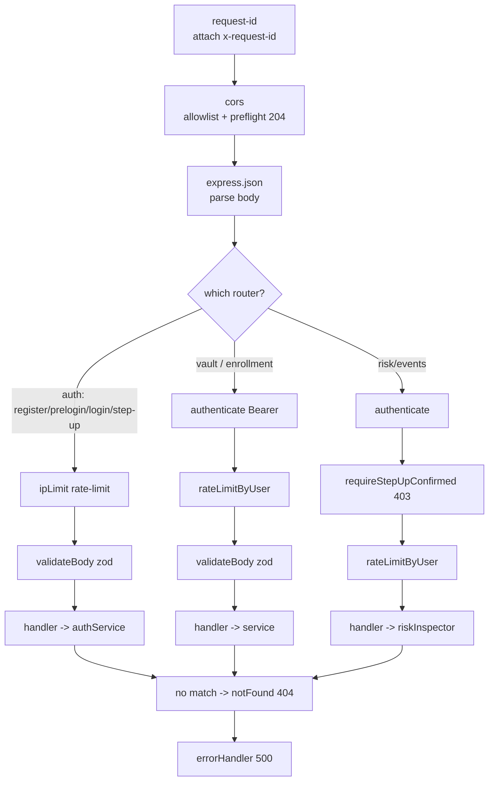

# 09 — Server & API: Express routes, WebSocket, what the server can and cannot see

> **Scope.** This doc covers the HTTP surface of the Cerberus server: every route, the fixed
> middleware chain, the routes → services → repositories layering, the full outcome/error
> taxonomy (and its deliberately non-leaking copy), the server's identity crypto, the config and
> production-refusal guards, and the session model. The WebSocket is covered in depth in
> [Continuous Auth](08-continuous-auth.md); here we only place it in the picture. The risk **engine**
> behind the login decision lives in [Decision & Policy](07-decision-and-policy.md). The behavioral
> baselines feeding it are in [Behavioral Engine](06-behavioral-engine.md). The database tables are
> in [Database](10-database.md).

---

## 1. In plain English

The server is the password vault's **filing cabinet and bouncer**, and it is deliberately
**blind**. A filing cabinet that cannot read the files it holds: every secret arrives already
locked (encrypted) by the desktop app, and the server only ever stores the locked blob plus a few
non-secret labels (your username, when an item changed, a coarse country). The master password,
the keys, and the plaintext of any credential **never reach the server** — not in a request, a
log, an error, or a test fixture. This is what "zero-knowledge" means here.

The "bouncer" part is the risk-based login. When you log in, the server checks a proof that you
know your password (without ever seeing the password), then weighs behavioral and contextual
signals into a single risk score, and decides: **let you in (grant)**, **ask for a second factor
(step-up / TOTP)**, or **refuse (deny)**. Crucially, every one of those outcomes — plus the
generic failures (bad credentials, too many attempts, server fault) — comes back as a **distinct,
generic message that reveals nothing** about which signal fired or whether the account even exists.

> **Acronyms defined on first use, repeated in the glossary.** *API* (Application Programming
> Interface) = the set of HTTP endpoints. *TOTP* (Time-based One-Time Password) = the 6-digit code
> from an authenticator app. *AEAD* (Authenticated Encryption with Associated Data) = encryption
> that also detects tampering. *KDF* (Key Derivation Function) = the slow hashing that turns a
> password into a key. *IDOR* (Insecure Direct Object Reference) = a bug where user A can read
> user B's data by guessing an id. *CORS* (Cross-Origin Resource Sharing) = the browser rule the
> server must satisfy so the desktop webview can call it.

---

## 2. Where it lives

```
apps/server/src/
├── index.ts                     process bootstrap: load config, open GeoIP, pool, attach WS, listen
├── app.ts                       wires the fixed middleware chain + all routers (dependency injection)
├── config.ts                    env → ServerConfig; production-refusal guards; demo-override gating
├── routes/                      THIN HTTP surface (validate → one service call → map result)
│   ├── index.ts                 aggregates the always-on routers (currently just health)
│   ├── health.ts                GET /health  (no DB, no auth)
│   ├── auth.ts                  register / prelogin / login / step-up / totp / me
│   ├── vault.ts                 GET /vault/key + CRUD on /vault/items
│   ├── enrollment.ts            behavioral baseline sample buffering
│   └── risk.ts                  GET /risk/events  (step-up-gated inspector)
├── middleware/                  the chain, one file each
│   ├── request-id.ts  cors.ts  validate.ts  rate-limit.ts  async-handler.ts
│   ├── authenticate.ts          Bearer-token session auth + requireStepUpConfirmed gate
│   ├── not-found.ts  error-handler.ts
├── services/                    business logic (routes never touch the DB)
│   ├── auth.ts                  the login enforcement point (grant / step-up / deny)
│   ├── auth-crypto.ts           the ONLY server-side identity crypto (hash the auth key, etc.)
│   └── health.ts  vault.ts  enrollment.ts  totp-service.ts  risk-inspector.ts  …
└── repositories/                all SQL, every query scoped to user_id (e.g. sessions.ts)

packages/shared-types/src/index.ts   the request/response contract (zod schemas + inferred types)
```

This doc reads `routes/*`, `middleware/*`, `services/auth.ts`, `services/auth-crypto.ts`,
`config.ts`, `app.ts`, `index.ts`, and the DTO schemas in `packages/shared-types/src/index.ts`.
It references (not re-explains) the services in docs 06/07/08 and the repositories in doc 10.

---

## 3. File-by-file

### 3.1 The bootstrap and the wiring

**[`index.ts`](../../apps/server/src/index.ts)** — *the process entry point.* `main()` loads the
config, opens the offline GeoIP database (or, **outside production only**, falls back to the demo
geo table; in production a missing DB stays neutral), creates the Postgres pool, builds the Express
app via `createApp`, wraps it in a raw `http.createServer` (needed so the WebSocket can hook the
HTTP *upgrade*), attaches the continuous-auth WS, and calls `server.listen(config.port)` (default
8080). On any startup failure it sets `process.exitCode = 1` — **fail closed**, no half-started
server. No business logic lives here.

**[`app.ts`](../../apps/server/src/app.ts)** — *the composition root.* `createApp(pool, config, deps)`
does three things: (1) sets `trust proxy` from config so the real client IP is read behind a reverse
proxy; (2) installs the fixed middleware chain (§4); (3) **constructs every service once** (scoring,
enrollment, risk-decision, totp, auth, vault, risk-inspector) and injects them into the routers.
Dependencies are injected so tests can run against an ephemeral Postgres and a stub geo lookup.
Four `RateLimiter` instances are created here and shared per process: one per-IP (`ipLimiter`) and
three per-user (`vaultLimiter`, `enrollmentLimiter`, `riskLimiter`).

### 3.2 The routes (thin HTTP surface)

The project rule (PROJECT.md §4) is **routes → services → repositories**: a route may only
validate input, call **one** service method, and map the result to an HTTP response. **Routes touch
no database.** All four mounted routers follow this.

**[`routes/index.ts`](../../apps/server/src/routes/index.ts)** — aggregates the always-on routers.
Currently mounts only `healthRouter`; the auth/vault/enrollment/risk routers are mounted separately
in `app.ts` because they need injected dependencies.

**[`routes/health.ts`](../../apps/server/src/routes/health.ts)** — `GET /health`. Delegates to
`getHealth()`; no DB, no auth. Returns `{ status: 'ok', uptimeSeconds, timestamp }`.

**[`routes/auth.ts`](../../apps/server/src/routes/auth.ts)** — the identity surface (§6). Key local
helpers: `granted()` maps a granted `LoginResult` to its DTO; `sendLoginResult()` is the **single
place** that maps every login outcome to an HTTP status (shared by `/auth/login` and
`/auth/step-up/verify`) — this is where the non-leaking taxonomy is enforced (§7).

**[`routes/vault.ts`](../../apps/server/src/routes/vault.ts)** — encrypted-blob CRUD (§6). Note
`itemId()`: a path `:id` that is not a UUID is treated as **not-found**, identical to not-owned, so
the API never reveals whether an id exists (no IDOR / existence leak). `router.use(authenticate)`
then `router.use(rateLimit)` apply to **all** vault routes.

**[`routes/enrollment.ts`](../../apps/server/src/routes/enrollment.ts)** — buffers behavioral
samples toward a baseline. It does **not** score or enforce — scoring happens at the login decision
point. The submitted feature vector is biometric-adjacent and is never logged or echoed.

**[`routes/risk.ts`](../../apps/server/src/routes/risk.ts)** — `GET /risk/events`, the read-only
risk **inspector** (a demonstration/research affordance, not a shipped end-user feature). Chained
`authenticate → requireStepUp → rateLimit`. The handler never reads a user id from the request — it
takes it from the authenticated session — and re-validates the outgoing page with
`RiskEventsResponseSchema.parse` (defense in depth) so a raw feature vector can never leak.

### 3.3 The middleware (one file each)

| File | Job | Gotcha |
|---|---|---|
| [`request-id.ts`](../../apps/server/src/middleware/request-id.ts) | First in the chain. Attaches `x-request-id` (incoming or a fresh UUID) to `res.locals` + the response header for log correlation. | Logs carry IDs and decisions, never PII or secrets. |
| [`cors.ts`](../../apps/server/src/middleware/cors.ts) | Allowlist-based CORS for the desktop webview's cross-origin calls. Answers the `OPTIONS` preflight with `204`. | Explicit allowlist, **never `*`**; no credentials mode (Bearer tokens, not cookies). A disallowed origin gets no `Access-Control-Allow-Origin` header and the browser blocks it (fail closed). |
| [`async-handler.ts`](../../apps/server/src/middleware/async-handler.ts) | Wraps an async handler so a rejected promise is forwarded to the error handler. | Prevents floating promises / unhandled rejections (PROJECT.md §4). |
| [`validate.ts`](../../apps/server/src/middleware/validate.ts) | `validateBody(schema)`: zod-parses the body; on failure → generic `400 {error:'invalid_request'}`; on success stores the typed value in `res.locals.body`. | The invalid input is **never echoed back** — it may carry secret-adjacent material. |
| [`rate-limit.ts`](../../apps/server/src/middleware/rate-limit.ts) | `rateLimitByIp` (keys on `ip:<addr>`) and `rateLimitByUser` (keys on `user:<id>`, falling back to IP if no session). On limit → `429` + `Retry-After`. | The `RateLimiter` instance is shared per process (in-memory). |
| [`authenticate.ts`](../../apps/server/src/middleware/authenticate.ts) | `createAuthenticate(sessions)`: parse the `Bearer` token, hash it, look up an **active, unexpired** session, attach an `AuthenticatedSession` to `res.locals.session`. Any failure → `401`. Also exports `requireStepUpConfirmed` (the inspector gate). | Fails closed on every error. See §8 for the session model. |
| [`not-found.ts`](../../apps/server/src/middleware/not-found.ts) | Terminal handler for unmatched routes → `404 {error:'not_found'}`. | Stable, non-leaking shape. |
| [`error-handler.ts`](../../apps/server/src/middleware/error-handler.ts) | Centralized error handler (last in the chain). Any thrown/rejected error → `500 {error:'internal_error', requestId}`. | Keeps all four parameters (Express identifies error handlers by arity). Carries a `TODO` for structured logging — IDs and decisions only, never PII/secrets. |

### 3.4 The identity crypto and config

**[`services/auth-crypto.ts`](../../apps/server/src/services/auth-crypto.ts)** — *the only
server-side identity crypto.* This is **not** vault crypto (that lives entirely in Rust; see
[Cryptographic Core](04-cryptographic-core.md)). It hashes the client-derived **auth key**, runs the
user-enumeration mitigation, and hashes session tokens. Detailed in §5.

**[`services/auth.ts`](../../apps/server/src/services/auth.ts)** — *the auth service*: register,
prelogin, login (the enforcement point), `verifyStepUp`, `elevateStepUp`. It orchestrates the
repositories and the risk-decision service; the route just calls it. Walked in §6.2.

**[`config.ts`](../../apps/server/src/config.ts)** — `loadConfig()` reads the environment once at
startup into a `ServerConfig`. Holds the production-refusal guards and the demo-override gating
(§9).

**[`packages/shared-types/src/index.ts`](../../packages/shared-types/src/index.ts)** — the
**contract**. Every request/response shape is a zod schema (the single source of truth for both
the static TypeScript type *and* the runtime validator), consumed by both server and webview. Only
non-secret shapes appear here.

*Trivial files skipped:* `services/health.ts` (a three-field status object, shown inline in §6.1).
The remaining services (`scoring`, `enrollment`, `totp-service`, `risk-decision`,
`risk-inspector`, `continuous-auth`, `vault`) are owned by docs 05–08 and only referenced here.

---

## 4. How it works — the fixed middleware chain

**Plain English.** Every request runs a gauntlet in a fixed order before any route handler sees it,
and the order is a security decision, not a convenience.

`app.ts` installs the chain. The intent (PROJECT.md §4.3) is:

```
request-id → cors → json → [per router: authenticate → rate-limit → validation] → handler → not-found → error
```



**Why this order.** Several choices "fail closed":

- **`request-id` first** so even a `500` from a later stage carries a correlation id.
- **`cors` before everything** so a cross-origin preflight short-circuits (`204`) before any handler
  or validation runs. *Naive alternative:* CORS late → preflights would hit auth/rate-limit logic
  pointlessly, and a misconfig could let a disallowed origin trigger work.
- **`authenticate` before `rate-limit`** on protected routers so the per-user limiter can key on the
  session user id (`user:<id>`) rather than only the IP — fairer and harder to evade via IP rotation.
  *Subtle:* on the **unauthenticated** auth routes the order is the reverse — `ipLimit` runs first
  (rate-limit *before* validation) so a flood is cheaply rejected without parsing bodies.
- **`rate-limit` before `validation`** so a flood is rejected without spending parse work, and the
  limiter reads only the IP/session, never the (possibly secret-adjacent) body.
- **`validation` before the handler** so the handler only ever sees a typed, bounds-checked value
  (`res.locals.body`), never raw input.
- **`not-found` then `error-handler` last** so any unmatched path or thrown error degrades to a
  stable, non-leaking shape.

> ⚠️ **Minor doc-vs-code nuance (not a bug).** The header comments say
> `request-id → auth → rate-limit → validation`, but `authenticate` is **not** a global middleware —
> it is mounted **per router** (and per route in `risk.ts`). The auth routes that need no session
> (register/prelogin/login/step-up/verify) skip it entirely; the protected routers apply it via
> `router.use(authenticate)`. The "auth" slot in the prose describes the protected path, not a
> single global step.

---

## 5. The only server-side crypto: hashing the auth key

**Plain English.** The desktop app turns your master password into a 256-bit **auth key** (a login
proof) and an **encryption key** (which never leaves the device). The server receives only the auth
key, and even that it treats like a password it must store safely: it **hashes** it before storing.
Hashing the auth key is the *sole* cryptographic operation the server performs on identity material.
It cannot derive your encryption key, decrypt your vault, or recover your master password.

### 5a. Intuition

Storing the auth key as-is would mean a database leak hands an attacker the login proof directly.
So the server hashes it with a slow, salted, memory-hard hash (Argon2id) — "defense in depth." The
auth key is *already* 256-bit high-entropy, so brute force is infeasible regardless; the server-side
Argon2id params are therefore deliberately **moderate** (much lighter than the client KDF).

### 5b. Mechanism

[`auth-crypto.ts`](../../apps/server/src/services/auth-crypto.ts) provides:

- **`hashAuthKey(authKeyB64)`** / **`verifyAuthKey(storedHash, authKeyB64)`** — Argon2id hash and
  constant-time verify, both operating on the **base64 string** form of the key (the wire
  representation), for register/login consistency.
- **`verifyAgainstDummy(authKeyB64)`** — runs a verify against a *fixed precomputed* dummy hash so
  the unknown-user login path costs the same as the known-user path (no early return that would leak
  account existence via timing).
- **`deterministicDummySalt(secret, username)`** — `HMAC-SHA256(enumerationSecret, username)[..16]`
  — a stable dummy KDF salt for an unknown account, so prelogin for a missing user looks identical
  to a real one (ADR-0007).
- **`generateSessionToken()`** — 32 random bytes, base64url (a 256-bit opaque token).
- **`hashSessionToken(token)`** — `SHA-256` hex. The token is high-entropy, so a fast hash suffices
  (no Argon2id needed — unlike the low-entropy-derived auth key).

### 5c. Where in the code (real parameters)

- Argon2id auth-key params: `AUTH_HASH_OPTIONS` at `auth-crypto.ts:20-25` — **`memoryCost: 19_456`
  KiB (≈ 19 MiB), `timeCost: 2`, `parallelism: 1`**, algorithm Argon2id (`= 2`).
- The fixed dummy PHC string: `auth-crypto.ts:32-33`
  (`$argon2id$v=19$m=19456,t=2,p=1$…`) — same params as real hashes, so the unknown-user verify does
  identical work **with no extra hash build on the request path** (the cold-start timing
  distinguisher a lazily-built dummy would create is eliminated).
- Dummy salt: `auth-crypto.ts:69-71` — HMAC-SHA256, first 16 bytes.

> **Do not confuse three different "Argon2"/cipher uses** (a classic conflation):
> | Use | Where | Params |
> |---|---|---|
> | **Client master-key KDF** | Rust [`kdf.rs`](../../apps/desktop/src-tauri/src/crypto/kdf.rs) | 224 MiB, t=3, p=1 |
> | **Server auth-key hash** (this doc) | `auth-crypto.ts:20-25` | ≈19 MiB, t=2, p=1 |
> | **Baseline / TOTP at-rest cipher** | `baseline-crypto.ts` / `secretbox.ts` | AES-256-GCM |
> The middle one is the only Argon2 the server runs, and it is much lighter than the client KDF.

### 5d. Worked example

A user registers; the client sends `authKey = "Yk3v…=="` (base64 of 32 random-looking bytes).

1. Register: `hashAuthKey("Yk3v…==")` → a PHC string with its own random salt, stored in
   `users.auth_key_hash`.
2. Login: the same client re-derives the same auth key, sends it; `verifyAuthKey(stored, "Yk3v…==")`
   returns `true` in constant time.
3. Login for a **non-existent** user `"ghost"`: `findByUsername` returns nothing →
   `verifyAgainstDummy("Yk3v…==")` runs (same ≈19 MiB Argon2id work) → `valid = false`. The
   response is the same `401` and the same latency as a real wrong password, so the attacker cannot
   tell `ghost` does not exist.

---

## 6. The route catalog

> **Reading the table.** "Auth" = does it require a valid session (Bearer token)? "RL" = which rate
> limiter. "Validation" = the zod schema (or none). "Service" = the one service method called.
> Every route is `async`-wrapped so a rejection becomes a `500` via the error handler.

### 6.1 Always-on (no auth)

| Method · Path | Auth | RL | Validation | Service | Success | Errors |
|---|---|---|---|---|---|---|
| `GET /health` | none | none | none | `getHealth()` | `200 {status:'ok', uptimeSeconds, timestamp}` | — |

### 6.2 Auth router ([`routes/auth.ts`](../../apps/server/src/routes/auth.ts))

| Method · Path | Auth | RL | Validation | Service | Success | Errors |
|---|---|---|---|---|---|---|
| `POST /auth/register` | none | ipLimit | `RegisterRequestSchema` | `authService.register` | `201 {userId}` | `409 {error:'username_taken'}` · `429` · `400` invalid body |
| `POST /auth/prelogin` | none | ipLimit | `PreloginRequestSchema` | `authService.prelogin` | `200 {kdfVersion, kdfSalt, kdfParams}` (real **or** deterministic dummy) | `429` · `400` |
| `POST /auth/login` | none | ipLimit | `LoginRequestSchema` | `authService.login` | see **login taxonomy** §7 | see §7 |
| `POST /auth/step-up/verify` | none | ipLimit | `StepUpVerifyRequestSchema` | `authService.verifyStepUp` | `200` granted DTO | `401` bad/expired code or used challenge · `429` · `400` |
| `POST /auth/step-up/elevate` | **session** | ipLimit | `StepUpElevateRequestSchema` | `authService.elevateStepUp` | `200 {status:'confirmed'}` | `401 {error:'invalid_code'}` · `429` · `400` |
| `GET /auth/totp/status` | **session** | none | none | `totpService.status` | `200 {confirmed:boolean}` | `401` |
| `POST /auth/totp/setup` | **session** | none | none | `totpService.setup` | `200 {provisioningUri, secret}` | `401` |
| `POST /auth/totp/confirm` | **session** | none | `TotpConfirmRequestSchema` | `totpService.confirm` | `200 {confirmed:true}` | `400 {error:<reason>}` · `401` |
| `GET /auth/me` | **session** | none | none | — (reads `res.locals.session`) | `200 {userId, deviceId}` | `401` |

Notes:
- `/auth/step-up/elevate` is the **voluntary** step-up: a granted session proves TOTP **in place**
  (no new token) to unlock the gated inspector. A wrong code → generic `401 {error:'invalid_code'}`,
  no risk/identity detail.
- `/auth/totp/setup` and `/auth/totp/confirm` carry **no** rate limiter in the router wiring — only
  `authenticate`. (The session itself bounds access; the code is validated by the TOTP service.)

### 6.3 Vault router ([`routes/vault.ts`](../../apps/server/src/routes/vault.ts)) — all session + per-user RL

| Method · Path | Validation | Service | Success | Errors |
|---|---|---|---|---|
| `GET /vault/key` | none | `vaultService.getVaultKey` | `200 {wrappedVaultKey, wrappedVaultKeyNonce}` | `404 {error:'not_found'}` if none · `401` · `429` |
| `GET /vault/items` | none | `vaultService.listItems` | `200 VaultItem[]` | `401` · `429` |
| `POST /vault/items` | `CreateVaultItemRequestSchema` | `vaultService.createItem` | `201 {id, revision, updatedAt}` | `409 {error:'conflict'}` (id exists) · `400` · `401` · `429` |
| `GET /vault/items/:id` | `:id` must be UUID | `vaultService.getItem` | `200 VaultItem` | `404 {error:'not_found'}` (not-UUID **or** not-owned **or** absent) · `401` · `429` |
| `PUT /vault/items/:id` | `UpdateVaultItemRequestSchema` | `vaultService.updateItem` | `200 {id, revision, updatedAt}` | `409 {error:'revision_conflict'}` · `404 {error:'not_found'}` · `400` · `401` · `429` |
| `DELETE /vault/items/:id` | `:id` must be UUID | `vaultService.deleteItem` | `204` no body | `404 {error:'not_found'}` · `401` · `429` |

Every item field is an **opaque AEAD blob + non-secret metadata** — the server never decrypts. The
not-UUID-collapses-to-404 trick (`itemId()`) means *the API never distinguishes "doesn't exist"
from "isn't yours"* (no IDOR / existence oracle). See [Vault & Sync](05-vault-and-sync.md).

### 6.4 Enrollment router ([`routes/enrollment.ts`](../../apps/server/src/routes/enrollment.ts)) — session + per-user RL

| Method · Path | Validation | Service | Success | Errors |
|---|---|---|---|---|
| `GET /enrollment/status` | none | `enrollmentService.getStatus` | `200 EnrollmentStatus` | `401` · `429` |
| `POST /enrollment/samples` | `EnrollmentSampleRequestSchema` | `enrollmentService.submitSample` | `201 status` | `409 {error:'schema_version'}` (client must upgrade) · `400 {error:'dimension_mismatch'}` · `401` · `429` |

### 6.5 Risk router ([`routes/risk.ts`](../../apps/server/src/routes/risk.ts)) — session + **step-up** + per-user RL

| Method · Path | Validation | Service | Success | Errors |
|---|---|---|---|---|
| `GET /risk/events?limit&offset` | query coerced/bounded by `PaginationSchema`; response re-validated | `riskInspector.listEvents` | `200 {events[], limit, offset}` | `403 {error:'step_up_required'}` (no step-up) · `400 {error:'invalid_request'}` (bad pagination) · `401` · `429` |

`limit` defaults to `RISK_EVENTS_DEFAULT_LIMIT`, max `RISK_EVENTS_MAX_LIMIT`; `offset` defaults `0`.
`signals` carries scores + structured reasons **only — never a raw feature vector** (biometric
privacy), and the outgoing shape is `RiskEventsResponseSchema.parse`-d before it leaves the server.

### 6.6 The login service path (follow the data)

`login()` in [`auth.ts`](../../apps/server/src/services/auth.ts) is the enforcement point. In order:

1. **Per-IP backstop (hard).** Truncate the IP; count recent failures for it. If `>= ipHardCap`
   (default 50, 15-min window) → `rate_limited` (`429`). This is a coarse anti-abuse cap, not the
   adaptive policy.
2. **Verify the auth key.** Look up the user. If found, `verifyAuthKey`; if not, run
   `verifyAgainstDummy` to equalize timing and set `valid = false`. On no-user-or-invalid → record a
   failure and return `invalid_credentials` (`401`).
3. **Enroll the device.** `devicesRepository.enroll` — a never-seen fingerprint hash marks the
   device new.
4. **Behavioral sub-score** (`behavioralFor`): if an active baseline exists and a keystroke sample is
   present, score it (Mahalanobis → χ²); if the baseline exists but **no sample** is sent, **fail
   closed** to score `1` ("missing" — suppression is not a bypass); if still enrolling, buffer the
   sample and treat behavioral as cold-start neutral (score `0`).
5. **Contextual signals + combine + band** via `riskDecision.decide` (new-device, geovelocity,
   time-of-day, failure-velocity → composite → grant / step-up / deny). See
   [Decision & Policy](07-decision-and-policy.md). A `X-Demo-Geo` country override is honored **only
   outside production**.
6. **Record** a `risk_events` row (signals, sub-scores, composite, band, action, coarse geo,
   truncated IP).
7. **Enforce.** `denied` → `403` (+ demo-only breakdown); `step_up_required` → create a step-up
   challenge, return its token (`200 step_up_required`); `granted` / `step_up_bootstrap_grant` →
   issue a session (**not** step-up-confirmed) and return the granted DTO with the wrapped vault key.

---

## 7. The outcome / error taxonomy (distinct, non-leaking copy)

**Plain English.** The single most security-sensitive thing about this API is that **each outcome
returns a different, generic message that reveals nothing** — not which signal fired, not the
device, not the location, not even whether the account exists. The mapping lives in **one function**,
`sendLoginResult()` ([`auth.ts:58-89`](../../apps/server/src/routes/auth.ts)), so it cannot drift.

| `LoginResult.kind` | HTTP | Body | What it must NOT reveal |
|---|---|---|---|
| `granted` | `200` | `{status:'granted', sessionToken, expiresAt, wrappedVaultKey, wrappedVaultKeyNonce, device:{isNew}}` | — |
| `step_up` | `200` | `{status:'step_up_required', challengeToken, expiresAt, methods:['totp']}` | which signal pushed it to step-up |
| `denied` | `403` | `{error:'denied'}` (+ `risk` breakdown **only outside production**) | which signal fired, device, location |
| `rate_limited` | `429` | `{error:'too_many_requests'}` + `Retry-After` header | per-account vs per-IP cause |
| `invalid_credentials` / default | `401` | `{error:'invalid_credentials'}` | whether the account exists |

Beyond login, the broader set of distinct outcomes a client can observe:

- **`400 {error:'invalid_request'}`** — body failed zod validation (or bad pagination on the
  inspector). The invalid input is never echoed.
- **`401 {error:'unauthorized'}`** — missing/invalid/expired Bearer token (from `authenticate`).
- **`403 {error:'step_up_required'}`** — authenticated but the session never passed a TOTP step-up
  (the inspector gate). Note this is a *different* `403` body from a login deny.
- **`404 {error:'not_found'}`** — unmatched route, or a vault item that is not-UUID / not-owned /
  absent (uniform — no existence oracle).
- **`409`** — `username_taken` (register), `conflict` (duplicate vault id), `revision_conflict`
  (optimistic-concurrency clash), or `schema_version` (enrollment client too old).
- **`500 {error:'internal_error', requestId}`** — any thrown/rejected error (the "server fault"
  outcome). Leaks no internal detail; the `requestId` is for log correlation only.

> **Why one function?** If the deny/step-up/401 copy were scattered across handlers, a future edit
> could accidentally make a deny say "new device detected" or make an unknown-user 401 differ from a
> wrong-password 401 — a textbook account-enumeration leak. Centralizing it makes the invariant
> testable and hard to break. The deny-only `risk` breakdown is `undefined` in a production build
> (`demoOverridesAllowed` is false), so it is simply **omitted from the JSON** there.

---

## 8. The session model

**Plain English.** A successful login mints an opaque random token. The client keeps it; the server
keeps only its **SHA-256 hash**. On each protected request the client sends `Authorization: Bearer
<token>`; the server hashes what it received and looks for a matching **active, unexpired** session.
A session also remembers whether it ever passed a TOTP step-up — a flag that gates the inspector.

### How a request authenticates

In [`authenticate.ts`](../../apps/server/src/middleware/authenticate.ts) → `verify()`:

1. Read the `Authorization` header; require the `Bearer ` prefix and a non-empty token, else `401`.
2. `hashSessionToken(token)` (SHA-256 hex) → `sessions.findActiveByTokenHash(hash)`. The SQL
   (`sessions.ts:90-95`) filters `status = 'active' AND expires_at > now()`. No row → `401`.
3. Build `AuthenticatedSession` on `res.locals.session`:

   | Field | Meaning |
   |---|---|
   | `id` | the session row id (server-side only; used to elevate this session in place) |
   | `userId` | the owner |
   | `deviceId` | the device this session was issued for (nullable) |
   | `createdAt` | login time (feeds contextual time-of-day signals) |
   | `isNewDevice` | whether the device was new at this login |
   | `stepUpConfirmed` | whether this session passed a TOTP step-up **this session** |

`AuthenticatedSession` is a **superset** of the public `SessionInfo` DTO and is **never serialized
wholesale** to a client.

### The step-up-confirmed flag

Three ways the flag is set, and what reads it:

- **Set at creation** when a session is born from a passed step-up: `verifyStepUp` consumes the
  challenge and calls `issueSession(…, stepUpConfirmed = true)`.
- **Set in place** by `elevateStepUp` → `sessions.markStepUpConfirmed(id)` (a granted session
  proves TOTP voluntarily). Only touches an `active` session; idempotent.
- **Not set** for an ordinary grant or a `step_up_bootstrap_grant` (the newcomer who has no usable
  second factor yet) — `issueSession(…, false)`.

`requireStepUpConfirmed` ([`authenticate.ts:77-84`](../../apps/server/src/middleware/authenticate.ts))
reads it: a missing or non-step-up session → `403 {error:'step_up_required'}`, **enforced on the
server, never by hiding a button**.

### Session lifecycle

- **TTL**: `expiresAt = now + config.sessionTtlMs` (default 24 h). Expiry is enforced in the lookup
  query, not by a background job.
- **Lock**: a continuous-auth spike calls `sessions.markLocked(id)` → `status = 'locked'`; the
  bearer token then no longer authenticates (the lookup filters `status='active'`), forcing a fresh
  re-unlock. See [Continuous Auth](08-continuous-auth.md).

---

## 9. Config, production-refusal guards, and demo gating

**Plain English.** `loadConfig()` reads environment variables into one frozen `ServerConfig` at
startup. Two things make it safe: it **refuses to start a production server with known-insecure
defaults**, and it **ignores demo-weakening knobs in production**.

### Production-refusal guards ([`config.ts`](../../apps/server/src/config.ts))

These throw on startup (→ `index.ts` sets `exitCode = 1` — the server never comes up):

| Guard | Trigger | Why |
|---|---|---|
| `ENUMERATION_SECRET` (`config.ts:196-200`) | `NODE_ENV=production` **and** the secret is still the public dev value | If leaked, an attacker could recompute dummy salts and distinguish real vs absent accounts (defeats ADR-0007). |
| `BASELINE_ENC_KEY` (`loadBaselineKey`, `config.ts:181-190`) | `NODE_ENV=production` and the key is unset | The behavioral baselines at-rest key must be real; in dev it falls back to an obviously-non-secret all-zero key. |
| `decodeKey` (`config.ts:172-179`) | the key does not decode to exactly 32 bytes | A wrong-length key is a misconfiguration; fail loudly rather than silently truncate. |

### Demo-override gating

`demoOverridesAllowed(nodeEnv)` returns `true` for **every non-production** environment. Demo knobs
make a baseline activate and the continuous-auth spike→lock trigger within seconds for a live demo:
`MIN_ENROLLMENT_SAMPLES`, `MOUSE_MIN_ENROLLMENT_SAMPLES`, `CONTINUOUS_AUTH_EWMA_ALPHA`,
`CONTINUOUS_AUTH_SPIKE_THRESHOLD`. Read via `demoIntFromEnv` / `demoFloatFromEnv`:

- **In production** the env var is **ignored** and the secure default applies; if one is set, a
  `console.warn` records that it was ignored (never silent).
- **Outside production** an applied override is `console.warn`-logged (non-secret) so it is never
  silent.

The same gate guards two **runtime** demo behaviors: the `X-Demo-Geo` login header (simulate a
location for impossible-travel demos; `auth.ts:243-246`) and the deny-only `risk` breakdown attached
to a `403` (`auth.ts:280-282`). Both are `undefined`/ignored in production, so user-facing copy stays
generic.

### Other notable config

- `trustProxy` from `TRUST_PROXY` (default `false`) → `app.set('trust proxy', …)`. This reconciles a
  prose conflict between ADRs: ADR-0011 (the proxy setting **is** configurable) supersedes ADR-0007.
- `corsAllowedOrigins` defaults to the Tauri origins (`http://localhost:1420`, `tauri://localhost`,
  `http(s)://tauri.localhost`); overridable via `CORS_ALLOWED_ORIGINS` (CSV).
- `sessionTtlMs` default 24 h; rate-limit windows/caps via `RL_*`.

> ⚠️ **Vestigial config (flagged, not a bug).** `RateLimitConfig.accountMaxFailures` /
> `accountLockoutMs` (env `RL_ACCOUNT_*`) are still defined and parsed (`config.ts:212-213`) but are
> **unused** — the M4 per-account lockout was replaced by the per-IP backstop in `auth.ts`. They
> remain as dead config.

---

## 10. How it connects

- **Receives from the webview** (`apps/desktop/src/lib/api.ts`): all HTTP requests above. The client
  derives keys in Rust first, so the server only ever sees the auth key, public KDF params/salt,
  AEAD-wrapped blobs, and device-fingerprint **hash**.
- **Hands to the webview**: session tokens + the wrapped vault key (so a fresh client can unlock
  locally), TOTP provisioning URIs, opaque vault blobs, and risk-event pages — all non-secret or
  client-decryptable-only.
- **Calls into services → repositories**: `app.ts` injects every service; services own the logic and
  the repositories own all SQL, **every query scoped to `user_id`** (no IDOR). See
  [Database](10-database.md).
- **Shares the contract**: `@cerberus/shared-types` schemas are the same zod objects the client uses
  to validate replies — drift is caught at compile time on one side and at runtime on both.
- **The WebSocket** (`/ws/continuous-auth`) is attached to the *same* HTTP server in `index.ts` but
  is its own protocol; the in-session mouse stream and spike→lock live in
  [Continuous Auth](08-continuous-auth.md).

---

## 11. Gotchas & invariants

1. **Zero-knowledge is structural, not a promise.** The server's only identity crypto is
   `hashAuthKey` (≈19 MiB Argon2id). No endpoint, log, error, or fixture handles the master password
   or a derived encryption key. Vault crypto is entirely in Rust.
2. **One mapping function for all login copy.** `sendLoginResult` is the single source of the
   grant / step-up / 401 / 403 / 429 taxonomy — keep it that way so the non-leaking invariant stays
   testable.
3. **Distinct 403s.** A login **deny** is `403 {error:'denied'}`; a missing **step-up** on the
   inspector is `403 {error:'step_up_required'}`. Same status, deliberately different bodies; do not
   merge them.
4. **Fail closed everywhere.** Missing telemetry on an active baseline → behavioral score `1` (deny
   pressure), not a skip (`auth.ts:109-111`). Any auth failure → `401`. Any thrown error → `500`. A
   disallowed CORS origin → no header. Startup misconfig → process exits.
5. **No existence oracle.** Unknown-user prelogin returns a deterministic dummy salt; unknown-user
   login runs the dummy verify for equal timing and returns the same `401`; a not-UUID/not-owned
   vault id returns the same `404` as an absent one.
6. **The inspector gate is server-enforced.** `requireStepUpConfirmed` runs on the server; the UI
   button being hidden is incidental. Output is re-validated to guarantee no raw feature vector
   leaves.
7. **Rate-limit state is in-memory and per-process.** The four `RateLimiter`s in `app.ts` are not
   shared across instances — fine for the single-process thesis deployment, but a horizontally
   scaled deployment would need a shared store. (Observation from `app.ts:52-58`; no TODO in code.)
8. **`routes/index.ts` only mounts health.** The other routers are mounted in `app.ts` because they
   need injected deps — the header comment ("New route groups are mounted here as they land") is
   aspirational for the always-on set.
9. **Doc-vs-code chain nuance.** `authenticate` is per-router, not a global step, despite the
   "request-id → auth → rate-limit" prose (§4). The unauthenticated auth routes order rate-limit
   *before* validation; the protected routers order authenticate → rate-limit → validation.
10. **`error-handler` carries a TODO.** Structured logging is not yet implemented:
    `// TODO (later phases): structured logging — IDs and decisions only, never PII or secrets`
    ([`error-handler.ts:16-17`](../../apps/server/src/middleware/error-handler.ts)). The current
    `500` body is already non-leaking.
```
