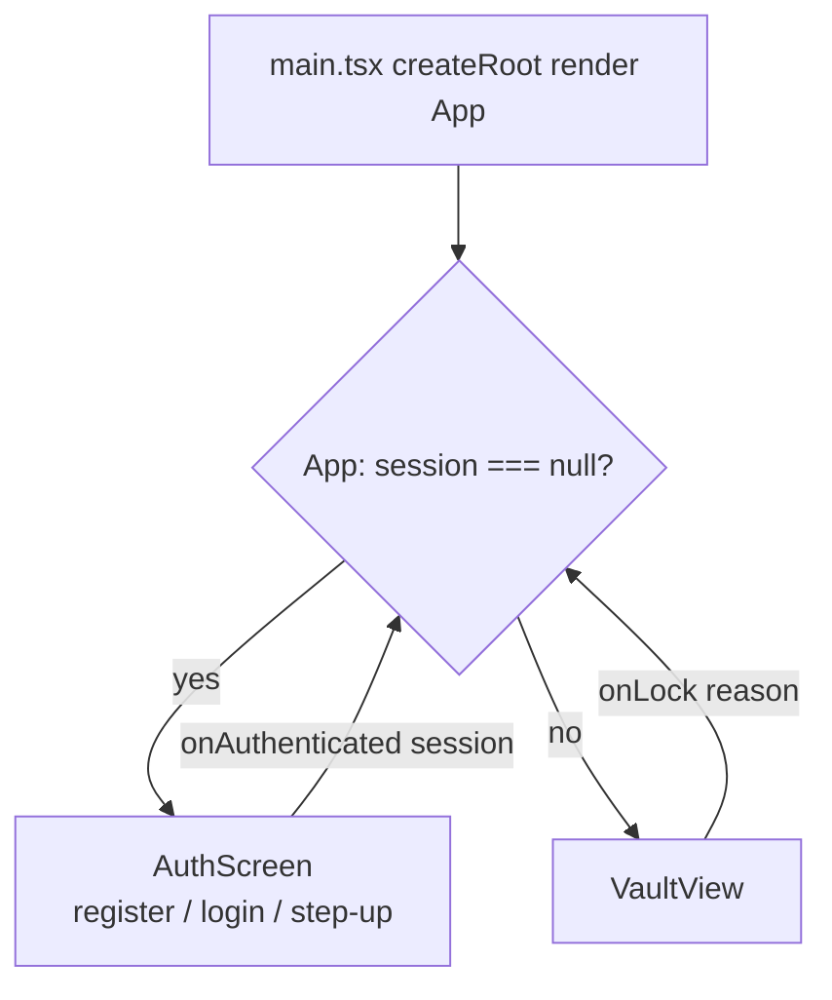
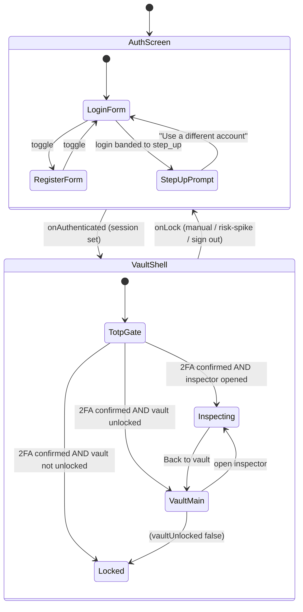
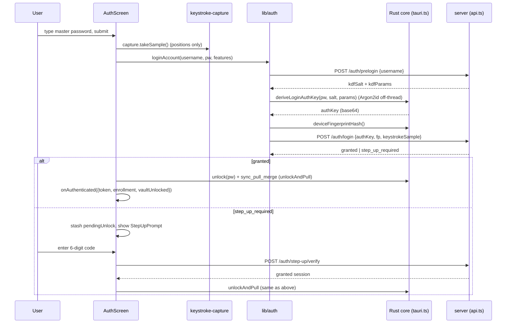

# 11 — Frontend: React structure, key screens, state, how the UI calls the core

> One-line: how the desktop webview is built — a router-less two-state shell, the
> auth / vault / inspector screens, how it talks to the Rust security core and the
> server, where behavioral capture is wired, and the "never leak a risk reason" copy rule.

---

## 1. In plain English

The desktop app is two programs glued together. One is a **Rust security core** (where the
master password, encryption keys, and plaintext secrets live — see
[Cryptographic core](04-cryptographic-core.md)). The other is the part you actually see: a
**webview**, which is a small embedded web browser running a React + TypeScript app. This
document is about that webview.

"React" here means: the screen is described as a tree of small functions ("components") that
each return some HTML, and React re-draws the right pieces when data changes. There is **no
router** (no URLs, no `/login` vs `/vault` pages). Instead the app holds one piece of state —
"do we have a logged-in session?" — and shows one of two screens accordingly. Inside each
screen, more local state decides which sub-view you see (the unlock form, the step-up code
prompt, the vault list, the second-factor setup, the inspector dashboard).

The webview never holds a key. When it needs cryptography, it **asks the Rust core** over a
channel called Tauri IPC (Inter-Process Communication — a way for the webview to call named
Rust functions and get a reply). When it needs stored ciphertext or a login decision, it
**asks the server** over HTTP. Two strict rules run through everything: (1) the master
password only ever flows *to Rust*, never to the server or to browser storage; (2) any
"access denied / verify again / locked" message is **generic** — it never tells the user which
risk signal fired ([ADR-0015](../adr/0015-ui-design-system.md), echoing
[ADR-0012](../adr/0012-adaptive-policy-and-step-up.md)).

---

## 2. Where it lives

```
apps/desktop/src/
├── main.tsx                      React entry: mount <App/> into #root
├── App.tsx                       the two-state shell (session? → AuthScreen | VaultView)
├── features/
│   ├── auth/
│   │   ├── AuthScreen.tsx        register / login / step-up form + outcome handling
│   │   ├── AuthFrame.tsx         the two-panel auth shell (brand panel + content)
│   │   └── TotpOnboarding.tsx    mandatory 2FA setup gate (QR + 6-digit confirm)
│   ├── vault/
│   │   ├── VaultView.tsx         the unlocked vault (list / detail / add-edit / lock)
│   │   └── OtpField.tsx          per-item live TOTP code + countdown ring
│   └── inspector/                Risk & Behavior Inspector (UNTRACKED on this branch)
│       ├── RiskDashboard.tsx     the full-screen dashboard (5 panels, LIVE vs ILLUSTRATIVE)
│       ├── model.ts              the unified Attempt shape + band math + BAND_META
│       ├── live.ts               map a real risk_events row → Attempt
│       ├── illustrative.ts       scenario generators + random walk (simulated data)
│       ├── theme.ts              spec-exact tokens for this view (not the app tokens)
│       ├── charts.tsx            Gauge / Monitor / Rhythm SVG charts (not in scope here)
│       └── icons.tsx             inspector-local icon set (not in scope here)
├── lib/
│   ├── tauri.ts                  wrappers around the 12 Rust IPC commands (zod-validated)
│   ├── api.ts                    HTTP client for the server (zod-validated)
│   ├── auth.ts                   register/login/step-up/unlock orchestration
│   ├── auth-errors.ts            distinct, non-leaking error copy per outcome
│   ├── ws.ts                     continuous-auth WebSocket client
│   ├── otp.ts                    per-item RFC 6238 TOTP (Web Crypto, local)
│   ├── device.ts                 hashed device fingerprint
│   ├── keystroke-capture.ts      position-indexed keystroke timing (see doc 06)
│   ├── mouse-capture.ts          mouse-window features (see doc 08)
│   └── sync.ts                   encrypted-blob sync glue (see doc 05)
└── components/
    ├── icons.tsx                 the app-wide inline SVG icon set
    └── ui/input.tsx              the plain-<input> primitive (load-bearing for capture)
```

> Branch note: the entire `features/inspector/` directory plus `features/auth/TotpOnboarding.tsx`,
> `features/vault/OtpField.tsx`, and `lib/otp.ts` are **untracked** on `feat/inspector-live-data`
> (confirmed with `git status` — they show as `??`). They exist on disk and are fully wired into
> `VaultView`, so this document treats them as present. The earlier
> `features/vault/RiskInspector.{tsx,test.tsx}` and `features/vault/TotpEnrollment.{tsx,test.tsx}`
> are **deleted** (shown as `D` in git status) — superseded by, respectively, the inspector
> directory and `features/auth/TotpOnboarding.tsx`. There are no dangling imports of the old files.

---

## 3. File-by-file

### `main.tsx` — the React entry point

One job: find the `<div id="root">` in `index.html`, create a React root there, and render
`<App/>` inside React's `StrictMode`. If `#root` is missing it throws (loud failure, not a
silent blank screen). Nothing else lives here. See
[main.tsx](../../apps/desktop/src/main.tsx).

> `StrictMode` deliberately double-invokes effects in development to surface bugs. This matters
> below: it means `VaultView`'s effects (which open a WebSocket) mount-unmount-remount once in
> dev — the WS cleanup must be correct, and it is (`return () => { detach(); client.close(); }`).

### `App.tsx` — the two-state shell

The whole router-less navigation lives in ~40 lines. It holds two pieces of state:
`session: AuthenticatedSession | null` and `lockReason: LockReason`. If `session === null`
it shows `<AuthScreen>`; otherwise it shows `<VaultView>`. `onAuthenticated` (passed to
`AuthScreen`) sets the session; `onLock` (passed to `VaultView`) clears it. See
[App.tsx](../../apps/desktop/src/App.tsx).

`lockReason` is **presentation only** — the comment is explicit: it remembers *why* we are back
at the unlock screen so a continuous-auth spike-lock can show a calm notice. When `onLock` is
called with `'risk'` it sets `lockReason = 'risk'`; any other reason resets it to `null`. It
changes no flow.

Imports: `AuthScreen` (and its exported types `AuthenticatedSession`, `LockReason`) and
`VaultView`. Imported by: `main.tsx`.

> Gotcha: the prompt's scope lists `AuthFrame.tsx` and `TotpOnboarding.tsx`, but `App.tsx`
> imports neither directly — it only knows `AuthScreen` and `VaultView`. `AuthFrame` is the
> shared shell used *inside* `AuthScreen` and `TotpOnboarding`; `TotpOnboarding` is rendered
> by `VaultView`, not by `App`. The types `AuthenticatedSession` / `LockReason` are exported
> from `AuthScreen.tsx`, not from a separate types module.

### `features/auth/AuthFrame.tsx` — the auth shell

Presentation only, no logic. A two-panel card: a left **brand panel** (hidden below the `lg`
breakpoint) telling the "your vault knows it's you" story, and a right **content panel** that
renders whatever children it is given (register, unlock, or step-up). See
[AuthFrame.tsx](../../apps/desktop/src/features/auth/AuthFrame.tsx). The trust tags are
`['Zero-knowledge', 'Adaptive trust', 'End-to-end encrypted']` — note "Adaptive trust", never
"Keystroke-aware": the no-risk-detail rule extends even to branding (ADR-0015 §D). Imported by
`AuthScreen` and `TotpOnboarding`.

### `features/auth/AuthScreen.tsx` — register / login / step-up

The entry screen and the most logic-dense auth file. See
[AuthScreen.tsx](../../apps/desktop/src/features/auth/AuthScreen.tsx). Key exports:

- `AuthenticatedSession` — what a finished auth hands up: `{ token, enrollment, vaultUnlocked }`.
  `vaultUnlocked` is the single source of truth for the vault's lock state (is the encryption
  key in memory?). Registration hands up `vaultUnlocked: false` (it authenticates but does not
  derive the vault key).
- `LockReason` — `'risk' | null`.
- `AuthScreen({ onAuthenticated, lockNotice })` — the component.

Internal state machine within this one component: `mode` (`'login' | 'register'`), and a
`challengeToken` that, when non-null, switches the whole render to the step-up code prompt.
The master password lives in `password` state and is cleared (`clearSecrets()`) the moment it
is handed to Rust or an attempt fails. The unlock context needed *after* a step-up passes
(master password + KDF salt/params) is stashed in a `useRef` (`pendingUnlock`), not in
rendered state, and wiped once the vault unlocks or the user abandons step-up.

The `passwordField` helper renders the master-password input and — crucially — forwards
`capture.inputRef` to it so keystroke timing attaches to the real DOM node (see §4).

Imports: `lib/auth` (the orchestration), `lib/api` (`getEnrollmentStatus`, `ApiError`),
`lib/auth-errors` (the message mappers), `lib/keystroke-capture` (`useKeystrokeCapture`),
`AuthFrame`, and UI primitives. Imported by `App`.

Gotcha — the `DenyExplanation` panel: `AuthScreen` will render a *non-production* breakdown of a
denied login **only if the server chose to attach one** to the 403 (`extractDenyRisk` returns
`null` unless an `ApiError` with status 403 carries a `DeniedLoginResponseSchema`-shaped `risk`
object). It is clearly labelled "Research / thesis view only" and "A production build never
reveals this — the user just sees 'Access denied.'" It renders data the server volunteered; it
cannot reveal anything on its own.

### `features/auth/TotpOnboarding.tsx` — mandatory second-factor gate

A full-screen step shown after login when the account has **no confirmed TOTP** (Time-based
One-Time Password) yet. There is no skip — every user sets up 2FA before reaching the vault.
See [TotpOnboarding.tsx](../../apps/desktop/src/features/auth/TotpOnboarding.tsx). On mount it
calls `setupTotp(token)` for a fresh secret + provisioning URI, renders the QR **locally** with
the `qrcode` package's `toDataURL` (never sent to any external service), and shows the base32
setup key grouped in fours. The `OtpBoxes` sub-component is six single-digit inputs with
auto-advance / backspace-back / paste-to-fill; when six digits are present it auto-submits via
`confirmTotp`. Props: `token`, `onConfirmed`, `onSignOut`. Imported by `VaultView`.

> No crypto here: the secret is generated and verified server-side; the screen only renders the
> setup key + QR and posts the typed code back.

### `features/vault/VaultView.tsx` — the unlocked vault

The largest file; the home screen once authenticated. See
[VaultView.tsx](../../apps/desktop/src/features/vault/VaultView.tsx). It is itself a small state
machine that picks one of several sub-views (in priority order, see §4):

1. `TotpOnboarding` — if `token !== null && totpConfirmed === false` (mandatory 2FA).
2. `RiskDashboard` — if `showDashboard && token !== null` (the inspector, full-screen).
3. `LockedVault` — if `!vaultUnlocked` (encryption key not in memory).
4. The full vault chrome — sidebar + search + list + detail/`ItemForm`.

It owns all vault CRUD by talking to the Rust core (`lib/tauri`): `listCredentials`,
`getCredential`, `addCredential`, `updateCredential`, `deleteCredential`, `lock`. It also opens
the continuous-auth WebSocket and attaches mouse capture while unlocked. Props: `onLock`,
`session`. Imported by `App`.

Notable internal helpers: `emptyInput` / `inputFromCredential` (build the `CredentialInput`
form model), `paletteColor` (deterministic colour per name/category), `passwordAgeDays` +
`PASSWORD_STALE_DAYS = 90` (the "time to update your password" nudge), and the sub-components
`Sidebar`, `DetailPane`, `ItemForm`, `SecretRow`, `PlainRow`, `EnrollmentBanner`, `LockedVault`.

### `features/vault/OtpField.tsx` — per-item live TOTP

Shows a credential's own one-time-password code (e.g. `806 094`) with a countdown ring. See
[OtpField.tsx](../../apps/desktop/src/features/vault/OtpField.tsx). Every second it recomputes
the code locally via `lib/otp` from the item's base32 seed and updates the ring. The seed lives
only inside the decrypted blob, is never shown, and is never sent anywhere. Props: `{ secret }`.
Rendered by `DetailPane` only when `isValidOtpSecret(c.otpSecret)` is true.

> This is the vault acting as an authenticator app for *other* sites. It is unrelated to the
> account-level step-up TOTP in `TotpOnboarding` — different secret, different purpose.

### `features/inspector/RiskDashboard.tsx` — the Risk & Behavior Inspector

A dedicated **full-screen** view (not an overlay) that ports the design spec's dashboard. See
[RiskDashboard.tsx](../../apps/desktop/src/features/inspector/RiskDashboard.tsx). Five panels:
(1) decision gauge, (2) signal breakdown, (3) keystroke rhythm, (4) live session monitor,
(5) recent-events audit trail. It runs in two clearly-separated modes — **LIVE** and
**ILLUSTRATIVE** — covered in detail in §4. Props: `token`, `onClose`. Imported by `VaultView`.

### `features/inspector/model.ts` — the unified render model

The mode-agnostic shape every panel consumes, so panels never need to know whether the data is
real or simulated. See [model.ts](../../apps/desktop/src/features/inspector/model.ts). Exports:
`Band` (`'grant' | 'stepup' | 'deny'`), `SignalBar`, `KsRhythm`, `Attempt`, `BAND_META`,
`ILLUSTRATIVE_WEIGHTS`, and helpers `bandOf` / `bandFromPolicy` / `fmtTime`.

### `features/inspector/live.ts` — real event → Attempt

Maps one real `risk_events` row (from the gated `GET /risk/events`) into an `Attempt`. See
[live.ts](../../apps/desktop/src/features/inspector/live.ts). It renders **only what the event
actually contains** — each signal's sub-score, the backend's own
`signals.combiner.contributions`, and the stored reason text. Weights are *derived* from
`contrib / subscore`, never invented; a `weightFallback` (the documented combiner weight) is
used only when the sub-score is `0` so contrib can't recover the weight. Panel-3 rhythm is
generated illustratively because the real per-attempt vector is purged (ADR-0002).

### `features/inspector/illustrative.ts` — simulated data

The spec's scenario generators + random walk, producing the same `Attempt` shape from pure
simulation. See [illustrative.ts](../../apps/desktop/src/features/inspector/illustrative.ts).
Exports `ENROLLED` (a hardcoded baseline rhythm), `genKeystroke`, `makeIllustrativeAttempt`,
`initialMonitor`, `monitorStep`, `calmMonitor`. All clearly labelled simulated.

### `lib/tauri.ts` — the Rust IPC bridge

Thin async wrappers around the Tauri commands. See
[tauri.ts](../../apps/desktop/src/lib/tauri.ts). Every wrapper calls `invoke('command_name', { … })`
and **zod-parses the reply** before returning it — trust nothing across the process boundary,
even Rust. The wrappers (12 commands): `prepareRegistration`, `deriveLoginAuthKey`,
`sealCredential`, `openCredential`, `unlock`, `syncPullMerge`, `lock`, `addCredential`,
`listCredentials`, `getCredential`, `updateCredential`, `deleteCredential`. Plus a
non-leaking `errorMessage(error)` helper. Args use **camelCase** keys (Tauri v2 maps
`masterPassword` → Rust's `master_password`).

### `lib/api.ts` — the HTTP client

Every server endpoint the webview uses, each response zod-validated. See
[api.ts](../../apps/desktop/src/lib/api.ts). Exports an `ApiError` class carrying the HTTP
`status` and a best-effort parsed `detail` body (this is how the demo deny-breakdown reaches
`AuthScreen`). Two private helpers: `postJson` (unauthenticated `POST`) and `authed`
(adds `Authorization: Bearer <token>`). Public functions cover register / prelogin / login /
step-up verify+elevate, vault items, enrollment, TOTP setup/confirm/status, and the gated
`getRiskEvents`. Base URL defaults to `http://localhost:8080` (overridable with
`VITE_API_BASE_URL`).

### `lib/auth.ts` — account-flow orchestration

The glue that sequences Rust IPC and server HTTP for register / login / step-up / unlock. See
[auth.ts](../../apps/desktop/src/lib/auth.ts). Exports `LoginOutcome` (a discriminated union:
`granted` | `step_up`), `registerAccount`, `loginAccount`, `completeStepUp`, `unlockVault`,
`unlockAndPull`. The master password is forwarded to Rust only and never persisted.

### `lib/auth-errors.ts` — distinct, non-leaking copy

Maps a thrown error to one of six categories and then to a fixed string per flow. See
[auth-errors.ts](../../apps/desktop/src/lib/auth-errors.ts). Covered in §6.

### `lib/ws.ts` — continuous-auth WebSocket client

Opens the session-authenticated stream that pushes mouse-window vectors and receives `locked` /
`score` messages. See [ws.ts](../../apps/desktop/src/lib/ws.ts). Exports `openContinuousAuth`,
`continuousAuthWsUrl`, and the types `ContinuousAuthClient` / `ContinuousAuthHandlers` /
`SessionScore`. Detailed in [Continuous auth](08-continuous-auth.md).

### `lib/otp.ts` — per-item TOTP

Pure RFC 6238 / RFC 4226 in the webview using Web Crypto (HMAC-SHA1), 6 digits, 30-second
period. See [otp.ts](../../apps/desktop/src/lib/otp.ts). Exports `isValidOtpSecret`,
`otpSecondsRemaining`, `generateTotp`. Worked example in §4.

### `lib/device.ts` — hashed device fingerprint

Gathers non-secret environment signals (user agent, language, screen geometry, timezone) into
one string and returns its **SHA-256 hash as base64** — the raw fingerprint never leaves the
device. See [device.ts](../../apps/desktop/src/lib/device.ts). Exports `deviceFingerprintHash`
and the unit-testable `hashFingerprint`. Used by `loginAccount` for the new-device signal
([decision and policy](07-decision-and-policy.md)).

### `components/ui/input.tsx` — the plain `<input>` primitive

A shadcn-style `forwardRef` wrapper over a real `<input>` — **no debounce, no segmentation, no
key interception**. See [input.tsx](../../apps/desktop/src/components/ui/input.tsx). This is
load-bearing: it forwards its `ref` to the real DOM node so keystroke capture attaches exactly
as before (ADR-0015 §C). See §6.

### `components/icons.tsx` — the app-wide icon set

Hand-authored inline SVGs (no icon dependency), each `currentColor` + 1.7 stroke. See
[icons.tsx](../../apps/desktop/src/components/icons.tsx). Includes `BrandMark` (the shield +
keyhole guardian mark). Presentation only.

### `tailwind.config.js` — the design tokens

The single source of the "Vault" palette / type / radius / shadow scale. See
[tailwind.config.js](../../apps/desktop/tailwind.config.js) and §5.

> Skipped as trivial / out of scope: `components/ui/{button,banner,label,wave,card}.tsx`,
> `lib/cn.ts` (a `clsx`+`tailwind-merge` helper), `features/inspector/{charts.tsx,icons.tsx}`
> (SVG drawing only), and `lib/{keystroke-capture,mouse-capture,sync}.ts` (documented in
> [doc 06](06-behavioral-engine.md), [doc 08](08-continuous-auth.md), [doc 05](05-vault-and-sync.md)).

---

## 4. How it works (follow the data)

### 4.1 Mount → shell → screen



`main.tsx` mounts `<App/>`. `App` reads `session`. With no session it shows `AuthScreen` and
passes `onAuthenticated` (which sets the session) and `lockNotice` (the calm spike-lock copy).
With a session it shows `VaultView` and passes `onLock` (which clears the session, recording
`'risk'` vs everything-else for the notice).

### 4.2 The full screen state machine (no router)



There is no URL. Navigation is just which branch each component's `if` chain takes:

- **`App`**: `session === null ? AuthScreen : VaultView`.
- **`AuthScreen`**: `challengeToken !== null ? StepUpPrompt : (register | login form)`.
- **`VaultView`** (the order matters — first match wins):
  1. `token !== null && totpConfirmed === false` → `TotpOnboarding` (mandatory 2FA).
  2. `showDashboard && token !== null` → `RiskDashboard` (inspector). The comment notes
     `VaultView` stays mounted so the continuous-auth lock keeps running while inspecting.
  3. `!vaultUnlocked` → `LockedVault`.
  4. otherwise → the full vault (sidebar + list + detail/form).

### 4.3 A login, end to end (the webview's part)

This is the orchestration in `AuthScreen.doLogin` → `lib/auth.loginAccount`. The server-side
half is in [server and API](09-server-and-api.md); the crypto half in
[cryptographic core](04-cryptographic-core.md).



Walking the data in `loginAccount` ([auth.ts](../../apps/desktop/src/lib/auth.ts:44)):

1. `prelogin({ username })` → the user's public `kdfSalt` + `kdfParams` (or a deterministic
   dummy for an unknown user, server-side — see doc 09).
2. `deriveLoginAuthKey(masterPassword, salt, params)` → Rust runs Argon2id then HKDF and
   returns only the **auth key** (base64). The master password and encryption key stay in Rust.
3. `deviceFingerprintHash()` → SHA-256 of the environment string.
4. `login({ username, authKey, deviceFingerprintHash, keystrokeSample })`, where
   `keystrokeSample` is `{ featureSchemaVersion: FEATURE_SCHEMA_VERSION, features }` — durations
   only, never characters — or `undefined` if no sample was captured.
5. The response is a discriminated union: `status === 'granted'` → `{ kind: 'granted', … }`;
   otherwise `{ kind: 'step_up', challengeToken, … }`. Both carry `kdfSalt` + `kdfParams` so the
   caller can open the local vault after access is granted.

Back in `AuthScreen`: a grant calls `finishGranted`, which `unlockAndPull`s the local vault
(opens it in Rust **and** pulls the server's encrypted items, decrypting client-side — see
[vault and sync](05-vault-and-sync.md)). If the unlock throws, it proceeds **locked**
(`vaultUnlocked = false`) rather than claiming "Unlocked" — fail closed. A step-up stashes the
unlock context in `pendingUnlock.current`, sets `challengeToken`, and the render flips to the
TOTP prompt; on a correct code `completeStepUp` returns the granted session and the same
`finishGranted` runs.

### 4.4 Inside `VaultView`: effects and CRUD

Three `useEffect`s drive the vault's side effects ([VaultView.tsx](../../apps/desktop/src/features/vault/VaultView.tsx:690)):

1. `refresh` on `[vaultUnlocked]` — if unlocked, `listCredentials()` (Rust) → `setItems`.
2. TOTP status on `[token]` — `getTotpStatus(token)` → `setTotpConfirmed`. A `false` triggers
   the mandatory onboarding gate; a thrown error sets `null` (no gate, no crash).
3. Continuous auth on `[token, vaultUnlocked, onLock]` — only when both `token` and
   `vaultUnlocked` are set: `openContinuousAuth(token, { onLocked })` and
   `attachMouseCapture(window, features => client.sendWindow(features))`. The cleanup detaches
   capture and closes the socket. On a server-commanded lock it calls `lock()` (Rust zeroizes
   keys) then `onLock('risk')`.

CRUD all goes through `lib/tauri` (the Rust core), **not** the server:

- `select(id)` → `getCredential(id)` → `setRevealed`.
- `save()` → `updateCredential` (edit) or `addCredential` (new). It stamps
  `passwordUpdatedAt = new Date().toISOString()` when the password is newly set or changed and
  the item is a login/card — that powers the 90-day staleness nudge.
- `remove()` → `deleteCredential(id)`.
- `toggleFavourite()` → `updateCredential` with the flag flipped.

> Half-wired area worth flagging: `VaultView` only mutates the **local Rust vault** and only
> ever **pulls** from the server (on unlock, via `unlockAndPull`). It never calls
> `lib/sync.ts`'s `pushNewItem` / `pushUpdatedItem` — those exist and are tested but are not
> wired into `VaultView` on this branch. So a second device sees items only after they were
> pushed by *some* path; edits made here are not propagated server-side from the UI. This
> matches recon note §11.3 — possibly intentional for this branch, to confirm against
> [ADR-0008](../adr/0008-encrypted-blob-sync.md).

### 4.5 The inspector: LIVE vs ILLUSTRATIVE

The dashboard exists to *explain* the risk engine, so it must never fake real data. It has two
modes, and the boundary is the security point:

- **LIVE** (default): panels 1/2/5 come from the gated `GET /risk/events`; panel 4 comes from
  the **real** continuous-auth mouse WebSocket score stream. Panel 3 (keystroke rhythm) is
  **always illustrative** and labelled "illustrative — simulated data", because the real
  per-attempt feature vector is **purged / never stored** (ADR-0002) — there is nothing real to
  draw. Simulate/Spike buttons do not act in LIVE.
- **ILLUSTRATIVE**: every panel uses the spec's scenario generators + a random walk,
  unmistakably banner-labelled "ILLUSTRATIVE — SIMULATED DATA … Nothing here reflects real
  attempts." This is the "explain the mechanism" mode.

Follow the LIVE load ([RiskDashboard.tsx](../../apps/desktop/src/features/inspector/RiskDashboard.tsx:51)):

1. `loadLive()` calls `getRiskEvents(token, { limit: 25 })`.
2. Success → map each row with `liveEventToAttempt` (`live.ts`) → `setEvents`; pick a current
   row; `liveLoad = 'ok'`.
3. `ApiError` with `status === 403` → `liveLoad = 'forbidden'` (the session is not
   step-up-confirmed). Any other failure → `liveLoad = 'error'`.
4. A `setInterval(..., 7000)` re-polls while in LIVE.

When `forbidden`, the dashboard renders a `Forbidden` panel offering **voluntary step-up**:
`onElevate(code)` → `elevateStepUp(token, code)` (POST `/auth/step-up/elevate`) which confirms
the second factor **in place** (no new token), then re-loads. A wrong code throws; the message
is generic ("Incorrect or expired code") and the session stays gated — fail closed. The user
can also pick "explore the illustrative walkthrough" instead.

Panel 4's LIVE stream is gated the same way: only a step-up-confirmed session receives `score`
messages, so the effect skips the stream entirely when `liveLoad === 'forbidden'`
([RiskDashboard.tsx](../../apps/desktop/src/features/inspector/RiskDashboard.tsx:93)).

`liveEventToAttempt` is careful never to fabricate ([live.ts](../../apps/desktop/src/features/inspector/live.ts:89)):
- `composite = num(event.compositeScore) ?? 0`; `band = bandFromPolicy(event.policyBand, composite)`.
- For each of the five `LOGIN_SIGNALS`, `subscore = signals[sigKey].score`,
  `contrib = signals.combiner.contributions[contribKey]`, and `weight = contrib / subscore`
  (or the documented `weightFallback` when `subscore === 0`).
- `driver` = the highest-contribution real signal — what actually moved the decision.
- `ks` = `genKeystroke(behavioralSubscore)` — an illustrative overlay shaped by the real
  behavioral sub-score so a high-anomaly event visibly flags, but explicitly **not** the real
  captured vector.

> Algorithm note — the illustrative composite (ILLUSTRATIVE mode only).
> (a) Intuition: pick a target outcome (grant/step-up/deny), roll plausible per-signal numbers
> for it, and add them up with the spec's display weights.
> (b) Mechanism: `genRaw(band)` draws each sub-score from a band-specific range, then
> `composite = Σ wᵢ·rawᵢ` over `ILLUSTRATIVE_WEIGHTS`, then `bandOf(composite)` re-resolves the
> band (`<0.30` grant, `≤0.70` step-up, else deny).
> (c) Code: [illustrative.ts](../../apps/desktop/src/features/inspector/illustrative.ts:26)
> (`genRaw`/`composite`); weights in [model.ts](../../apps/desktop/src/features/inspector/model.ts:93).
> The ILLUSTRATIVE display weights are `behavioral 0.40, newDevice 0.15, travel 0.20,
> timeOfDay 0.10, failureRate 0.15` (they sum to 1.0 for a clean demo).
> (d) Worked example, a "grant" roll: `behavioral 0.10, newDevice 0, travel 0.05, timeOfDay
> 0.12, failureRate 0.04`. Composite = 0.40·0.10 + 0.15·0 + 0.20·0.05 + 0.10·0.12 + 0.15·0.04 =
> 0.040 + 0 + 0.010 + 0.012 + 0.006 = **0.068** → `bandOf(0.068)` = grant.

> Important: those ILLUSTRATIVE display weights are **not** the deployed combiner weights. The
> real server combiner (used in LIVE via `signals.combiner.contributions`, and listed as
> `weightFallback` in `live.ts`) is `behavioral 0.5, newDevice 0.35, geovelocity 0.5,
> timeOfDay 0.2, failureVelocity 0.35` — un-normalized, summing to 1.9
> ([decision and policy](07-decision-and-policy.md)). The dashboard's gauge bands (grant
> `<0.30`, step-up `0.30–0.70`, deny `>0.70`) match the deployed thresholds.

### 4.6 Per-item TOTP (OtpField + lib/otp), worked

`OtpField` ticks once per second: `otpSecondsRemaining(now)` drives the ring,
`generateTotp(secret, now)` produces the 6-digit code, both recomputed locally.

> Algorithm — RFC 6238 TOTP, the path `generateTotp` takes
> ([otp.ts](../../apps/desktop/src/lib/otp.ts:55)).
> (a) Intuition: turn a shared secret + the current 30-second window number into a fixed-length
> HMAC, then squeeze 6 digits out of it; both sides computing the same window get the same code.
> (b) Mechanism: `counter = floor(unixSeconds / 30)` as an 8-byte big-endian message;
> `HMAC-SHA1(secret, counter)`; RFC 4226 dynamic truncation picks a 4-byte slice by the low
> nibble of the last byte; `code = (bin & 0x7fffffff) % 10^6`, zero-padded to 6.
> (c) Code: counter at [otp.ts:61](../../apps/desktop/src/lib/otp.ts:61), HMAC via
> `crypto.subtle` at line 67, truncation at lines 70-77. `PERIOD_SECONDS = 30`, `DIGITS = 6`.
> (d) Worked example for the window: at `nowMs = 1_700_000_000_000`,
> `unixSeconds = 1_700_000_000`, `counter = floor(1_700_000_000 / 30) = 56_666_666`; that 8-byte
> counter is HMAC'd, truncated, and reduced mod 1_000_000 to a 6-digit string (the exact digits
> depend on the secret). `otpSecondsRemaining` = `30 - (1_700_000_000 % 30)` =
> `30 - 20` = **10** seconds left.

---

## 5. The design system (ADR-0015) and the no-risk-detail rule

The webview uses **Tailwind CSS** + the **shadcn/ui** component pattern (cva variants + a `cn`
class-merge helper + `forwardRef` primitives in `components/ui/`). The palette / type / radius /
shadow scale lives in **one place**, `tailwind.config.js`; components reference semantic classes
(`bg-card`, `text-muted`, `bg-field`, `border-line`, brass `bg-accent`), never scattered inline
hex. See [ADR-0015](../adr/0015-ui-design-system.md).

Token highlights ([tailwind.config.js](../../apps/desktop/tailwind.config.js)): canvas `#070809`;
card gradient `#15171d → #0f1115`; field `#14161b`; text `fg #edeef1`, `muted #9ba1ac`,
`muted2 #8c929c`, `faint #6b717c`; brass `accent #e8a24a` (hi `#eba64e`, lo `#dd9333`, on-accent
`#1a1206`); `ok #5bbf92`, `info #7fa8de`, `danger #ef6b6b`. Fonts: IBM Plex Sans (UI), IBM Plex
Mono (secrets/codes), Space Grotesk (display). Composite backgrounds (`.app-canvas`,
`.surface-card`, `.surface-panel`) live in `styles/globals.css`.

> The inspector deliberately does **not** use these app tokens. `features/inspector/theme.ts`
> defines its own `C` palette + fonts taken "EXACTLY from the provided spec" so the dashboard
> matches the spec pixel-for-pixel. Two token sources is intentional and scoped to that view.

**The no-risk-detail copy rule (security, not style — ADR-0015 §D, ADR-0012):** every denial /
step-up / lock message is **generic** and never names which signal fired, the location, or the
device. Concretely in the code:

- Step-up prompt: "Additional verification needed" / "Enter the 6-digit code…"
  ([AuthScreen.tsx:287](../../apps/desktop/src/features/auth/AuthScreen.tsx:287)).
- Spike-lock notice: "Locked for your security … Your credentials stayed encrypted and safe."
  ([AuthScreen.tsx:350](../../apps/desktop/src/features/auth/AuthScreen.tsx:350)).
- Deny: "Access denied due to risk" — one static string
  ([auth-errors.ts:59](../../apps/desktop/src/lib/auth-errors.ts:59)).
- Branding: the brand panel says "Adaptive trust", not "Keystroke-aware"
  ([AuthFrame.tsx:11](../../apps/desktop/src/features/auth/AuthFrame.tsx:11)).

---

## 6. Gotchas & invariants

**The master-password `<input>` must stay a plain `<input>` with a forwarded ref.** The M6/M8
behavioral capture (`lib/keystroke-capture`, `lib/mouse-capture`) observes real DOM events. If
`Input` debounced, segmented, or intercepted keys, the captured timing would be wrong or empty.
`components/ui/input.tsx` is therefore a bare `forwardRef` over `<input>` with the comment
spelling out the constraint; `AuthScreen` forwards `capture.inputRef` to it. Never swap it for a
component that intercepts keys (ADR-0015 §C, [PROJECT.md](../../PROJECT.md) §4.2).

**Keystroke capture sends positions, never characters.** `capture.takeSample()` yields a
duration vector (`{ featureSchemaVersion, features }`); the master password value flows *only*
to Rust via `deriveLoginAuthKey`. See [behavioral engine](06-behavioral-engine.md).

**`vaultUnlocked` is the single source of truth for lock state.** It means "the encryption key
is held in Rust memory." Registration sets it `false`; a failed `unlockAndPull` keeps it `false`
(fail closed); a successful unlock sets it `true`. The vault chrome, the `refresh` effect, and
the WS effect all gate on it.

**Every reply across a boundary is zod-validated.** Both `lib/tauri.ts` (IPC) and `lib/api.ts`
(HTTP) parse with the shared `@cerberus/shared-types` schemas before returning — "trust nothing
across the process/network boundary," including replies from Rust.

**Distinct, non-leaking error copy.** `auth-errors.ts` classifies into six kinds —
`invalid_credentials` (401), `access_denied` (403), `rate_limited` (429), `server_error` (5xx),
`network` (a `fetch` `TypeError` with no HTTP response), `unknown` — and renders one fixed
string per flow (`loginErrorMessage`, `stepUpErrorMessage`, `registerErrorMessage`). Each
outcome reads distinctly without revealing risk detail: a 5xx says "The server ran into a
problem" (distinct from a vague "Something went wrong"), and registration maps 409 to "That
username is already taken" (ordinary UX, not a risk disclosure). A 403 is always the single
generic "Access denied due to risk."

**The demo deny-breakdown only renders what the server volunteered.** `DenyExplanation`
appears solely when an `ApiError(403)` carries a `risk` object the server chose to attach
**outside production**; otherwise `extractDenyRisk` returns `null` and the user sees only the
generic deny copy. The panel is labelled research/thesis-only. It cannot leak anything on its
own.

**The inspector is gated server-side, fail-closed.** `GET /risk/events` and the WS `score`
stream are both restricted to a step-up-confirmed session; a non-elevated session gets a 403,
which the UI shows as a generic "Additional verification needed" with a voluntary-step-up form.
A wrong elevate code leaves the session un-elevated. The dashboard never invents a `0.00` gauge:
LIVE-with-no-events renders an explicit empty state (`showEmptyLive`).

**Panel 3 is always illustrative — by design, not omission.** The real per-attempt keystroke
vector is purged on baseline activation (ADR-0002), so there is no real rhythm to draw; the
panel says so on its chip ("illustrative — simulated data") and its axis ("characters never
captured").

**Untracked / superseded files (branch reality).** The inspector dir, `TotpOnboarding.tsx`,
`OtpField.tsx`, and `lib/otp.ts` are present-but-untracked (`??`); `RiskInspector.*` and
`TotpEnrollment.*` are deleted (`D`). The app builds and runs against the working tree, which is
what this doc describes.

**Edits are not pushed to the server from the UI on this branch.** As noted in §4.4,
`VaultView` only writes to the local Rust vault and only pulls (never pushes) over the network;
`lib/sync.ts`'s push functions are unused here. Flag for confirmation against ADR-0008.
