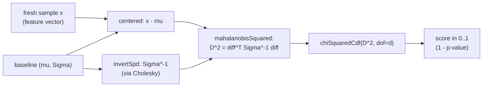

# 14 — Algorithms deep dive: the math, gathered and explained from zero

> **In plain English.** Cerberus decides "does this login look like *you*?" by comparing how you
> typed (or moved the mouse) against a statistical *fingerprint* it built from your past behavior.
> This document is the one place where every piece of math behind that decision is explained from
> scratch — covariance, shrinkage, the "distance that knows what normal variation looks like"
> (Mahalanobis distance), the chi-squared probability that turns a distance into a 0–1 anomaly
> score, the moving-average smoothing used in-session, and the way we *measure* how good all of
> this is (FAR / FRR / EER). No prior stats background assumed: every term is defined the moment it
> appears, and every algorithm gets a worked example with small concrete numbers you can follow by
> hand. This is the math HOME — other docs ([behavioral engine](06-behavioral-engine.md),
> [decision & policy](07-decision-and-policy.md), [continuous auth](08-continuous-auth.md)) point
> here instead of re-deriving.

Argon2id (the password-stretching function) is owned by [the cryptographic core](04-cryptographic-core.md#key-hierarchy)
— it is *not* re-derived here; this doc covers only the statistics/ML of the risk engine.

---

## 1. In plain English (the whole pipeline in one breath)

Imagine a bouncer who has watched you walk in 200 times. He doesn't just memorize your average
height — he learns that your stride *varies* a little, that you always lean left, that your gait is
tightly consistent on some features and loose on others. When someone new walks in, he doesn't ask
"are they exactly average?" — he asks "how many standard deviations of *normal-for-this-person*
variation away is this walk?" and converts that into a probability: "a genuine visitor would look
this unusual only 2% of the time." That probability is the **anomaly score**.

Precisely, for a fresh feature vector `x` (your typing timings this login) and a per-user baseline
`(μ, Σ)` — mean vector `μ` and covariance matrix `Σ` —:

1. **Mahalanobis distance squared** `D² = (x − μ)ᵀ Σ⁻¹ (x − μ)` measures distance *in units of the
   user's own variation*.
2. **Chi-squared CDF** turns `D²` into a score in `[0,1]`: under the assumption that genuine vectors
   are Gaussian, `D²` follows a chi-squared distribution with `d` degrees of freedom (`d` = number
   of features), so `score = P(χ²_d ≤ D²)` is "the fraction of genuine attempts at least this close
   to the mean." Score 0 = right at the mean, score → 1 = far out / anomalous.

To even *compute* `Σ⁻¹`, the covariance must be invertible — and with only ~10 enrollment samples
in 31 dimensions, the raw sample covariance is singular (no inverse). That is fixed by
**Ledoit-Wolf shrinkage** plus a tiny **ridge**, then inverted via **Cholesky decomposition**. The
in-session continuous-auth path reuses the *same* scorer and smooths the stream of scores with an
**EWMA** (exponentially-weighted moving average) before locking on a spike. Finally, to know whether
any of this works, we measure **FAR/FRR/EER** on public benchmarks and compare against two offline
detectors (**isolation forest**, **one-class SVM**).

---

## 2. Where it lives

```text
apps/server/src/risk/
├── baseline-model.ts        fit μ + Σ; Ledoit-Wolf shrinkage; Cholesky; SPD inverse
├── mahalanobis.ts           squared Mahalanobis distance D²
├── chi-squared.ts           χ² CDF / survival via regularized incomplete gamma
├── scorer.ts                live scorer: sample + model → score; + offline Mahalanobis detector
├── combiner.ts              weighted-linear fusion of behavioral + contextual sub-scores
├── continuous-auth.ts       in-session EWMA + spike→lock decision
├── eer.ts                   FAR/FRR sweep → Equal-Error Rate (+ mean/std)
├── evaluation.ts            Killourhy & Maxion harness (per-subject train/test loop)
├── threshold-tuning.ts      operating-point tuning on a held-out validation split
├── random.ts                seeded mulberry32 PRNG (reproducible isolation forest)
├── config.ts                ALL named constants (no magic numbers)
├── detectors/
│   ├── index.ts             three detector factories, uniform interface
│   ├── scaler.ts            z-score standardization (for the RBF SVM)
│   ├── isolation-forest.ts  iTree ensemble, score 2^(−E[h]/c(ψ))
│   └── ocsvm.ts             one-class ν-SVM, RBF kernel, deterministic SMO
└── geo/
    └── haversine.ts         great-circle distance (used by the geovelocity signal)
```

Reproducible results + provenance: [`docs/evaluation/`](../evaluation/README.md). Binding decisions:
[ADR-0010](../adr/0010-mahalanobis-scoring-and-detector-comparison.md) (scoring + detector
comparison) and [ADR-0014](../adr/0014-evaluation-methodology-and-operating-point.md) (evaluation +
operating point). The exact source listings are reproduced verbatim in
[Appendix C](../appendices/appendix-C.md).

---

## 3. File-by-file

For each significant file: one-sentence job, key exports, who imports it, and gotchas. Trivial
helpers are folded into their parent file's entry.

### [`baseline-model.ts`](../../apps/server/src/risk/baseline-model.ts) — fit the fingerprint, make it invertible
Fits `μ` + a regularized covariance `Σ` from enrollment vectors and provides the SPD inverse.
- **Exports:** `fitBaseline(samples, ridge?)` → `FittedBaseline {dimension, sampleCount, mean,
  covariance, shrinkage, ridge}`; `choleskyDecompose(a)` → lower-triangular `L` or `null`;
  `invertSpd(a)` → inverse matrix or `null`.
- **Internal:** `columnMeans`, `sampleCovariance` (MLE, denominator `N`), `trace`,
  `ledoitWolfShrinkage`.
- **Imports:** `COVARIANCE_RIDGE` from [`config.ts`](../../apps/server/src/risk/config.ts).
  **Imported by:** [`scorer.ts`](../../apps/server/src/risk/scorer.ts),
  [`threshold-tuning.ts`](../../apps/server/src/risk/threshold-tuning.ts).
- **Gotcha:** the sample covariance uses denominator `N` (the MLE form), *not* `N−1`, because the
  Ledoit-Wolf formulas assume that convention. `fitBaseline` throws on empty/ragged input (fail
  closed — never fit an inconsistent batch).

### [`mahalanobis.ts`](../../apps/server/src/risk/mahalanobis.ts) — distance in units of normal variation
Computes `D² = (x−μ)ᵀ Σ⁻¹ (x−μ)` given a precomputed inverse covariance.
- **Exports:** `centered(x, mean)`; `mahalanobisSquared(x, mean, inverseCovariance)`.
- **Imported by:** `scorer.ts`. **Gotcha:** the result is clamped to `≥ 0` (line 34) — an SPD
  inverse guarantees `D² ≥ 0` mathematically, but floating-point round-off can produce a tiny
  negative, which would be meaningless as a distance.

### [`chi-squared.ts`](../../apps/server/src/risk/chi-squared.ts) — distance → probability
Converts a squared distance into a tail probability via the regularized incomplete gamma function.
- **Exports:** `chiSquaredCdf(x, dof)` (lower tail `P(χ²≤x)` = the anomaly score); `chiSquaredSf(x,
  dof)` (upper tail `P(χ²>x)` = the p-value).
- **Internal:** `lnGamma` (Lanczos approximation), `gammaSeries`, `gammaContinuedFraction`,
  `lowerRegularizedGamma`, `upperRegularizedGamma`.
- **Gotcha (fail-closed):** `chiSquaredCdf(+∞, dof) = 1` (infinite distance ⇒ maximally anomalous)
  and `chiSquaredCdf(NaN, dof) = 0` (NaN treated as benign — but NaN can only arise upstream of
  here; the live scorer guards dimension/version first).

### [`scorer.ts`](../../apps/server/src/risk/scorer.ts) — the live decision, glued together
The pure scorer that the login path calls; also exposes the offline Mahalanobis detector.
- **Exports:** `BaselineModelSchema` (zod), `scoreSample(model, sample)` → `ScoreResult`,
  `trainMahalanobisDetector(trainingVectors)`.
- **Imports:** `baseline-model`, `chi-squared`, `mahalanobis`, `zod`. **Imported by:** the scoring
  service (login), the detector factories, the tuning runner.
- **Gotcha:** fails *closed and explicit* — returns `{scored:false, reason}` for
  `schema_version_mismatch`, `dimension_mismatch`, or `singular_covariance` rather than crashing or
  emitting a wrong number. Score semantics: `score = 1 − pValue`.

### [`combiner.ts`](../../apps/server/src/risk/combiner.ts) — fuse behavioral + contextual
Weighted-linear fusion into a composite score; covered in depth in
[decision & policy](07-decision-and-policy.md). Summarized here because the math is trivial:
`composite = clamp01(Σ weightᵢ · subscoreᵢ)`, with per-signal *contributions* returned for
explainability. Weights are NOT normalized (they sum to 1.9) — see [§9](#9-the-combiner-why-weights-do-not-sum-to-1).

### [`continuous-auth.ts`](../../apps/server/src/risk/continuous-auth.ts) — in-session smoothing
Two tiny pure functions: `updateInSessionComposite(prev, subScore, alpha)` (the EWMA) and
`isSpike(composite, config)` (`composite ≥ spikeThreshold`). See [§8](#8-ewma-smoothing-the-in-session-stream).

### [`eer.ts`](../../apps/server/src/risk/eer.ts) — how good is it?
Sweeps a threshold over genuine + impostor scores to find the **Equal-Error Rate**.
- **Exports:** `equalErrorRate(genuineScores, impostorScores)` → `{eer, far, frr, threshold}`;
  `meanStd(values)`. **Gotcha:** throws on empty input (an empty test set is a harness bug, not a
  0% error).

### [`evaluation.ts`](../../apps/server/src/risk/evaluation.ts) — the benchmark harness
Implements the Killourhy & Maxion (2009) per-subject protocol; `runEvaluation(dataBySubject,
detectors, config)`. Drives all three detectors over the *same* vectors so they are comparable.

### [`threshold-tuning.ts`](../../apps/server/src/risk/threshold-tuning.ts) — pick the operating point
Sweeps the *production* score (χ² CDF, not raw distance) on a validation split disjoint from the
test set; `tuneThresholds(dataBySubject, config)`. Produces the recommended step-up / deny bands.

### [`random.ts`](../../apps/server/src/risk/random.ts) — reproducible randomness
`createPrng(seed)` (mulberry32), `randomInt`, `sampleIndices` (partial Fisher-Yates). The isolation
forest is the *only* randomized detector; seeding it makes every reported number reproduce exactly.

### [`detectors/`](../../apps/server/src/risk/detectors/index.ts) — the offline comparison
`createDetectors(config)` returns three `DetectorFactory`s with a uniform `train(vectors) →
(x)=>score` interface. `scaler.ts` z-scores features for the SVM; `isolation-forest.ts` and
`ocsvm.ts` are the two non-deployed comparison detectors.

### [`geo/haversine.ts`](../../apps/server/src/risk/geo/haversine.ts) — great-circle distance
`haversineKm([lat,lon], [lat,lon])` for the geovelocity signal; small, self-contained, covered in
[§10](#10-haversine-great-circle-distance).

### [`config.ts`](../../apps/server/src/risk/config.ts) — every named constant
No magic numbers anywhere else; every threshold/weight/sample-count is here. The parameter table in
[§12](#12-the-named-parameters-all-from-configts) lists the load-bearing values.

---

## 4. Background math, from zero

These three ideas underpin everything. Skip if you already know mean/variance/covariance.

### 4.1 Mean and variance
The **mean** of a list is its average. The **variance** is the average squared distance from the
mean — a number that says "how spread out is this." Its square root is the **standard deviation
(SD)**, in the same units as the data. If your "hold time on key 3" is `120 ms` on average with SD
`15 ms`, then `135 ms` is "1 SD high" and `165 ms` is "3 SD high" (very unusual *for you*).

### 4.2 Covariance and the covariance matrix
**Covariance** between two features measures whether they move together: positive if when one is
high the other tends to be high, negative if they trade off, zero if unrelated. For a `d`-dimensional
feature vector, the **covariance matrix** `Σ` is `d×d`: the diagonal holds each feature's variance,
the off-diagonals hold every pairwise covariance. It is symmetric (`Σ[i][j] = Σ[j][i]`).

Why we need the whole matrix and not just per-feature variances: features are *correlated*. Your
flight time from key 2→3 and your hold on key 3 might rise together when you're tired. Treating each
feature independently (diagonal only) would call a tired-but-genuine login anomalous; the full matrix
"knows" those two features co-vary and forgives it. That is the entire reason Mahalanobis beats a
naive per-feature z-score.

### 4.3 Why a few samples make covariance unstable (the singularity problem)
A covariance matrix estimated from `N` samples has **rank at most `N − 1`**. With `N = 10`
enrollment samples and `d = 31` features, the matrix is `31×31` but rank ≤ 9 — it is **singular**:
its determinant is 0 and it has **no inverse**. But Mahalanobis distance *requires* `Σ⁻¹`. Naively
inverting it either crashes or produces garbage (dividing by a near-zero determinant explodes tiny
noise into huge distances). The fix is regularization: nudge `Σ` toward a simple, well-behaved
target until it is safely invertible — [§6](#6-ledoit-wolf-shrinkage-making-the-covariance-invertible).

The code comment states this directly:

> "with ~10 samples and a 31-dim vector the sample covariance is singular (rank ≤ N−1 < d) and has
> no inverse." — [`baseline-model.ts:7-8`](../../apps/server/src/risk/baseline-model.ts)

---

## 5. The fitted baseline (mean + covariance)

**(a) Intuition.** Build the fingerprint: the average typing pattern, plus how each feature varies
and co-varies.

**(b) Mechanism.** From `N` enrollment vectors of dimension `d`:
- **Mean:** `μ[j] = (1/N) Σ_k x_k[j]`.
- **Sample covariance (MLE):** `S = (1/N) Σ_k (x_k − μ)(x_k − μ)ᵀ`. Note the denominator is `N`, not
  `N−1` — required because the Ledoit-Wolf formulas use the MLE convention.

**(c) Where in code.** [`baseline-model.ts`](../../apps/server/src/risk/baseline-model.ts):
`columnMeans` (lines 29-37) and `sampleCovariance` (lines 39-61). `fitBaseline` (line 123) ties mean
→ covariance → shrinkage → ridge together.

**(d) Worked example.** Take `N = 3` samples in `d = 2` dimensions:

```
x₁ = [10, 20]   x₂ = [12, 18]   x₃ = [14, 22]
```

Mean: `μ = [(10+12+14)/3, (20+18+22)/3] = [12, 20]`.

Centered (subtract `μ`): `[−2,0], [0,−2], [2,2]`.

Covariance (denominator `N=3`):
- `S[0][0] = ((−2)² + 0² + 2²)/3 = 8/3 ≈ 2.667`
- `S[1][1] = (0² + (−2)² + 2²)/3 = 8/3 ≈ 2.667`
- `S[0][1] = S[1][0] = ((−2·0)+(0·−2)+(2·2))/3 = 4/3 ≈ 1.333`

So `S = [[2.667, 1.333], [1.333, 2.667]]`. (Positive off-diagonal: the two features tend to rise
together here.) With only 3 samples in 2D this `S` happens to be invertible, but with 10 samples in
31D it would not be — which is what §6 fixes.

---

## 6. Ledoit-Wolf shrinkage (making the covariance invertible)

**(a) Intuition.** The raw sample covariance from few samples is *noisy and over-confident* about
correlations it cannot really estimate. A boring, robust target — "every feature has the same
variance, no correlations" (a scaled identity matrix) — is too rigid but never breaks. Ledoit-Wolf
finds the *mathematically optimal blend* of the two: `Σ = (1−ρ)·S + ρ·(μ·I)`. The blending fraction
`ρ ∈ [0,1]` is computed from the data — high when the sample covariance is unreliable (few samples,
high noise), low when it is trustworthy. It is not a hand-tuned knob.

**(b) Mechanism.** From Ledoit & Wolf (2004):
- Target scale `μ̄ = trace(S)/d` (the average per-feature variance).
- Dispersion of `S` around the target: `d² = ‖S − μ̄·I‖²_F` (sum of squared entries of the
  difference; `‖·‖_F` is the Frobenius norm = "flatten the matrix and take its vector length").
- Sampling error of `S`: `b̄² = (1/N²) Σ_k ‖x_k x_kᵀ − S‖²_F`, then clip `b² = min(b̄², d²)`.
- **Shrinkage intensity `ρ = b²/d²`.** (If `d² = 0`, `S` already equals the target, so `ρ = 0`.)

Intuition for the ratio: `b²` is "how much `S` jitters from sample to sample" and `d²` is "how far
`S` is from the simple target." If the jitter is large relative to the signal, trust the target more
(`ρ` near 1); if `S` is stable and far from the target, trust `S` (`ρ` near 0).

Then a **diagonal ridge** `COVARIANCE_RIDGE = 1e-6` is added to the diagonal as a final floor so the
result is *strictly* positive-definite even in degenerate cases (e.g. all samples identical, where
`ρ = 0`): `Σ[i][i] += 1e-6`.

**(c) Where in code.** `ledoitWolfShrinkage` ([`baseline-model.ts:77-117`](../../apps/server/src/risk/baseline-model.ts)):
`dSq` is the `d²` loop (85-93), `bBarSq` is the `b̄²` loop (98-114), `bSq = Math.min(bBarSq, dSq)`
(115), return `bSq/dSq` (116). The blend + ridge is in `fitBaseline` (146-157):
`shrunk = (1 − rho)·S[i][j] + (i===j ? rho·mu : 0)`, then `+ ridge` on the diagonal. The ridge
constant: [`config.ts:26`](../../apps/server/src/risk/config.ts) `COVARIANCE_RIDGE = 1e-6`.

> ADR-0010 notes the cost: our deployed Mahalanobis EER (13.42%) is ~2.4 points above Killourhy &
> Maxion's published 11.0% *precisely because* we apply this shrinkage for consistency with the live
> model — K&M used the unregularized covariance, which is well-conditioned at `N=200 ≫ d=31`. We
> trade a little benchmark accuracy for a model that works at `N=10`.

**(d) Worked example.** Reuse `S = [[2.667, 1.333],[1.333, 2.667]]` from §5.
- `μ̄ = trace(S)/d = (2.667 + 2.667)/2 = 2.667`. Target `μ̄·I = [[2.667,0],[0,2.667]]`.
- `S − μ̄·I = [[0, 1.333],[1.333, 0]]`, so `d² = 0² + 1.333² + 1.333² + 0² = 3.556`.
- Compute `b̄²` over the three centered samples `c_k` (we use centered outer products `c_k c_kᵀ`,
  consistent with the code subtracting the mean):
  - `c₁ = [−2,0]`: `c₁c₁ᵀ = [[4,0],[0,0]]`; minus `S` = `[[1.333,−1.333],[−1.333,−2.667]]`; squared
    sum = `1.778 + 1.778 + 1.778 + 7.111 = 12.444`.
  - `c₂ = [0,−2]`: `c₂c₂ᵀ = [[0,0],[0,4]]`; minus `S` = `[[−2.667,−1.333],[−1.333,1.333]]`; squared
    sum = `7.111 + 1.778 + 1.778 + 1.778 = 12.444`.
  - `c₃ = [2,2]`: `c₃c₃ᵀ = [[4,4],[4,4]]`; minus `S` = `[[1.333,2.667],[2.667,1.333]]`; squared sum
    = `1.778 + 7.111 + 7.111 + 1.778 = 17.778`.
  - sum = `12.444 + 12.444 + 17.778 = 42.667`; `b̄² = 42.667 / N² = 42.667 / 9 = 4.741`.
- Clip: `b² = min(4.741, 3.556) = 3.556`. So **`ρ = b²/d² = 3.556/3.556 = 1.0`** — with only 3 noisy
  samples Ledoit-Wolf shrinks *all the way* to the identity target. The blended `Σ` becomes
  `(1−1)·S + 1·μ̄·I = [[2.667,0],[0,2.667]]`, then `+1e-6` on the diagonal →
  `[[2.667001, 0],[0, 2.667001]]`. The off-diagonal correlation — which 3 samples could not reliably
  estimate — has been discarded, leaving a clean, invertible matrix. (With many trustworthy samples
  `ρ` would land well below 1 and most of `S`'s structure would survive.)

---

## 7. Cholesky decomposition, SPD inverse, and Mahalanobis distance

### 7.1 Cholesky and the SPD inverse
**(a) Intuition.** A symmetric positive-definite (**SPD**) matrix is the matrix analogue of a
positive number — it has a "square root." Cholesky finds a lower-triangular `L` with `Σ = L·Lᵀ`.
Two payoffs: (1) `L` exists *iff* `Σ` is SPD, so a successful Cholesky is a *proof* that the
regularized covariance is invertible; (2) inverting via `L` (solve `L·Lᵀ·x = eₖ` for each unit
column) is numerically stable — far better than a generic inverse.

**(b) Mechanism.** Standard Cholesky–Banachiewicz recurrence; if any diagonal would be `≤ 0` the
matrix is not positive-definite and the function returns `null`. `invertSpd` does forward
substitution (solve `L·y = e`) then back substitution (solve `Lᵀ·x = y`) per column.

**(c) Where in code.** `choleskyDecompose` ([`baseline-model.ts:167-197`](../../apps/server/src/risk/baseline-model.ts))
— note line 186-188 returns `null` when `sum ≤ 0`. `invertSpd` (200-230). The live scorer calls
`invertSpd(model.covariance)` and returns `singular_covariance` if it is `null`
([`scorer.ts:71-73`](../../apps/server/src/risk/scorer.ts)) — should never happen after §6, but
handled rather than assumed.

**(d) Worked example.** `Σ = [[4, 2],[2, 3]]`.
- `L[0][0] = √4 = 2`. `L[1][0] = Σ[1][0]/L[0][0] = 2/2 = 1`.
- `L[1][1] = √(Σ[1][1] − L[1][0]²) = √(3 − 1) = √2 ≈ 1.414`.
- So `L = [[2,0],[1,1.414]]`, and `L·Lᵀ = [[4,2],[2,3]] = Σ`. ✓ All diagonals were `> 0`, so `Σ` is
  SPD and invertible.

### 7.2 Mahalanobis distance
**(a) Intuition.** Ordinary (Euclidean) distance treats all directions equally. Mahalanobis distance
*stretches space* by the inverse covariance: a deviation along a direction the user varies a lot is
cheap; the same deviation along a direction the user is consistent on is expensive. It is "how many
standard-deviations-of-this-user away, accounting for correlations."

**(b) Mechanism.** `D² = (x − μ)ᵀ Σ⁻¹ (x − μ)`. The code computes `diff = x − μ`, then
`acc = Σ_i diff[i] · (Σ⁻¹ row i · diff)`, clamped to `≥ 0`.

**(c) Where in code.** `mahalanobisSquared` ([`mahalanobis.ts:18-35`](../../apps/server/src/risk/mahalanobis.ts)),
clamp at line 34. The live scorer computes `distanceSquared` then `dof = model.dimension`
([`scorer.ts:75-76`](../../apps/server/src/risk/scorer.ts)).

**(d) 2D worked example.** Baseline `μ = [0,0]`, `Σ = [[4,0],[0,1]]` — feature 0 varies a lot (SD 2),
feature 1 is tight (SD 1). Then `Σ⁻¹ = [[0.25, 0],[0, 1]]`.
- Sample `a = [2, 0]` (2 units out along the *loose* axis = exactly 1 SD): `D² = 2²·0.25 + 0²·1 =
  1`. So `D = 1`.
- Sample `b = [0, 2]` (2 units out along the *tight* axis = 2 SD): `D² = 0²·0.25 + 2²·1 = 4`. So
  `D = 2`.

Both points are Euclidean-distance 2 from the mean, but Mahalanobis correctly says `b` is twice as
anomalous as `a`, because the user is twice as consistent on feature 1. *That* is "distance that
accounts for normal variation."

---

## 8. Chi-squared CDF — distance to anomaly score

**(a) Intuition.** A distance of "4" means nothing by itself — is that big? It depends on how many
features you summed over. The chi-squared distribution answers "if this person is genuine, how often
would their `D²` be this large or larger?" That probability is comparable across users and feature
counts, and lives cleanly in `[0,1]`.

**(b) Mechanism.** If the genuine feature vectors are multivariate Gaussian, then `D²` (with the
*true* `Σ`) follows a **chi-squared distribution with `d` degrees of freedom**, where `d` = feature
dimension. The anomaly score is the lower-tail CDF: `score = P(χ²_d ≤ D²)`. The p-value (logged for
explainability) is the upper tail: `pValue = P(χ²_d > D²) = 1 − score`. The CDF is the **regularized
lower incomplete gamma** `P(a, x)` with `a = d/2`, `x = D²/2`, computed (Numerical Recipes) by a
series expansion when `x < a+1` and a continued fraction otherwise; `ln Γ` via the Lanczos
approximation. No table lookup, no magic cutoff — dimension-aware and parameter-free.

> Design choice ([ADR-0010](../adr/0010-mahalanobis-scoring-and-detector-comparison.md), §A.1 and
> "Alternatives"): a raw-distance threshold was *rejected* because it is not dimension-aware and
> needs a hand-tuned cutoff. The χ² tail is principled.

**(c) Where in code.** `chiSquaredCdf(x, dof)` ([`chi-squared.ts:109-117`](../../apps/server/src/risk/chi-squared.ts))
calls `lowerRegularizedGamma(dof/2, x/2)`. The dof is set to the *full* feature dimension at
[`scorer.ts:76`](../../apps/server/src/risk/scorer.ts) (`dof = model.dimension`) — for `n` keystrokes
that is `3n − 2` (holds `n`, down-down `n−1`, up-down `n−1`); for the master-password CMU benchmark
`d = 31`; for mouse `d = 9`. Fail-closed edges: `+∞ → 1`, `NaN/≤0 → 0` (lines 110-115).

**(d) Worked example (`d = 2`).** For 2 degrees of freedom the χ² CDF has a clean closed form:
`P(χ²₂ ≤ D²) = 1 − e^(−D²/2)`.
- From §7.2, sample `a` had `D² = 1`: `score = 1 − e^(−0.5) = 1 − 0.6065 = 0.3935`. So a 1-SD-ish
  deviation scores ~0.39 — mildly elevated, not alarming.
- Sample `b` had `D² = 4`: `score = 1 − e^(−2) = 1 − 0.1353 = 0.8647`. A clearly anomalous ~0.86,
  p-value 0.135.
- At the mean `D² = 0`: `score = 1 − e^0 = 0`. Perfectly genuine.

You can verify the code path: `chiSquaredCdf(4, 2)` → `lowerRegularizedGamma(1, 2)` →
`gammaSeries`/CF for `a=1, x=2` → `0.8647`. Higher dimensions need the gamma machinery, but the
shape is the same: 0 at the mean, climbing toward 1 as `D²` grows.

### Pipeline diagram



---

## 9. The combiner — why weights do not sum to 1

**(a) Intuition.** One strong signal (a brand-new device, impossible travel) should be able to
*trigger a step-up on its own*, but no single signal should be able to *deny* by itself — a deny
needs corroboration. That is engineered by deliberately *not* normalizing the weights.

**(b) Mechanism.** `composite = clamp01(Σ weightᵢ · subscoreᵢ)`, with each `weightᵢ · subscoreᵢ`
contribution returned for the audit trail.

**(c) Where in code.** `combine` ([`combiner.ts:37-60`](../../apps/server/src/risk/combiner.ts));
weights at [`config.ts:255-261`](../../apps/server/src/risk/config.ts): behavioral 0.5, newDevice
0.35, geovelocity 0.5, timeOfDay 0.2, failureVelocity 0.35 (sum **1.9**). Bands at `config.ts:283-286`:
`stepUp 0.30`, `deny 0.70`.

**(d) Worked example.** A perfect-anomaly behavioral score `1.0` alone → `0.5·1.0 = 0.50` composite:
above `stepUp` (0.30), below `deny` (0.70) — *step-up, never deny alone*. Add impossible travel
`1.0` → `0.50 + 0.5·1.0 = 1.0` (clamped) → **deny**, because two strong signals stacked. Deny `0.70`
is set above the maximum single contribution (0.5) precisely so a deny requires stacking. Full policy
in [decision & policy](07-decision-and-policy.md#combiner-and-bands).

---

## 10. EWMA smoothing (the in-session stream)

**(a) Intuition.** During a session, mouse windows are scored continuously, and any single window is
noisy. We don't want one twitchy window to lock the vault — but a *sustained* spike should. An EWMA
(exponentially-weighted moving average) is a running average that weights recent windows more, so a
lone outlier barely moves it while a string of high scores crosses the lock threshold within a few
windows.

**(b) Mechanism.** `compositeₜ = clamp01( α·subScoreₜ + (1−α)·compositeₜ₋₁ )`, starting from `0`
(a fresh session is neutral). `α` ("alpha", the smoothing factor) is `0.5`. Lock fires when
`composite ≥ spikeThreshold = 0.85`.

**(c) Where in code.** `updateInSessionComposite` and `isSpike`
([`continuous-auth.ts:17-24`](../../apps/server/src/risk/continuous-auth.ts)); `ewmaAlpha = 0.5`,
`spikeThreshold = 0.85` at [`config.ts:354-358`](../../apps/server/src/risk/config.ts). The wiring
(WebSocket → score → EWMA → lock) is [continuous auth](08-continuous-auth.md).

**(d) Worked example (`α = 0.5`, threshold `0.85`).** Start `composite = 0`.
- One lone bad window `subScore = 1.0`: `0.5·1.0 + 0.5·0 = 0.50` → below 0.85, **no lock** (a single
  outlier can't lock — by design).
- Now a sustained attack, every window `subScore = 1.0`:
  - w1: `0.5·1 + 0.5·0 = 0.50`
  - w2: `0.5·1 + 0.5·0.50 = 0.75`
  - w3: `0.5·1 + 0.5·0.75 = 0.875` → **≥ 0.85, LOCK** on the third sustained window.
- Contrast a genuine user who happens to have one rough window (`1.0`) then settles (`0.1`):
  `0.50 → 0.5·0.1 + 0.5·0.50 = 0.30 → 0.20 → …` — decays back toward 0, no lock.

The EWMA buys robustness at the cost of a 2–3 window latency, an explicit trade documented in the
[mouse evaluation](../evaluation/mouse-detector-comparison.md) (noisy modality → smooth before
acting).

---

## 11. Evaluation: FAR, FRR, EER, and the harness

### 11.1 FAR / FRR / EER for a beginner
- A login is flagged "impostor" when its score exceeds a threshold `θ`.
- **FRR (False-Reject Rate):** fraction of *genuine* attempts wrongly flagged (`score > θ`). High
  FRR = annoying real users.
- **FAR (False-Accept Rate):** fraction of *impostor* attempts wrongly let through (`score ≤ θ`).
  High FAR = attackers get in.
- These trade off: raise `θ` and FAR rises while FRR falls; lower it and the reverse. The **EER
  (Equal-Error Rate)** is the one threshold where `FAR = FRR` — a single, tuning-free number to
  compare detectors. **Lower EER = better.**

### 11.2 How `equalErrorRate` finds it
**(b) Mechanism.** Sort genuine and impostor scores. Candidate thresholds = every distinct score
(plus a guard at `minimum − 1`, below all scores). At each `θ`, compute `FRR = P(genuine > θ)` and
`FAR = P(impostor ≤ θ)` (via a binary search `fractionAbove`). Track `diff = FAR − FRR`; when `diff`
**changes sign** between two candidates, the curves cross there — **linearly interpolate** the exact
crossing and report `eer = (far + frr)/2`. If they never cross exactly, fall back to the `θ` that
minimizes `|FAR − FRR|`.

**(c) Where in code.** `equalErrorRate` ([`eer.ts:40-94`](../../apps/server/src/risk/eer.ts)); the
sign-change interpolation is lines 63-73; the no-crossing fallback is 77-91. `meanStd` (97-105) uses
*population* SD (denominator `N`).

**(d) Worked example.** Genuine scores `[0.1, 0.2, 0.3]`, impostor scores `[0.4, 0.6, 0.8]` (perfectly
separated). At `θ = 0.35`: `FRR = P(genuine > 0.35) = 0/3 = 0`; `FAR = P(impostor ≤ 0.35) = 0/3 = 0`.
Both zero → EER `0%` (the ideal). Now overlap them: genuine `[0.1, 0.5]`, impostor `[0.4, 0.9]`. At
`θ = 0.45`: `FRR = 1/2 = 0.5` (the `0.5` genuine is flagged); `FAR = 1/2 = 0.5` (the `0.4` impostor
passes). `FAR = FRR = 0.5` → EER `50%` (a coin flip). Real detectors land in between.

### 11.3 The Killourhy & Maxion harness
**(b) Mechanism.** Per subject `S` treated as genuine: train on `S`'s first `trainSize` (200) reps;
genuine test = `S`'s remaining reps; impostor test = the first `impostorReps` (5) reps of every other
subject. Score both sets, compute the per-subject EER; report **mean ± SD** across subjects.
Deterministic (sorted subjects, fixed seed).

**(c) Where in code.** `runEvaluation` ([`evaluation.ts:44-115`](../../apps/server/src/risk/evaluation.ts));
config `KM_TRAIN_SIZE = 200`, `KM_IMPOSTOR_REPS = 5`, `EVALUATION_SEED = 20_240_601`
([`config.ts:51-57`](../../apps/server/src/risk/config.ts)).

### 11.4 Threshold tuning (picking the deployed operating point)
**(b) Mechanism.** This sweeps the *production* score (χ² CDF from `scoreSample`), **not** the raw
distance, on a **validation split disjoint from the test set** (no tuning-on-test): fit on reps
`[0,150)`, genuine validation `[150,200)`, impostor validation = other subjects' reps `[5,10)` (the
K&M impostor test is `[0,5)`); the K&M genuine test `[200,end)` is never read. Finding: the χ² score
is *soft* — genuine scores cluster near 0, impostors spread high — so the EER point sits at a tiny
threshold (~0.002, EER 19.25%), where ~19% of genuine logins would step up (poor UX). Instead the
chosen point is the **most sensitive composite step-up keeping the genuine false-step-up rate ≤ 7%**.

**(c) Where in code.** `tuneThresholds` ([`threshold-tuning.ts:116-190`](../../apps/server/src/risk/threshold-tuning.ts));
`makeScorer` (66-82) builds a production-equivalent χ² scorer; `operatingPointAtMaxFrr` (98-113) picks
the budget point. Config: `TUNE_TRAIN_SIZE = 150`, `TUNE_MAX_STEPUP_FRR = 0.07`
([`config.ts:145,160`](../../apps/server/src/risk/config.ts)). Result:
[`threshold-tuning.md`](../evaluation/threshold-tuning.md) — tuned composite **0.29** (genuine FRR
6.98%, behavioral-only FAR 48.84%); shipped config **keeps 0.30** as a clean, within-rounding value.

---

## 12. The offline comparison detectors

These two are *not deployed* — they exist only to validate the deployed Mahalanobis scorer against
the literature on the same vectors (apples-to-apples). All three return "higher ⇒ more anomalous."

### 12.1 Isolation forest
**(a) Intuition.** To find a weird point, repeatedly cut the data with random splits. An anomaly sits
off on its own, so it gets *isolated* after only a few cuts; a normal point, buried in the crowd,
takes many. The detector grows many random trees and uses the *average number of cuts to isolate a
point* as its anomaly signal — fewer cuts = more anomalous.

**(b) Mechanism.** Build `t = 100` isolation trees, each on a random subsample of size `ψ = 256`
(or `N` if smaller). Each node picks a random feature and a random split value between that feature's
min and max in the node, recursing until a height limit `⌈log₂ ψ⌉` or a single point. The path length
`h(x)` is the depth a point reaches plus `c(node.size)` (the expected extra search cost in a leaf
with multiple points). Score: `s(x) = 2^(−E[h(x)]/c(ψ))`, where `c(n) = 2·H(n−1) − 2(n−1)/n` is the
average unsuccessful-search path length of a binary tree (`H` = harmonic number), with the exact
small cases `c(1)=0`, `c(2)=1`. As `E[h] → 0`, `s → 1` (anomaly); as `E[h] → c(ψ)`, `s → 0.5`
(normal).

**(c) Where in code.** [`isolation-forest.ts`](../../apps/server/src/risk/detectors/isolation-forest.ts):
`averagePathLength` (19-28, note `c(2)=1` exactly, line 23-25), `buildTree` (34-75), `pathLength`
(77-83), `trainIsolationForest` (97-123) with the `2 ** (-expectedPath / normalizer)` score (120).
Randomness from the seeded mulberry32 PRNG ([`random.ts`](../../apps/server/src/risk/random.ts)).
Params: `IFOREST_TREES = 100`, `IFOREST_SUBSAMPLE = 256`
([`config.ts:60-61`](../../apps/server/src/risk/config.ts)).

**(d) Worked example.** Suppose for a point `x`, averaged over 100 trees, `E[h(x)] = 3` cuts, and the
subsample normalizer `c(256) ≈ 2·(ln 255 + 0.5772) − 2·255/256 ≈ 2·6.119 − 1.992 ≈ 10.25`. Score:
`2^(−3/10.25) = 2^(−0.293) ≈ 0.816` — isolated quickly relative to the ~10-cut norm, so strongly
anomalous. A normal point with `E[h] = 10` scores `2^(−10/10.25) = 2^(−0.976) ≈ 0.508` — right around
the 0.5 "normal" mark.

### 12.2 One-class SVM (RBF kernel)
**(a) Intuition.** Wrap the genuine training points in a tight boundary in a curved feature space; a
test point inside scores low, outside scores high. The RBF (radial basis function) kernel measures
similarity as `exp(−γ‖a−b‖²)` — 1 for identical points, decaying to 0 as they separate — so "inside
the blob of genuine points" means "similar to enough of them."

**(b) Mechanism.** Solve the ν-SVM dual `min_α ½ αᵀKα s.t. Σα = 1, 0 ≤ αᵢ ≤ 1/(νN)` by a
deterministic SMO (Sequential Minimal Optimization) working-set solver. `ν` upper-bounds the fraction
of training points allowed to be outliers. The anomaly score is `ρ − Σ αᵢ k(xᵢ, x)` (higher =
more outside the boundary). Because RBF is scale-sensitive, features are **z-score standardized**
first (the only detector that needs the scaler).

**(c) Where in code.** [`ocsvm.ts`](../../apps/server/src/risk/detectors/ocsvm.ts): `rbf` (35-37),
`trainOcSvm` (40-153) — kernel matrix (47-59), SMO loop (74-116), `ρ` from free support vectors
(118-133), score `rho - sum` (150). Standardization in
[`scaler.ts`](../../apps/server/src/risk/detectors/scaler.ts) (`fitScaler`/`applyScaler`, population
std with a `1e-9` floor). Params: `OCSVM_NU = 0.1`, `γ = OCSVM_GAMMA_OVER_D/d = 1/d`,
`tolerance = 1e-4`, `maxItersPerPoint = 50` ([`config.ts:68-71`](../../apps/server/src/risk/config.ts)).
The factory divides `gammaOverD` by the dimension at
[`detectors/index.ts:42`](../../apps/server/src/risk/detectors/index.ts).

**(d) Worked example (the RBF, the load-bearing piece).** With `d = 2`, `γ = 1/2 = 0.5`: similarity
between `a = [0,0]` and `b = [1,1]` is `exp(−0.5·((0−1)²+(0−1)²)) = exp(−0.5·2) = exp(−1) ≈ 0.368`.
Identical points give `exp(0) = 1`; far-apart points → ~0. The score sums these kernel similarities
over the learned support vectors, weighted by `αᵢ`, and subtracts the offset `ρ`: a test point near
many genuine points has a large sum (low/negative score = inlier), a far point has a near-zero sum
(score ≈ `ρ` = outlier).

### 12.3 Why pure-TS, seeded implementations
[ADR-0010](../adr/0010-mahalanobis-scoring-and-detector-comparison.md) ("Alternatives"): a
scikit-learn/libsvm dependency was *rejected* — pure-TS, seeded, dependency-free detectors are more
reproducible and auditable for a security thesis, and the EER numbers validate them end-to-end
against the published benchmark.

---

## 13. Haversine — great-circle distance

**(a) Intuition.** The straight-line "as the crow flies" distance over the Earth's curved surface
between two lat/lon points; feeds the geovelocity signal (distance ÷ time = implied travel speed).

**(b) Mechanism.** `h = sin²(Δlat/2) + cos(lat₁)·cos(lat₂)·sin²(Δlon/2)`; distance
`= 2R·asin(min(1, √h))`, `R = 6371 km`.

**(c) Where in code.** `haversineKm` ([`geo/haversine.ts:11-21`](../../apps/server/src/risk/geo/haversine.ts)).
Used by the geovelocity signal (see [decision & policy](07-decision-and-policy.md#geovelocity)).

**(d) Worked example.** Sofia (≈ 42.70°N, 23.32°E) to Berlin (≈ 52.52°N, 13.40°E): `Δlat ≈ 9.82°`,
`Δlon ≈ −9.92°`. Plugging in gives ≈ **1,300 km**. If two logins are 1 hour apart, implied speed
≈ 1300 km/h — above the `impossibleKmh = 1000` band ([`config.ts:368`](../../apps/server/src/risk/config.ts)),
so geovelocity would score near 1 (faster than a commercial flight ⇒ impossible).

---

## 14. The reported numbers (honest, with provenance)

These are the committed evaluation figures. **Provenance:** every number is regenerated by a committed
`npm run eval:*` runner with fixed seed **20240601**; the underlying datasets (CMU keystroke, Balabit
mouse) are **real human captures and are gitignored** (`docs/evaluation/data/`, PROJECT.md §5) — only
the derived `.json`/`.md` results are tracked. So this doc *quotes with provenance*; it does not
recompute.

| Modality / metric | Dataset | Detector | EER (mean ± SD) | Source |
|---|---|---|---:|---|
| **Keystroke** (login, deployed) | CMU, 51 subj, dim 31 | **Mahalanobis** | **13.42% ± 6.73%** | [keystroke-detector-comparison.md](../evaluation/keystroke-detector-comparison.md) |
| Keystroke | CMU | one-class SVM | 10.69% ± 7.18% | same |
| Keystroke | CMU | isolation forest | 8.89% ± 6.68% | same |
| **Mouse** (continuous, deployed) | Balabit, 10 users, dim 9 | **Mahalanobis** | **38.18% ± 7.82%** | [mouse-detector-comparison.md](../evaluation/mouse-detector-comparison.md) |
| Mouse | Balabit | one-class SVM | 35.94% ± 2.86% | same |
| Mouse | Balabit | isolation forest | 34.95% ± 6.50% | same |
| **Behavioral-only** (validation) | CMU held-out split | χ² CDF score | EER **19.25%** | [threshold-tuning.md](../evaluation/threshold-tuning.md) |

Operating point: tuned composite **0.29** at a 7% genuine false-step-up budget (genuine FRR 6.98%,
**behavioral-only FAR ≈ 48.84%**); the shipped config keeps **stepUp 0.30 / deny 0.70** (0.30 is
within rounding of 0.29 and a clean value — documented, not a bug:
[`config.ts:267-277`](../../apps/server/src/risk/config.ts)).

**The honest reading.** Keystroke dynamics on a *fixed* master password is a *moderate* discriminator
(EER ≈ 9–13% across detectors; Mahalanobis is the deployed one and is the *worst* of the three —
deliberately, because it shares the live shrinkage). Mouse dynamics is **markedly noisier** (per-window
EER ≈ 35–38% with large per-user SD). The behavioral-only FAR near 49% at the deployed operating point
means **behavioral alone lets in roughly half of impostors** — which is *exactly why* Cerberus never
lets behavioral decide alone:
- it is one *contributing* signal in the [combiner](#9-the-combiner-why-weights-do-not-sum-to-1)
  (weight 0.5 — reaches step-up alone, never deny);
- its residual FAR is closed by **contextual stacking + a recoverable TOTP step-up**
  ([decision & policy](07-decision-and-policy.md));
- continuous-auth **smooths windows with an EWMA** before locking ([§10](#10-ewma-smoothing-the-in-session-stream)),
  trading latency for far fewer false locks.

Reporting the SD (not just the mean) is a deliberate honesty choice: the per-user spread *is* the
story for mouse ([ADR-0014](../adr/0014-evaluation-methodology-and-operating-point.md), §A/§D).

---

## 15. The named parameters (all from `config.ts`)

| Parameter | Value | Constant / line | Used by |
|---|---|---|---|
| Covariance ridge | `1e-6` | `COVARIANCE_RIDGE` ([26](../../apps/server/src/risk/config.ts)) | `fitBaseline` |
| Min enrollment (keystroke) | 10 | `MIN_ENROLLMENT_SAMPLES` (15) | baseline activation |
| Min enrollment (mouse) | 12 | `MOUSE_MIN_ENROLLMENT_SAMPLES` (337) | mouse baseline |
| Eval seed | 20240601 | `EVALUATION_SEED` (51) | iForest + harness |
| K&M train size | 200 | `KM_TRAIN_SIZE` (54) | `runEvaluation` |
| K&M impostor reps | 5 | `KM_IMPOSTOR_REPS` (57) | `runEvaluation` |
| iForest trees / subsample | 100 / 256 | `IFOREST_TREES` / `IFOREST_SUBSAMPLE` (60-61) | isolation forest |
| OCSVM ν / γ / tol / iters | 0.1 / 1/d / 1e-4 / 50 | `OCSVM_*` (68-71) | one-class SVM |
| Tuning train / FRR budget | 150 / 0.07 | `TUNE_TRAIN_SIZE` (145) / `TUNE_MAX_STEPUP_FRR` (160) | `tuneThresholds` |
| Combiner weights | 0.5 / 0.35 / 0.5 / 0.2 / 0.35 | `DEFAULT_COMBINER_WEIGHTS` (255-261) | `combine` |
| Bands (step-up / deny) | 0.30 / 0.70 | `DEFAULT_BAND_THRESHOLDS` (283-286) | policy |
| EWMA α / spike | 0.5 / 0.85 | `DEFAULT_CONTINUOUS_AUTH_CONFIG` (354-358) | continuous auth |
| Geovelocity normal / impossible | 250 / 1000 km/h | `DEFAULT_CONTEXTUAL_CONFIG` (367-369) | geovelocity |

---

## 16. Gotchas & invariants

1. **Privacy: raw vectors never leave the engine.** Scores and scalar reasons (`distance`,
   `distanceSquared`, `dof`, `pValue`, `modelVersion`, `sampleCount`) are returned/logged — the raw
   feature vector is *never* written to `risk_events` or returned over the API. The decrypted
   baseline blob is zod-validated (`BaselineModelSchema`) before use — it is a trust boundary
   ([`scorer.ts:18-28`](../../apps/server/src/risk/scorer.ts), ADR-0010 §A.5).
2. **Fail closed everywhere.** Unscoreable sample ⇒ explicit `{scored:false, reason}` (the *service*
   then treats this as maximally anomalous); `tuneThresholds`/`makeScorer` map an unscoreable vector
   to score `1` ([`threshold-tuning.ts:80`](../../apps/server/src/risk/threshold-tuning.ts));
   `chiSquaredCdf(+∞) = 1`; `equalErrorRate` throws on empty input. Omitting telemetry **cannot
   bypass** the check — it denies/escalates.
3. **`dof` is the FULL feature dimension** (`scorer.ts:76`), e.g. `3n−2` for `n` keystrokes — not the
   sample count, not a reduced dimension. Getting this wrong would systematically mis-score.
4. **MLE covariance (denominator `N`, not `N−1`).** Required by the Ledoit-Wolf derivation; using
   `N−1` would make `ρ` wrong.
5. **The deployed Mahalanobis is intentionally the *least* accurate of the three benchmark
   detectors** — it ships because it reuses the exact `(μ, Σ)` + shrinkage of the live M6 model, so
   the offline number describes production honestly (ADR-0010 §B.7). Do not "upgrade" to the SVM/forest
   for a better EER without re-deriving the whole live path.
6. **Reproducibility depends on the seed.** Only the isolation forest is randomized; it draws from
   the seeded mulberry32 in [`random.ts`](../../apps/server/src/risk/random.ts). Change the seed and
   the committed iForest numbers no longer reproduce byte-for-byte.
7. **No tuning-on-test.** The tuning split (`[0,150)`/`[150,200)`/impostor `[5,10)`) is *disjoint*
   from the K&M test set (`[200,end)`/impostor `[0,5)`); a test asserts the K&M genuine test region
   is never read ([ADR-0014](../adr/0014-evaluation-methodology-and-operating-point.md), §B).
8. **The 0.29→0.30 rounding is documented, not a bug.** The tuned value is 0.29; the shipped band is
   0.30 (clean, within rounding). The deny band 0.70 is *deliberately* above the max single-signal
   contribution (0.5) so no single signal denies alone.

---

### See also
- [06 — Behavioral engine](06-behavioral-engine.md) (feature extraction, enrollment lifecycle)
- [07 — Decision & policy](07-decision-and-policy.md) (combiner, bands, contextual signals, TOTP)
- [08 — Continuous auth](08-continuous-auth.md) (the WebSocket → score → EWMA → lock wiring)
- [04 — Cryptographic core](04-cryptographic-core.md#key-hierarchy) (Argon2id, the KDF — owned there)
- [Appendix C](../appendices/appendix-C.md) (verbatim source listings of the risk engine)
- [`docs/evaluation/`](../evaluation/README.md) (reproducible results + provenance)
